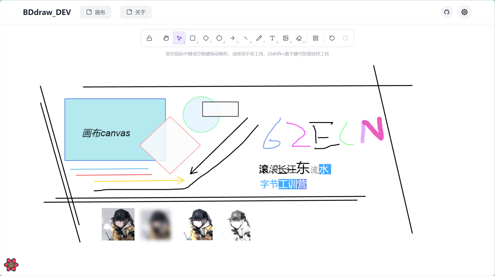
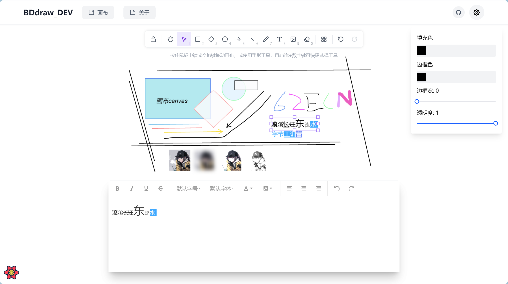

# BDdraw_DEV

基于 React 18 + TypeScript 5 + Vite 3 + Tailwind CSS 3 + Zustand + React Query + PixiJS 8 的 2D 画布应用

#### 技术栈 · Tech Stack

核心框架 | Core


构建与样式 | Build & Styling


UI 组件库 | UI Library


数据请求与缓存 | Data Fetching


状态管理 | State Management

  

图形渲染 | Graphics & Canvas


富文本编辑 | Rich Text Editor

  

图标 | Icons

  

工具库 | Utilities


代码质量 | Code Quality


#### 项目架构树

```sh
BDdraw_DEV/
├── .husky/                     # Git hooks 配置
├── .vscode/                    # VSCode 配置
├── docs/                       # 文档目录
├── public/                     # 静态资源目录
├── src/                        # 源代码主目录
│   ├── api/                    # API 接口定义
│   ├── assets/                 # 静态资源文件
│   ├── components/             # 公共组件
│   │   ├── Richtext_editor/    # 富文本编辑器组件
│   │   ├── canvas_toolbar/     # 画布工具栏组件
│   │   ├── console/            # 控制台组件
│   │   ├── error-page/         # 错误页面组件
│   │   ├── header/             # 头部组件
│   │   ├── image-insert-modal/ # 图像插入模态框组件
│   │   ├── layout/             # 布局组件
│   │   ├── property-panel/     # 属性面板组件
│   │   └── ui/                 # 基础UI组件
│   ├── hooks/                  # 自定义 React Hooks
│   ├── lib/                    # 工具库和核心功能模块
│   │   ├── ResizeCommand.ts    # 调整大小命令
│   │   ├── UndoRedoManager.ts  # 撤销重做管理器
│   │   ├── UpdateElementCommand.ts # 更新元素命令
│   │   ├── constants.ts        # 常量定义
│   │   ├── env.ts              # 环境配置
│   │   └── utils.ts            # 工具函数
│   ├── pages/                  # 页面组件
│   │   ├── about/              # 关于页面
│   │   ├── canvas/             # 画布页面
│   │   │   ├── Pixi_STM_modules/ # Pixi Stage Manager 模块
│   │   │   │   ├── core/       # 核心类和类型定义
│   │   │   │   │   ├── StageManagerCore.ts # 舞台管理核心类
│   │   │   │   │   └── types.ts # 核心类型定义
│   │   │   │   ├── interaction/ # 交互处理模块
│   │   │   │   │   └── InteractionHandler.ts # 交互处理器
│   │   │   │   ├── rendering/  # 渲染模块
│   │   │   │   │   ├── ElementRenderer.ts # 元素渲染器
│   │   │   │   │   └── TransformerRenderer.ts # 变换控制器渲染器
│   │   │   │   ├── utils/      # 工具函数
│   │   │   │   │   └── cursorUtils.ts # 光标工具函数
│   │   │   │   └── STM_modules.md # 模块说明文档
│   │   │   ├── Pixi_stageManager.ts # Pixi舞台管理器入口
│   │   │   └── index.tsx       # 画布页面入口
│   │   └── home/               # 主页
│   │       └── index.tsx       # 主页入口
│   ├── router/                 # 路由配置
│   │   └── router.tsx          # 路由定义
│   ├── stores/                 # 状态管理
│   │   └── canvasStore.ts      # 画布状态管理
│   ├── styles/                 # 样式文件
│   ├── app.tsx                 # 应用入口组件
│   ├── main.tsx                # 主入口文件
│   └── vite-env.d.ts           # Vite 环境声明文件
├── .editorconfig               # 编辑器配置
├── .eslintrc                  # ESLint 配置
├── .gitignore                 # Git 忽略文件配置
├── .prettierrc.js             # Prettier 配置
├── .stylelintrc.json          # Stylelint 配置
├── commitlint.config.cjs      # Commitlint 配置
├── components.json            # 组件配置
├── index.html                 # HTML 入口
├── lint-staged.config.js      # Lint-staged 配置
├── package.json               # 项目依赖和脚本配置
├── postcss.config.js          # PostCSS 配置
├── tailwind.config.js         # Tailwind CSS 配置
├── transmart.config.ts        # Transmart 配置
├── tsconfig.json              # TypeScript 配置
├── tsconfig.node.json         # Node.js TypeScript 配置
├── vite.config.ts             # Vite 配置
└── README.md                  # 项目说明文档
```

#### 运行项目

```shell
git clone git@github.com:Zhongye1/BDdraw_DEV.git

cd BDdraw_DEV
bun install (安装依赖包)
bun start (启动服务)
```

也可以用 npm 和 yarn，个人更推荐使用 bun 包管理器，见个人博客

[关于前端包管理器 npm,pnpm,yarn 和 bun 以及我为何选择后者](https://zhongye1.github.io/Arknight-notes/posts/15722.html)

---

## 特性

- 60 FPS 渲染（得益于 PixiJS WebGL）
- 完整撤销/重做（历史栈操作（redo 栈，undo 栈））
- 多元素选择与群组操作
- 画布元素变换控制器
- 富文本所见即所得编辑（WanngEditor + PIXI.HTMLText）
- 图片插入 + 内置滤镜（模糊、亮度、灰度等）
- 插件式元素系统，轻松扩展新图形
- 完整的 TypeScript 类型支持
- 现代开发体验（Vite + ESLint + Prettier + Husky）

---

## 项目预览图





#### 项目架构以及技术要素

项目采用了模块化的架构设计，将不同的功能划分为独立的模块，以方便后续维护和扩展

【目前还在补充中，见项目 doc 文档杂记，明天会附上博客链接 2025.11.22】

核心功能技术实现

- 基础渲染功能（图形、图片、文本）
- 画布交互功能（无限画布、选区、元素操作）
- 元素编辑功能（文本编辑、元素变换）
- 性能优化策略
- 富文本功能

高级功能技术要素

- 撤销重做功能
- 数据持久化
- 快捷键支持

用户界面技术要素

- UI组件库使用情况
- 样式系统（Tailwind CSS、Less、PostCSS）

开发工具链

- 代码质量工具（ESLint、Stylelint、Prettier等）
- 构建和部署支持

---


### TODO

#### 【P0】基础渲染

- ~~支持图形渲染，需要支持至少 3 种不同图形，比如**矩形**、圆角矩形、圆形、三角形等。需要支持以下图形属性：~~
  - ~~**背景色**（background）~~
  - ~~边框宽度（border-width）~~
  - ~~边框颜色（border-color）~~
- ~~支持图片渲染，需要支持 png、jpeg 格式，支持设置三种简单滤镜~~
- ~~支持富文本文字渲染，需要支持以下文本属性：~~
  - ~~字体（font-family）~~
  - ~~字号（font-size）~~
  - ~~颜色（color）~~
  - ~~背景色（background）~~
  - ~~BIUS（加粗、斜体、下划线、删除线）~~

#### 【P0】画布交互

- ~~支持无限画布的缩放、滚动、拖拽~~
  - ~~【挑战 ⭐️⭐️】支持无限画布滚动条~~
  - 【挑战 ⭐️⭐️⭐️】支持无限画布的 minimap 功能
- ~~支持选区功能：~~
  - ~~**点击选中单个元素**~~
  - ~~**框选选中多个元素**~~
- 支持数据持久化，每次操作后自动保存数据，刷新页面数据仍然存在
- 快捷键复制选中元素，粘贴后刷新页面还存在
- 【挑战 ⭐️⭐️⭐️】支持辅助线功能

#### ~~【P0】调参工具栏~~

- ~~浮动工具栏~~
  - ~~当选中文本元素时出现在上方，支持设置不同文本属性~~（做了个编辑器）
  - ~~当选中图形元素时出现在上方，支持设置不同图形属性~~
  - ~~当选中图片元素时出现在上方，支持设置不同图片属性~~
  - ~~【挑战 ⭐️⭐️】选中文本元素的部分文字时也能够出现，支持设置局部文本的文本属性~~（编辑器内编辑可实现）

#### 【P0】元素编辑

- 支持双击文本进入编辑，可以输入/删除文本内容
- ~~支持对选中元素（单个或多个）删除~~
- ~~支持对选中元素（单个或多个）拖拽~~
- ~~支持对选中元素（单个或多个）缩放~~
- 【挑战 ⭐️】支持对选中元素（单个或多个）旋转
- ~~【挑战 ⭐️⭐️】支持对多个元素进行组合操作，组合可以嵌套~~
- ~~【挑战 ⭐️⭐️⭐️】支持对多个元素进行打组、解组~~

#### ~~【P0】性能优化~~

- ~~画布存在 100 个元素，打开页面到渲染完成 < 3s~~
- ~~【挑战 ⭐️⭐️】同时操作 100 个元素，FPS 50+~~

#### 【P1】协同


- ~~【挑战 ⭐️⭐️⭐️】支持 undo & redo 操作~~ （实现了，可能要修一下 undo，redo 栈，有个不能稳定复现的 bug）
- 【挑战 ⭐️⭐️⭐️⭐️⭐️】支持协同编辑，多人打开同一个画布可以协同编辑
- 【挑战 ⭐️⭐️⭐️⭐️⭐️】支持离线编辑，断网后仍然可以对画布编辑，恢复网络后自动提交数据

> 各模块的技术文档补充中
>
> 此文档最后编辑于 2025.11.22by wcx
