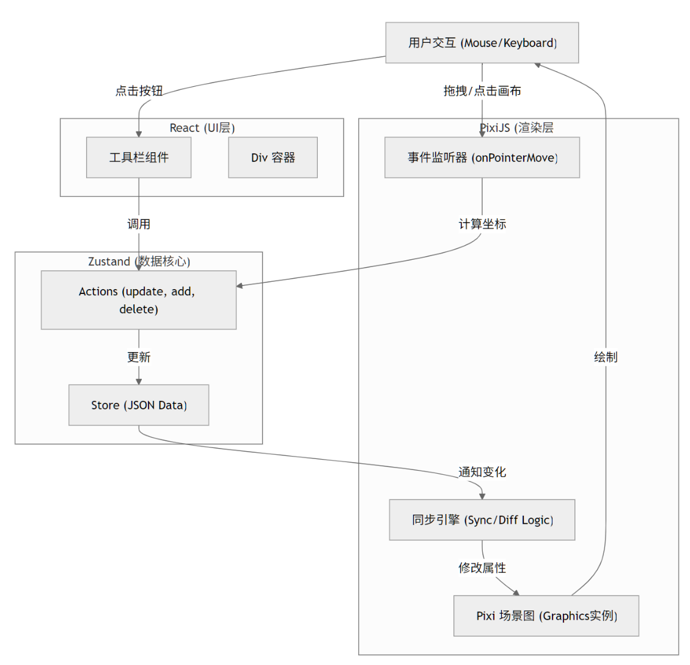
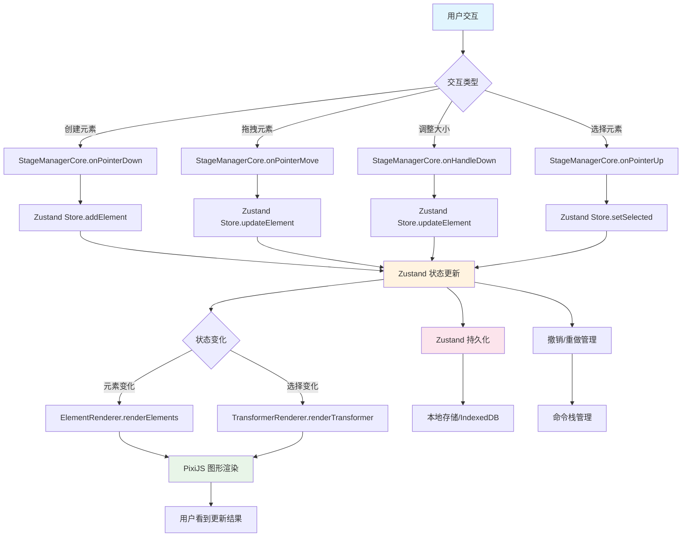

# BDdraw_DEV

现代协同 2D 画布编辑器 · React 18 + TypeScript + Vite + TailwindCSS + Zustand + PixiJS v8

#### 技术栈 · Tech Stack

                         

#### 运行项目

**frontend**

```bash
git clone git@github.com:Zhongye1/BDdraw_DEV.git

cd BDdraw_DEV (进入项目)
bun install (安装依赖包)
bun start (启动服务)
```

**backend**

```bash
cd BDdraw_DEV/ALD_Backend/
bun install #安装依赖
bun index.ts  #启动后端服务
```

推荐使用 bun 包管理器，见个人博客

[关于包管理器 npm,pnpm,yarn 和 bun 以及我为何选择后者](https://zhongye1.github.io/Arknight-notes/posts/15722.html)

#### Docker 部署

项目支持通过 Docker 进行容器化部署，使用 Node 22 和 Bun 包管理器。

**开发环境部署：**

```bash
docker-compose up -d
```

**生产环境部署：**

```bash
docker-compose -f docker-compose.prod.yml up -d
```

部署完成后，可以通过以下地址访问：

- 前端应用: http://localhost:5000/BDdraw_DEV/
- 后端 API 文档: http://localhost:3000/swagger-ui

#### 整体架构设计

项目采用了模块化的架构设计，将不同的功能划分为独立的模块，以方便后续维护和扩展

## 特性

- 60 FPS 渲染（得益于 PixiJS WebGL）
- 完整撤销/重做（Command Pattern + 防抖快照）
- 多元素选择与群组操作
- 画布元素变换控制器
- 富文本所见即所得编辑（WanngEditor + PIXI.HTMLText）
- 图片插入 + 内置滤镜（模糊、亮度、灰度等）
- 插件式元素系统
- 插件式元素系统
- 完整的 TypeScript 类型支持
- 现代开发体验（Vite + ESLint + Prettier + Husky）
- 集成 GitHub-Actions 支持， 实现每次 push 到 main 分支后，GitHub 自动构建 → 自动发布页面的操作

---

### 技术选型

这时候需要简单做一个技术选型分析，根据任务拆解，选择了如下技术栈

**【框架】**【技术方案：采用 React 18 + TypeScript 5 构建应用，React 提供完整的 UI 生态，TypeScript 提供更清晰可靠的类型安全，相比 JavaScript 更易于维护】

**【构建工具】**【技术方案：使用 Vite 5 作为构建工具，其开发服务器启动和热模块替换（HMR）速度明显快于 Webpack】

**【路由】**【技术方案：采用 React Router DOM 6 实现路由管理，API 稳定且文档完善】

**【样式】**【技术方案：使用 Tailwind CSS 3 + PostCSS 处理样式，开发时编写样式更快，生产环境会自动进行 tree-shaking 优化，相比 CSS Modules 和 styled-components 更高效且原子化更直观，对 AI 工具友好】

**【样式扩展】**【技术方案：少量使用 Less 覆盖 Tailwind 主题变量，保持兼容性】

**【SVG 处理】**【技术方案：使用 SVGR 1.5 处理 SVG，Vite 原生支持，可以将 SVG 作为 React 组件使用，比直接使用 SVG 或 SVG sprite 更灵活】

**【UI 组件库】**【技术方案：采用 shadcn/ui（latest）和 Arco Design 2 实现 UI 组件，易于使用，符合字节项目使用字节组件库的习惯】

**【全局状态】**【技术方案：采用 Zustand 4 管理全局状态，API 简洁、性能良好且无样板代码，相比 Redux Toolkit、Pinia、Jotai 代码量更少且配有 Devtools】

**【图形/画布】**【技术方案：使用 PixiJS 8 + pixi-viewport 实现图形和画布功能，基于 WebGL 渲染，适合处理大量精灵元素，相比其他可选方案性能更高】

**【富文本编辑器】**【技术方案：采用 WangEditor 5 作为富文本编辑器，轻量且文档和社区均为中文，相比 Slate/TipTap 等编辑器，默认输出的 HTML 可直接给 PixiJS HTMLText 进行渲染】

**【图标】**【技术方案：使用 Lucide React 图标库，图标数量多、风格统一且支持 Tree-shaking】

**【工具库】**【技术方案：采用 nanoid 3 为画布元素生成唯一标识符等操作，轻量实用】

**【代码质量】**【技术方案：使用 ESLint + Stylelint + Prettier + Husky + lint-staged + commitlint 保证团队代码风格一致，这是中大型项目的基本配置，有利于多人协作开发】

此外，还配置了 react 开发者工具 react-dev-inspector，配置了一下，开发环境下 ctrl+q 可以实现点击页面上的组件，在 VSCode 中自动跳转到对应文件，并定位到对应行号，方便调试（先前写 vue 也用过类似的）

项目 https://react-dev-inspector.zthxxx.me/docs

### 功能要素和方案

分析以上需求，查阅相关资料后，进行各个核心模块的技术方案选型，确定初步实现方案

**【基础渲染引擎】**【技术方案：PixiJS v8（WebGL）提供高性能 2D 渲染，根据不同元素类型创建对应的 Pixi 对象（图形、文本、图像），通过 pixi-viewport 实现无限画布的视口控制，支持缩放、拖拽等交互】

**【无限画布视口】**【技术方案：pixi-viewport（内置 zoom、drag、decelerate、clampZoom）库创建无限画布，在 StageManagerCore.ts 中初始化 viewport，并添加拖拽、缩放等交互功能，支持鼠标中键拖拽画布、滚轮缩放等常见操作】

**【富文本编辑】**【技术方案：WangEditor 5 作为富文本编辑器，提供完整的文本编辑功能，编辑结果以 HTML 格式存储在元素的 text/string 属性中，元素使用 PixiJS 内置的 HTMLText 进行渲染实现富文本效果】

**【状态管理与数据结构】**【技术方案：Zustand 作为全局状态管理库，通过 structuredClone 函数手动创建状态快照，管理画布元素、选中状态、工具类型等，通过中间件监听状态变化并触发重渲染，在特定的 ts 中定义所有状态和操作方法】

**【图片上传显示与滤镜】**【技术方案：PixiJS 内置 Filter 系统包括 BlurFilter、ColorMatrixFilter（黑白、对比度、饱和度）实现图像处理效果，支持模糊、亮度调整、灰度等多种滤镜效果，在 ElementRenderer.ts 中根据元素的 filter 属性应用相应滤镜，支持 blur（模糊）、brightness（亮度）、grayscale（灰度）等滤镜类型】

**【选中与变换系统】**【技术方案：SelectionManager + TransformOverlay（8 个把手 + 旋转把手）实现变换控件渲染，支持单个元素选中和多个元素群组选中，提供 8 个控制点和 1 个旋转点进行变换操作，根据不同元素类型提供不同的控制方式】

**【旋转与组合嵌套】**【技术方案：每个元素维护自己的 matrix（局部矩阵），组合后父容器统一应用矩阵变换，支持多层级嵌套和复杂变换】

**【Minimap】**【技术方案：单独一个小的 Pixi.Application（共享 texture 缓存）实现缩略图功能，主画布所有容器使用 cacheAsBitmap 后生成低分辨率 texture，实时更新到小画布，视口框用一个半透明矩形表示在主画布中的位置】

**【元素永久缓存】**【技术方案：使用 spriteMap 来存储 PIXI 对象，元素更新时只修改属性并设置 container.dirty = true，而不是销毁重建，来解决拖拽中断、光标丢失、闪烁等问题】

**【辅助对齐线】**【技术方案：拖拽时实时遍历所有元素 bounds，计算对齐情况（水平/垂直/间距相等），差值<6px 就吸附并画蓝线，支持水平、垂直对齐以及等间距对齐等多种对齐方式，当距离小于阈值时自动吸附并对齐】

**【Undo/Redo】**【技术方案：Command Pattern + structuredClone 完整快照（每步 before/after）实现撤销/重做功能，通过管理命令栈（undo，redo 栈），使用 structuredClone 创建状态快照，记录操作前后的完整状态，来支持添加元素、删除元素、修改元素属性等操作的撤销/重做，针对拖拽和调整大小操作的命令生成逻辑可能还要具体再处理一套】

**【数据持久化与离线】**【技术方案：Zustand-persist + localForage（IndexedDB）实现数据持久化和离线使用，使用 Zustand 的持久化中间件保存状态，通过 localForage 将数据存储到 IndexedDB 中，实现数据的自动保存和恢复功能】

**【实时协同】**【技术方案：Y.js + y-websocket（或自己写 CRDT）+ Operation Transform 合并策略实现无冲突的实时协同编辑，通过 y-websocket 插件实现服务端同步（问的 AI），有个思路是把操作打给时间 tag，然后然后按时间合并】

---

#### 项目架构树

```sh
BDdraw_DEV/
├── ALD_Backend/                    # 后端服务目录
│   ├── src/                        # 后端源代码
│   │   ├── api/                    # API接口目录
│   │   │   ├── Room_management/    # 房间管理相关API
│   │   │   │   ├── types/          # 房间管理相关类型定义
│   │   │   │   │   ├── Room_CRUD_types.ts  # 房间增删改查类型定义
│   │   │   │   │   ├── Room_List_types.ts  # 房间列表类型定义
│   │   │   │   │   ├── Room_users_types.ts # 房间用户类型定义
│   │   │   │   │   └── index.ts            # 类型索引文件
│   │   │   │   ├── CORE.ts         # 核心房间管理逻辑
│   │   │   │   ├── Room_CRUD.ts    # 房间增删改查操作实现
│   │   │   │   ├── Room_List.ts    # 房间列表管理实现
│   │   │   │   └── Room_users.ts   # 房间用户管理实现
│   │   │   ├── USER_management/    # 用户管理相关API
│   │   │   │   ├── auth_API.ts     # 用户认证API实现
│   │   │   │   └── auth_API_types.ts  # 用户认证类型定义
│   │   │   └── index.ts            # API索引文件
│   │   ├── auth.ts                 # 认证模块实现
│   │   ├── collab.ts               # 协作功能模块实现
│   │   └── db.ts                   # 数据库连接和操作实现
│   ├── ARCHITECTURE.md             # 后端架构说明文档
│   ├── README.md                   # 后端说明文档
│   ├── index.ts                    # 后端服务入口文件
│   ├── package.json                # 后端依赖配置文件
│   └── tsconfig.json               # 后端TypeScript配置
├── src/                            # 前端源代码目录
│   ├── api/                        # 前端API客户端
│   │   ├── types/                  # API类型定义
│   │   │   ├── Room_management/    # 房间管理相关类型定义
│   │   │   │   ├── Room_CRUD_types.ts  # 房间增删改查类型定义
│   │   │   │   ├── Room_List_types.ts  # 房间列表类型定义
│   │   │   │   ├── Room_users_types.ts # 房间用户类型定义
│   │   │   │   └── index.ts            # 类型索引文件
│   │   │   ├── auth_API_types.ts   # 认证相关类型定义
│   │   │   └── index.ts            # API类型索引文件
│   │   ├── utils/                  # API工具函数
│   │   │   └── apiClient.ts        # API客户端工具
│   │   ├── apiService.ts           # API服务封装实现
│   │   └── index.ts                # API索引文件
│   ├── components/                 # React组件目录
│   │   ├── Richtext_editor/        # 富文本编辑器组件
│   │   │   ├── BottomTextEditor.tsx    # 底部文本编辑器实现
│   │   │   └── Richtext_editor.tsx     # 富文本编辑器主组件
│   │   ├── canvas_toolbar/         # 画布工具栏组件
│   │   │   ├── ContextMenu.tsx     # 上下文菜单实现
│   │   │   └── TopToolbar.tsx      # 顶部工具栏实现
│   │   ├── collaboration/          # 协作功能组件
│   │   │   ├── CollaboratorCursors.tsx # 协作者光标显示组件
│   │   │   └── RemoteSelectionLayer.tsx # 远程选择层组件
│   │   ├── error-page/             # 错误页面组件
│   │   │   └── index.tsx           # 错误页面实现
│   │   ├── header/                 # 页面头部组件
│   │   │   ├── contents/           # 头部内容组件
│   │   │   │   ├── ExportCanvasModal.tsx   # 导出画布模态框
│   │   │   │   └── StageManagerContext.tsx # 舞台管理上下文
│   │   │   └── index.tsx           # 头部组件入口
│   │   ├── image-insert-modal/     # 图片插入模态框组件
│   │   │   └── index.tsx           # 图片插入模态框实现
│   │   ├── layout/                 # 布局组件
│   │   │   └── index.tsx           # 布局组件实现
│   │   ├── minimap/                # 小地图组件
│   │   │   └── Minimap.tsx         # 小地图实现
│   │   ├── property-panel/         # 属性面板组件
│   │   │   └── index.tsx           # 属性面板实现
│   │   ├── settings/               # 设置组件
│   │   │   └── setting.tsx         # 设置组件实现
│   │   ├── ui/                     # 基础UI组件
│   │   │   ├── blackwhitebutton.tsx    # 黑白按钮组件
│   │   │   ├── button.tsx          # 按钮组件
│   │   │   ├── icon-circle.tsx     # 圆形图标组件
│   │   │   ├── icon-clear.tsx      # 清除图标组件
│   │   │   ├── icon-rect.tsx       # 矩形图标组件
│   │   │   ├── icon-select.tsx     # 选择图标组件
│   │   │   └── icon-triangle.tsx   # 三角形图标组件
│   │   ├── AnimatedRoutes.tsx      # 动画路由组件
│   │   ├── ParallaxBackground.tsx  # 视差背景组件
│   │   └── WipeTransition.tsx      # 擦除过渡动画组件
│   ├── hooks/                      # 自定义React Hooks
│   │   ├── use-localstorage-state.ts   # localStorage状态管理Hook
│   │   └── use_React_hotkeys_management.ts # 快捷键管理Hook
│   ├── lib/                        # 工具库和核心功能模块
│   │   ├── AddElementCommand.ts    # 添加元素命令实现
│   │   ├── RemoveElementCommand.ts # 删除元素命令实现
│   │   ├── UndoRedoManager.ts      # 撤销重做管理器实现
│   │   ├── UpdateElementCommand.ts # 更新元素命令实现
│   │   ├── UpdateElementPropertyCommand.ts # 更新元素属性命令实现
│   │   ├── constants.ts            # 常量定义文件
│   │   ├── env.ts                  # 环境变量配置
│   │   ├── minimapUtils.ts         # 小地图工具函数
│   │   └── utils.ts                # 通用工具函数
│   ├── pages/                      # 页面组件目录
│   │   ├── auth/                   # 认证相关页面
│   │   │   ├── Login.tsx           # 登录页面实现
│   │   │   └── Register.tsx        # 注册页面实现
│   │   ├── canvas/                 # 画布主页面
│   │   │   ├── Pixi_STM_modules/   # Pixi.js状态管理模块
│   │   │   │   ├── core/           # 核心类和初始化逻辑
│   │   │   │   │   ├── Core_StageManager.ts    # 核心舞台管理器
│   │   │   │   │   ├── ElementRender.ts        # 元素渲染器
│   │   │   │   │   ├── TF_controler_Renderer.ts # 变换控制器渲染器
│   │   │   │   │   └── types.ts                # 核心类型定义
│   │   │   │   ├── interaction/    # 交互处理模块
│   │   │   │   │   ├── Base_InteractionHandler.ts   # 基础交互处理器
│   │   │   │   │   └── Stage_InteractionHandler.ts  # 舞台交互处理器
│   │   │   │   ├── shared/         # 共享类型定义
│   │   │   │   │   └── types.ts    # 共享类型定义文件
│   │   │   │   ├── utils/          # 工具函数目录
│   │   │   │   │   ├── commandUtils.ts      # 命令工具函数
│   │   │   │   │   ├── cursorUtils.ts       # 光标工具函数
│   │   │   │   │   ├── destroyUtils.ts      # 销毁工具函数
│   │   │   │   │   ├── dragUtils.ts         # 拖拽工具函数
│   │   │   │   │   ├── drawingUtils.ts      # 绘图工具函数
│   │   │   │   │   ├── eraserUtils.ts       # 橡皮擦工具函数
│   │   │   │   │   ├── geometryUtils.ts     # 几何工具函数
│   │   │   │   │   ├── guidelineUtils.ts    # 辅助线工具函数
│   │   │   │   │   ├── interactionUtils.ts  # 交互工具函数
│   │   │   │   │   ├── renderUtils.ts       # 渲染工具函数
│   │   │   │   │   ├── resizeUtils.ts       # 调整大小工具函数
│   │   │   │   │   ├── rotationUtils.ts     # 旋转工具函数
│   │   │   │   │   ├── scaleUtils.ts        # 缩放工具函数
│   │   │   │   │   ├── selectionUtils.ts    # 选择工具函数
│   │   │   │   │   └── stateUtils.ts        # 状态工具函数
│   │   │   │   └── STM_modules.md  # 状态管理模块说明文档
│   │   │   ├── Pixi_stageManager.ts    # Pixi舞台管理器入口
│   │   │   └── index.tsx           # 画布页面入口文件
│   │   ├── home/                   # 主页
│   │   │   ├── contents/           # 主页内容组件
│   │   │   │   └── AKN.tsx         # AKN内容组件
│   │   │   └── index.tsx           # 主页入口文件
│   │   ├── intro/                  # 介绍页面
│   │   │   └── index.tsx           # 介绍页面实现
│   │   └── room/                   # 房间管理页面
│   │       └── RoomManagement.tsx  # 房间管理页面实现
│   ├── router/                     # 路由配置目录
│   │   └── router.tsx              # 路由配置实现
│   ├── stores/                     # 状态存储目录(Zustand)
│   │   ├── canvasStore.ts          # 画布状态存储
│   │   ├── persistenceStore.ts     # 持久化状态存储
│   │   └── themeStore.ts           # 主题状态存储
│   ├── app.tsx                     # 应用根组件
│   ├── main.tsx                    # 应用入口文件
│   └── vite-env.d.ts               # Vite环境声明文件
├── README.md                       # 项目说明文档
├── components.json                 # 组件配置文件
├── index.html                      # HTML入口文件
├── lint-staged.config.js           # Lint-staged配置
├── package.json                    # 项目依赖和脚本配置
├── postcss.config.js               # PostCSS配置
├── tailwind.config.js              # Tailwind CSS配置
├── transmart.config.ts             # Transmart配置
├── tsconfig.json                   # TypeScript配置
├── tsconfig.node.json              # Node.js TypeScript配置
└── vite.config.ts                  # Vite构建配置
```

### 项目架构设计

项目采用数据驱动视图（Data-Driven View）模式，使用**React (UI) + Zustand (数据) + PixiJS (渲染)**的三层架构

React 只负责 UI 和事件入口
Zustand 是唯一的真实数据源（纯 JSON，可持久化、可协同）
PixiJS 层只做"渲染 + 交互计算"，所有对象永久缓存（Map），绝不每帧重建
所有变换（拖拽、缩放、旋转、组合）都在 Pixi 层完成，最后再同步回 Zustand（单向数据流）

项目主要划分为三个层次：渲染层、状态管理层和逻辑层，来实现关注点分离，提高代码的可维护性和可扩展性。

#### **渲染层**

主要由 PixiJS (WebGL) 负责处理图形渲染，包括创建、更新和删除图形对象。这一层负责将状态管理层的数据转换为可视化的图形元素，并处理用户的交互操作，如拖拽、缩放和旋转等

#### **状态管理层**

采用 Zustand 管理 JSON 画布数据。
先定义一个 CanvasState 接口（JSON 数据结构，包含 id, type, x, y, width, height 等属性）

```ts
interface CanvasState {
  tool: ToolType // 当前工具类型
  elements: Record<string, CanvasElement> // 画布元素集合
  selectedIds: string[] // 选中元素ID列表
  editingId: string | null // 正在编辑的元素ID
  clipboard: CanvasElement[] | null // 剪贴板数据
  pasteOffset: number // 粘贴偏移计数
  currentStyle: {
    fill: string
    stroke: string
    strokeWidth: number
    // ... 其他样式属性
  }
}
```

使用 Zustand 状态管理库，其中 elements 被定义为 Record<string, CanvasElement>类型，表示一个以 id 为键，CanvasElement 为值的对象，用于存储画布上的所有元素。更新元素时使用 structuredClone 函数来克隆状态数据。后续持久化存储和撤销重做机制也是基于这一套状态管理来实现。这一层作为数据核心，主要维护画布上所有元素的状态信息，通过集中管理状态，确保了数据的一致性，便于后续的协同编辑和撤销重做功能的开发。

#### **逻辑层**

核心是 StageManagerCore 类，通过 StageManagerState 接口管理交互状态，包括当前交互模式、起始位置、当前元素 ID、初始元素状态等，处理多种交互模式：

```bash
idle - 空闲状态
panning - 画布平移
selecting - 选择元素
dragging - 拖拽元素
resizing - 调整元素大小
drawing - 绘制元素
texting - 文本编辑
erasing - 擦除元素
```

处理多种元素操作逻辑：

```bash
创建元素 - 根据不同工具类型创建相应元素
选择元素 - 支持单选和多选
拖拽元素 - 记录初始状态，计算偏移量
调整大小 - 通过控制手柄调整元素尺寸
删除元素 - 通过橡皮擦工具删除元素
```

通过这种方式来实现面向对象编程并封装业务逻辑，提高代码的可维护性，利用后续拓展

---

### 数据流程





流程如下：

#### 用户交互输入

所有用户交互事件由 StageManagerCore 处理
用户通过鼠标、键盘等方式与画布进行交互：

- 创建新元素（点击工具栏选择图形类型后在画布上绘制）
- 拖拽元素（选中元素后拖动）
- 调整元素大小（拖拽元素控制点）
- 选择元素（点击或框选元素）

#### 创建元素流程

1. 用户在画布上按下鼠标开始绘制
2. [onPointerDown]()捕获事件，创建新元素
3. 调用 Zustand store 的[addElement]()方法添加元素

> 创建元素时的中间状态要锁定撤销/重做管理器防止记录中间的一堆状态

#### 拖拽元素流程

1. 用户按下并拖动已选中的元素
2. [onPointerMove]()持续捕获鼠标移动事件
3. 实时调用 Zustand store 的[updateElement]()更新元素位置

> 拖拽元素时也是中间状态要锁定撤销/重做管理器防止记录中间的一堆状态

#### 调整大小流程

1. 用户拖拽元素的控制点（resize handle）
2. [onHandleDown]()捕获控制点拖拽事件
3. [onPointerMove]()计算缩放比例并更新元素大小
4. 调用 Zustand store 的[updateElement]()更新元素属性

> 调整元素大小时也是中间状态要锁定撤销/重做管理器防止记录中间的一堆状态

#### 交互结束处理

1. 用户释放鼠标按键，[onPointerUp]()处理交互结束,解锁撤销/重做管理器
2. 创建相应的命令（[UpdateElementCommand]()并添加到命令栈中
3. 清理临时状态

#### 状态更新

Zustand 作为全局状态管理器，处理所有状态更新：

1. **状态更新**：自定义一套[originalSet]()方法更新状态
2. **撤销/重做处理**：创建状态快照并生成命令对象
3. **状态订阅**：通知所有订阅者状态变化

#### 渲染更新

Zustand 状态变化触发 StageManagerCore 的订阅回调：

1. [ElementRenderer.renderElements]() 根据元素数据更新 PixiJS 图形对象
2. [TransformerRenderer.renderTransformer]() 更新选中元素的变换控制器
3. PixiJS 自动进行渲染

#### 撤销/重做管理

通过命令模式实现撤销/重做功能：

1. 每个操作生成对应的命令对象（[UpdateElementCommand]()、[SnapshotCommand]()等）
2. 命令对象保存操作前后的状态快照
3. 通过[UndoRedoManager]()管理命令栈，实现撤销和重做功能

> 目前 undo 栈 redo 栈有一些不能稳定复现的小概率触发的 bug，还在修

#### 数据持久化阶段

Zustand 状态变化同时触发数据持久化：

1. 状态通过[persist]()中间件自动保存到本地存储
2. 数据存储在 IndexedDB 中，来支持离线使用

> 这一块还在写

---

### 设计的相关考虑

**解耦**：渲染层、状态管理层和逻辑层相互独立，便于维护和扩展

**便于后续的协同编辑**：实现多人协同，要监听 WebSocket 消息，然后更新 Zustand Store。StageManager 可以去监听到 Store 的变化，并作出相应的渲染更新

**对撤销/重做的实现**：因为所有状态都在 Store 里，只需要保存/恢复 Store 的快照

**序列化/反序列化**：保存项目只需 JSON.stringify(store.elements)

#### 目前的问题

【待补充】

## 项目预览图

部署地址：https://zhongye1.github.io/BDdraw_DEV/


### 具体模块设计文档（见博客或项目/doc）

[前端项目构建 Vite + React + TypeScript + Tailwind CSS ](https://zhongye1.github.io/Arknight-notes/posts/39845.html)

[项目基本社交与技术选型说明](https://zhongye1.github.io/Arknight-notes/posts/17360.html)

[2025-11-23-canvas 项目相关-逻辑层 ](https://zhongye1.github.io/Arknight-notes/posts/62456.html)

[2025-11-23-canvas 项目相关-状态管理层 ](https://zhongye1.github.io/Arknight-notes/posts/61172.html)

[2025-11-23-canvas 项目相关-渲染层 ](https://zhongye1.github.io/Arknight-notes/posts/8350.html)

[2025-11-23-canvas 项目相关-图像编辑机制 ](https://zhongye1.github.io/Arknight-notes/posts/55740.html)

[2025-11-23-Undo/Redo 机制具体实现 ](https://zhongye1.github.io/Arknight-notes/posts/52694.html)

[2025-11-23-canvas 项目相关-工具栏选择机制 ](https://zhongye1.github.io/Arknight-notes/posts/36977.html)

[2025-11-23-canvas 项目相关-快捷键管理 ](https://zhongye1.github.io/Arknight-notes/posts/25119.html)

[2025-11-23-canvas 项目相关-画布元素控制调整机制 ](https://zhongye1.github.io/Arknight-notes/posts/38567.html)

[2025-11-23-canvas 项目相关-富文本文本元素处理机制 ](https://zhongye1.github.io/Arknight-notes/posts/61907.html)

[2025-11-23-canvas 项目相关-视口管理机制 ](https://zhongye1.github.io/Arknight-notes/posts/12486.html)

[2025-11-22-使用 GitHub Actions 自动部署基于 vite 的项目到 GitHub Pages ](https://zhongye1.github.io/Arknight-notes/posts/33040.html)

[2025-11-24-canvas 项目相关-TransformerRenderer](https://zhongye1.github.io/Arknight-notes/posts/46327.html)

[2025-11-24-canvas 项目相关-元素操作和打组机制实现](https://zhongye1.github.io/Arknight-notes/posts/54304.html)

### TODO 待补充的文档

~~图像编辑机制~~
~~Undo/Redo 机制具体实现~~
~~画布元素控制调整机制~~
~~富文本文本元素处理机制~~
~~性能优化~~
~~视口管理机制~~
~~快捷键管理~~
~~工具栏选择机制~~
~~性能优化方案~~

~~元素打组机制和元素操作机制~~

数据持久化设计
协同编辑设计

【待补充 2025.11.27】

---

### TODO

#### ~~【P0】基础渲染~~

- ~~支持图形渲染，需要支持至少 3 种不同图形，比如矩形、圆角矩形、圆形、三角形等。需要支持以下图形属性：~~
  - ~~背景色（background）~~
  - ~~边框宽度（border-width）~~
  - ~~边框颜色（border-color）~~
- ~~支持图片渲染，需要支持 png、jpeg 格式，支持设置三种简单滤镜~~
- ~~支持富文本文字渲染，需要支持以下文本属性：~~
  - ~~字体（font-family）~~
  - ~~字号（font-size）~~
  - ~~颜色（color）~~
  - ~~背景色（background）~~
  - ~~BIUS（加粗、斜体、下划线、删除线）~~

#### ~~【P0】画布交互~~

- ~~支持无限画布的缩放、滚动、拖拽~~
  - ~~支持无限画布滚动条~~
  - ~~支持无限画布的 minimap 功能~~
- ~~支持选区功能：~~
  - ~~点击选中单个元素~~
  - ~~框选选中多个元素~~
- ~~支持数据持久化，每次操作后自动保存数据，刷新页面数据仍然存在~~
- ~~快捷键复制选中元素~~
- ~~支持辅助线功能~~

#### ~~【P0】调参工具栏~~

- ~~浮动工具栏~~
  - ~~当选中文本元素时出现在上方，支持设置不同文本属性~~（做了个编辑器）
  - ~~当选中图形元素时出现在上方，支持设置不同图形属性~~
  - ~~选中文本元素的部分文字时也能够出现，支持设置局部文本的文本属性~~（编辑器内编辑可实现）

#### ~~【P0】元素编辑~~

- ~~支持双击文本进入编辑，可以输入/删除文本内容~~
- ~~支持对选中元素（单个或多个）删除~~
- ~~支持对选中元素（单个或多个）拖拽~~
- ~~支持对选中元素（单个或多个）缩放~~
- ~~支持对选中元素（单个或多个）旋转~~
- ~~支持对多个元素进行组合操作，组合可以嵌套~~
- ~~支持对多个元素进行打组、解组~~~~(组操作 bug 复现了，目前在修)~~（已修复）

#### ~~【P0】性能优化~~

- ~~画布存在 100 个元素，打开页面到渲染完成 < 3s~~
- ~~同时操作 100 个元素，FPS 50+~~

#### ~~【P1】协同~~

- ~~支持 undo & redo 操作~~ ~~（大体实现了，可能要修一下 undo，redo 栈，有个不能稳定复现的 bug）~~（已实现）
- ~~支持协同编辑，多人打开同一个画布可以协同编辑~~ (写了个 Node.js 后端)
- ~~支持离线编辑，断网后仍然可以对画布编辑，恢复网络后自动提交数据~~（IndexedDB）

> 各模块的技术文档补充中
> 此文档最后编辑于 2025.11.27 by wcx
> 项目开发中，欢迎提 issue 和 pr
