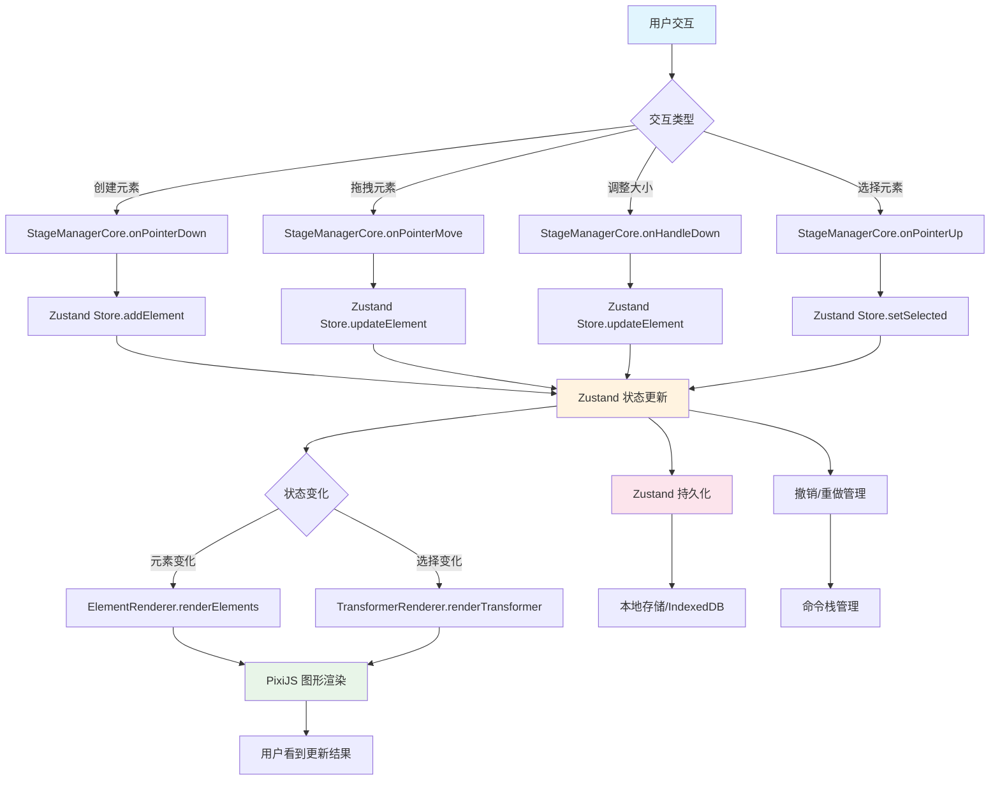

### DSF-MA

发了个任务要实现一个画布类产品对标 Excalidraw 和飞书 Slide 这种

库的话不允许使用 react-flow、tldraw、konva 等开源图形库，允许使用基础渲染库（pixi），局部功能使用三方库可接受，主要业务逻辑需自行实现，允许使用 Cursor/Trae 等 AI 编辑器，限制目前是这些

整理一份计划文稿具体拆解一下任务，如下所示

### 任务列表

#### 【P0】基础渲染

- 支持图形渲染，需要支持至少 3 种不同图形，比如矩形、圆角矩形、圆形、直线、箭头、菱形等。需要支持以下图形属性：
  - 背景色（background）
  - 边框宽度（border-width）
  - 边框颜色（border-color）
- 支持图片渲染，需要支持 png、jpeg 格式，支持设置三种简单滤镜
- 支持富文本文字渲染，需要支持以下文本属性：
  - 字体（font-family）
  - 字号（font-size）
  - 颜色（color）
  - 背景色（background）
  - BIUS（加粗、斜体、下划线、删除线）

#### 【P0】画布交互

- 支持无限画布的缩放、滚动、拖拽
  - 【挑战】支持无限画布滚动条
  - 【挑战】支持无限画布的 minimap 功能
- 支持选区功能：
  - **点击选中单个元素**
  - **框选选中多个元素**
- 支持数据持久化，每次操作后自动保存数据，刷新页面数据仍然存在
- 快捷键复制选中元素，粘贴后刷新页面还存在
- 【挑战】支持辅助线功能

#### 【P0】调参工具栏

- 浮动工具栏
  - 当选中文本元素时出现在上方，支持设置不同文本属性
  - 当选中图形元素时出现在上方，支持设置不同图形属性
  - 当选中图片元素时出现在上方，支持设置不同图片属性
  - 【挑战】选中文本元素的部分文字时也能够出现，支持设置局部文本的文本属性

#### 【P0】元素编辑

- 支持双击文本进入编辑，可以输入/删除文本内容
- 支持对选中元素（单个或多个）删除
- 支持对选中元素（单个或多个）拖拽
- 支持对选中元素（单个或多个）缩放
- 【挑战】支持对选中元素（单个或多个）旋转
- 【挑战】支持对多个元素进行组合操作，组合可以嵌套
- 【挑战】支持对多个元素进行打组、解组

#### 【P0】性能优化

- 画布存在 100 个元素，打开页面到渲染完成 < 3s
- 【挑战】同时操作 100 个元素，FPS 50+

#### 【P1】协同

- 【挑战】支持 undo & redo 操作
- 【挑战】支持协同编辑，多人打开同一个画布可以协同编辑
- 【挑战】支持离线编辑，断网后仍然可以对画布编辑，恢复网络后自动提交数据

### 技术选型

这时候需要简单做一个技术选型分析，根据任务拆解，选择了如下技术栈

**【框架】**【技术方案：采用 React 18 + TypeScript 5 构建应用，React 提供完整的 UI 生态，TypeScript 提供更清晰可靠的类型安全，相比 JavaScript 更易于维护】

**【构建工具】**【技术方案：使用 Vite 5 作为构建工具，其开发服务器启动和热模块替换（HMR）速度明显快于 Webpack】

**【路由】**【技术方案：采用 React Router DOM 6 实现路由管理，API 稳定且文档完善】

**【样式】**【技术方案：使用 Tailwind CSS 3 + PostCSS 处理样式，开发时编写样式更快，生产环境会自动进行 tree-shaking 优化，相比 CSS Modules 和 styled-components 更高效且原子化更直观，对 AI 工具友好】

**【样式扩展】**【技术方案：少量使用 Less 覆盖 Tailwind 主题变量，保持兼容性】

**【SVG 处理】**【技术方案：使用 SVGR 1.5 处理 SVG，Vite 原生支持，可以将 SVG 作为 React 组件使用，比直接使用 SVG 或 SVG sprite 更灵活】

**【UI 组件库】**【技术方案：采用 shadcn/ui（latest）和 Arco Design 2 实现 UI 组件，易于使用，符合字节项目使用字节组件库的习惯】

**【数据获取】**【技术方案：使用 TanStack Query v5 进行数据获取，具备自动缓存、后台重试、预取等功能，并配有 Devtools】

**【全局状态】**【技术方案：采用 Zustand 4 管理全局状态，API 简洁、性能良好且无样板代码，相比 Redux Toolkit、Pinia、Jotai 代码量更少且配有 Devtools】

**【图形/画布】**【技术方案：使用 PixiJS 8 + pixi-viewport 实现图形和画布功能，基于 WebGL 渲染，适合处理大量精灵元素，相比其他可选方案性能更高】

**【富文本编辑器】**【技术方案：采用 WangEditor 5 作为富文本编辑器，轻量且文档和社区均为中文，相比 Slate/TipTap 等编辑器，默认输出的 HTML 可直接给 PixiJS HTMLText 进行渲染】

**【图标】**【技术方案：使用 Lucide React 图标库，图标数量多、风格统一且支持 Tree-shaking】

**【工具库】**【技术方案：采用 nanoid 3 为画布元素生成唯一标识符等操作，轻量实用】

**【代码质量】**【技术方案：使用 ESLint + Stylelint + Prettier + Husky + lint-staged + commitlint 保证团队代码风格一致，这是中大型项目的基本配置，有利于多人协作开发】

此外，还配置了 react 开发者工具 react-dev-inspector，配置了一下，开发环境下 ctrl+q 可以实现点击页面上的组件，在 VSCode 中自动跳转到对应文件，并定位到对应行号，方便调试（先前写 vue 也用过类似的）

项目 https://react-dev-inspector.zthxxx.me/docs

### 功能要素和方案

分析以上需求，查阅相关资料后，进行各个核心模块的技术方案选型，确定初步实现方案

**【基础渲染引擎】**【技术方案：PixiJS v8（WebGL）提供高性能 2D 渲染，根据不同元素类型创建对应的 Pixi 对象（图形、文本、图像），通过 pixi-viewport 实现无限画布的视口控制，支持缩放、拖拽等交互】

**【无限画布视口】**【技术方案：pixi-viewport（内置 zoom、drag、decelerate、clampZoom）库创建无限画布，在 StageManagerCore.ts 中初始化 viewport，并添加拖拽、缩放等交互功能，支持鼠标中键拖拽画布、滚轮缩放等常见操作】

**【富文本编辑】**【技术方案：WangEditor 5 作为富文本编辑器，提供完整的文本编辑功能，编辑结果以 HTML 格式存储在元素的 text/string 属性中，元素使用 PixiJS 内置的 HTMLText 进行渲染实现富文本效果】

**【状态管理与数据结构】**【技术方案：Zustand 作为全局状态管理库，通过 structuredClone 函数手动创建状态快照，管理画布元素、选中状态、工具类型等，通过中间件监听状态变化并触发重渲染，在特定的 ts 中定义所有状态和操作方法】

**【图片上传显示与滤镜】**【技术方案：PixiJS 内置 Filter 系统包括 BlurFilter、ColorMatrixFilter（黑白、对比度、饱和度）实现图像处理效果，支持模糊、亮度调整、灰度等多种滤镜效果，在 ElementRenderer.ts 中根据元素的 filter 属性应用相应滤镜，支持 blur（模糊）、brightness（亮度）、grayscale（灰度）等滤镜类型】

**【选中与变换系统】**【技术方案：SelectionManager + TransformOverlay（8 个把手 + 旋转把手）实现变换控件渲染，支持单个元素选中和多个元素群组选中，提供 8 个控制点和 1 个旋转点进行变换操作，根据不同元素类型提供不同的控制方式】

**【旋转与组合嵌套】**【技术方案：每个元素维护自己的 matrix（局部矩阵），组合后父容器统一应用矩阵变换，支持多层级嵌套和复杂变换】

**【Minimap】**【技术方案：单独一个小的 Pixi.Application（共享 texture 缓存）实现缩略图功能，主画布所有容器使用 cacheAsBitmap 后生成低分辨率 texture，实时更新到小画布，视口框用一个半透明矩形表示在主画布中的位置】

**【元素永久缓存】**【技术方案：使用 spriteMap 来存储 PIXI 对象，元素更新时只修改属性并设置 container.dirty = true，而不是销毁重建，来解决拖拽中断、光标丢失、闪烁等问题】

**【辅助对齐线】**【技术方案：拖拽时实时遍历所有元素 bounds，计算对齐情况（水平/垂直/间距相等），差值<6px 就吸附并画蓝线，支持水平、垂直对齐以及等间距对齐等多种对齐方式，当距离小于阈值时自动吸附并对齐】

**【Undo/Redo】**【技术方案：Command Pattern + structuredClone 完整快照（每步 before/after）实现撤销/重做功能，通过管理命令栈（undo，redo 栈），使用 structuredClone 创建状态快照，记录操作前后的完整状态，来支持添加元素、删除元素、修改元素属性等操作的撤销/重做，针对拖拽和调整大小操作的命令生成逻辑可能还要具体再处理一套】

**【数据持久化与离线】**【技术方案：Zustand-persist + localForage（IndexedDB）实现数据持久化和离线使用，使用 Zustand 的持久化中间件保存状态，通过 localForage 将数据存储到 IndexedDB 中，实现数据的自动保存和恢复功能】

**【实时协同】**【技术方案：Y.js + y-websocket（或自己写 CRDT）+ Operation Transform 合并策略实现无冲突的实时协同编辑，通过 y-websocket 插件实现服务端同步（问的 AI），有个思路是把操作打给时间 tag，然后然后按时间合并】

---

### 项目架构设计

项目采用数据驱动视图（Data-Driven View）模式，使用**React (UI) + Zustand (数据) + PixiJS (渲染)**的三层架构

React 只负责 UI 和事件入口
Zustand 是唯一的真实数据源（纯 JSON，可持久化、可协同）
PixiJS 层只做"渲染 + 交互计算"，所有对象永久缓存（Map），绝不每帧重建
所有变换（拖拽、缩放、旋转、组合）都在 Pixi 层完成，最后再同步回 Zustand（单向数据流）

项目主要划分为三个层次：渲染层、状态管理层和逻辑层，来实现关注点分离，提高代码的可维护性和可扩展性。

#### **渲染层**

主要由 PixiJS (WebGL) 负责处理图形渲染，包括创建、更新和删除图形对象。这一层负责将状态管理层的数据转换为可视化的图形元素，并处理用户的交互操作，如拖拽、缩放和旋转等

#### **状态管理层**

采用 Zustand 管理 JSON 画布数据。
先定义一个 CanvasState 接口（JSON 数据结构，包含 id, type, x, y, width, height 等属性）

```ts
interface CanvasState {
  tool: ToolType // 当前工具类型
  elements: Record<string, CanvasElement> // 画布元素集合
  selectedIds: string[] // 选中元素ID列表
  editingId: string | null // 正在编辑的元素ID
  clipboard: CanvasElement[] | null // 剪贴板数据
  pasteOffset: number // 粘贴偏移计数
  currentStyle: {
    fill: string
    stroke: string
    strokeWidth: number
    // ... 其他样式属性
  }
}
```

使用 Zustand 状态管理库，其中 elements 被定义为 Record<string, CanvasElement>类型，表示一个以 id 为键，CanvasElement 为值的对象，用于存储画布上的所有元素。更新元素时使用 structuredClone 函数来克隆状态数据。后续持久化存储和撤销重做机制也是基于这一套状态管理来实现。这一层作为数据核心，主要维护画布上所有元素的状态信息，通过集中管理状态，确保了数据的一致性，便于后续的协同编辑和撤销重做功能的开发。

#### **逻辑层**

核心是 StageManagerCore 类，通过 StageManagerState 接口管理交互状态，包括当前交互模式、起始位置、当前元素 ID、初始元素状态等，处理多种交互模式：

```bash
idle - 空闲状态
panning - 画布平移
selecting - 选择元素
dragging - 拖拽元素
resizing - 调整元素大小
drawing - 绘制元素
texting - 文本编辑
erasing - 擦除元素
```

处理多种元素操作逻辑：

```bash
创建元素 - 根据不同工具类型创建相应元素
选择元素 - 支持单选和多选
拖拽元素 - 记录初始状态，计算偏移量
调整大小 - 通过控制手柄调整元素尺寸
删除元素 - 通过橡皮擦工具删除元素
```

通过这种方式来实现面向对象编程并封装业务逻辑，提高代码的可维护性，利用后续拓展

---

### 数据流程




流程如下：

#### 用户交互输入

所有用户交互事件由 StageManagerCore 处理
用户通过鼠标、键盘等方式与画布进行交互：

- 创建新元素（点击工具栏选择图形类型后在画布上绘制）
- 拖拽元素（选中元素后拖动）
- 调整元素大小（拖拽元素控制点）
- 选择元素（点击或框选元素）

#### 创建元素流程

1. 用户在画布上按下鼠标开始绘制
2. [onPointerDown]()捕获事件，创建新元素
3. 调用 Zustand store 的[addElement]()方法添加元素

> 创建元素时的中间状态要锁定撤销/重做管理器防止记录中间的一堆状态

#### 拖拽元素流程

1. 用户按下并拖动已选中的元素
2. [onPointerMove]()持续捕获鼠标移动事件
3. 实时调用 Zustand store 的[updateElement]()更新元素位置

> 拖拽元素时也是中间状态要锁定撤销/重做管理器防止记录中间的一堆状态

#### 调整大小流程

1. 用户拖拽元素的控制点（resize handle）
2. [onHandleDown]()捕获控制点拖拽事件
3. [onPointerMove]()计算缩放比例并更新元素大小
4. 调用 Zustand store 的[updateElement]()更新元素属性

> 调整元素大小时也是中间状态要锁定撤销/重做管理器防止记录中间的一堆状态

#### 交互结束处理

1. 用户释放鼠标按键，[onPointerUp]()处理交互结束,解锁撤销/重做管理器
2. 创建相应的命令（[UpdateElementCommand]()并添加到命令栈中
3. 清理临时状态

#### 状态更新

Zustand 作为全局状态管理器，处理所有状态更新：

1. **状态更新**：自定义一套[originalSet]()方法更新状态
2. **撤销/重做处理**：创建状态快照并生成命令对象
3. **状态订阅**：通知所有订阅者状态变化

#### 渲染更新

Zustand 状态变化触发 StageManagerCore 的订阅回调：

1. [ElementRenderer.renderElements]() 根据元素数据更新 PixiJS 图形对象
2. [TransformerRenderer.renderTransformer]() 更新选中元素的变换控制器
3. PixiJS 自动进行渲染

#### 撤销/重做管理

通过命令模式实现撤销/重做功能：

1. 每个操作生成对应的命令对象（[UpdateElementCommand]()、[SnapshotCommand]()等）
2. 命令对象保存操作前后的状态快照
3. 通过[UndoRedoManager]()管理命令栈，实现撤销和重做功能

> 目前 undo 栈 redo 栈有一些不能稳定复现的小概率触发的 bug，还在修

#### 数据持久化阶段

Zustand 状态变化同时触发数据持久化：

1. 状态通过[persist]()中间件自动保存到本地存储
2. 数据存储在 IndexedDB 中，来支持离线使用

> 这一块还在写

---

### 设计的相关考虑

**解耦**：渲染层、状态管理层和逻辑层相互独立，便于维护和扩展

**便于后续的协同编辑**：实现多人协同，要监听 WebSocket 消息，然后更新 Zustand Store。StageManager 可以去监听到 Store 的变化，并作出相应的渲染更新

**对撤销/重做的实现**：因为所有状态都在 Store 里，只需要保存/恢复 Store 的快照

**序列化/反序列化**：保存项目只需 JSON.stringify(store.elements)

#### 目前的问题

【待补充】

### 项目预览图


### 具体模块设计文档

【待补充】

---

### 参考

1. React 官方文档 [https://react.dev](https://react.dev/)
2. TypeScript 官方文档 [https://www.typescriptlang.org](https://www.typescriptlang.org/)
3. Vite 官方文档 [https://vitejs.dev](https://vitejs.dev/)
4. React Router 官方文档 [https://reactrouter.com](https://reactrouter.com/)
5. Tailwind CSS 3 官方文档 [https://tailwindcss.com](https://tailwindcss.com/)
6. Zustand 官方文档 https://docs.pmnd.rs/zustand
7. PixiJS 官方文档 https://pixijs.download/release/docs
8. pixi-viewport 官方文档 + 示例 https://davidfig.github.io/pixi-viewport/
9. WangEditor 5 官方文档（中文） https://www.wangeditor.com/v5/
10. ESLint 官方文档 [https://eslint.org](https://eslint.org/)
11. Prettier 官方文档 [https://prettier.io](https://prettier.io/)
12. Husky 官方文档 https://typicode.github.io/husky
13. commitlint 官方文档 [https://commitlint.js.org](https://commitlint.js.org/)
14. Y.js 官方文档（实时协同） [https://docs.yjs.dev](https://docs.yjs.dev/)
15. Excalidraw 主仓库（白板核心） https://github.com/excalidraw/excalidraw
16. Excalidraw-room（多人协作服务端） https://github.com/excalidraw/excalidraw-room
17. react-dev-inspector https://github.com/zthxxx/react-dev-inspector
18. localForage https://github.com/localForage/localForage
19. PixiJS 官方示例合集 https://pixijs.download/release/examples
20. Quilljou/vite-react-ts-tailwind-starter（优秀脚手架） https://github.com/Quilljou/vite-react-ts-tailwind-starter

**其他参考文章**

1. 前端研发链路之脚手架 - 阿里云开发者社区 https://developer.aliyun.com/article/1624016
2. Excalidraw 案例研究：成功应用与最佳实践 - CSDN https://blog.csdn.net/gitblog_00992/article/details/151003851
3. 产品经理：客户想要个画板，你们前端能不能做？ | 学习笔记 https://wang1xiang.github.io/blog/docs/work/excalidraw-use.html#缺点
4. 从手绘到架构：Excalidraw React 组件设计的优雅实践 - CSDN https://blog.csdn.net/gitblog_00090/article/details/150998508
5. Arco Design - 企业级产品设计与开发解决方案 https://arco.design/
6. 开发者工具 | TanStack Query React 文档 https://tanstack.com.cn/query/latest/docs/framework/react/devtools
7. react-dev-inspector 使用指南（踩坑） - 掘金 https://juejin.cn/post/6904438522749386759
8. React 状态管理终极指南：深挖 Redux、Zustand 与 MobX 的生存法则（2025） - 掘金 https://juejin.cn/post/7475715128682217509
9. [pixi.js] 刚学 pixi.js 做记录 创建应用 添加图片精灵 - CSDN https://blog.csdn.net/towrabbit/article/details/82465109
10. zustand-pub（跨应用/跨框架状态管理及共享） https://awesomedevin.github.io/zustand-vue/docs/introduce/start/zustand-pub
11. 从 v6 升级 | React Router 中文文档 https://reactrouter.remix.org.cn/upgrading/v6
12. Chrome 插件：Redux DevTools 让你的状态管理调试更高效 - 知乎 https://zhuanlan.zhihu.com/p/716637376
13. devtools | zustand 中文网 https://zustand.vscing.com/docs/middlewares/devtools
14. 优势 | wangEditor https://www.wangeditor.com/v5/
