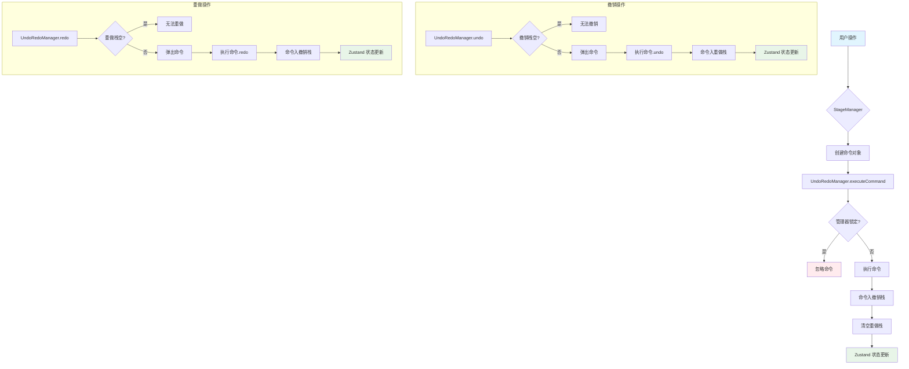
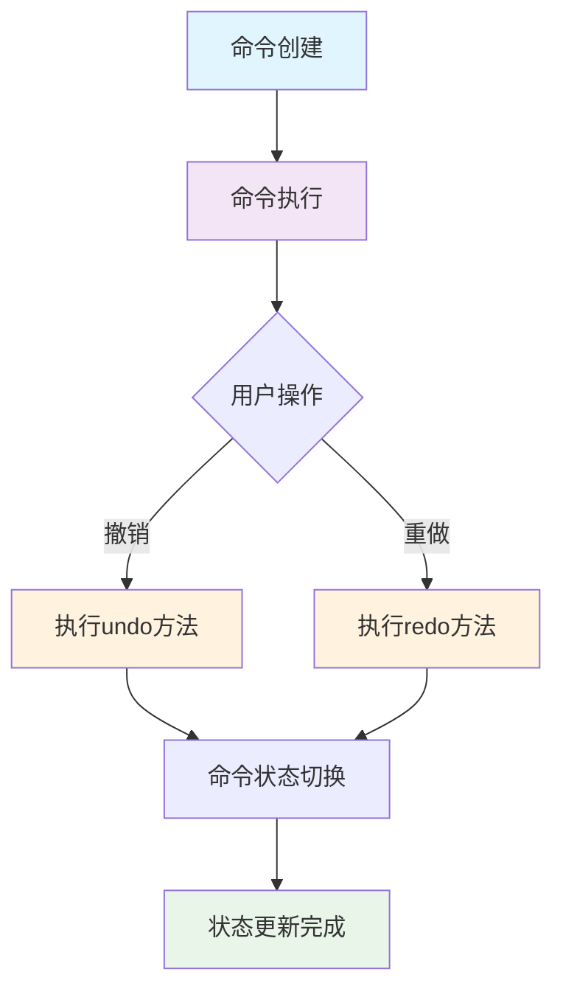
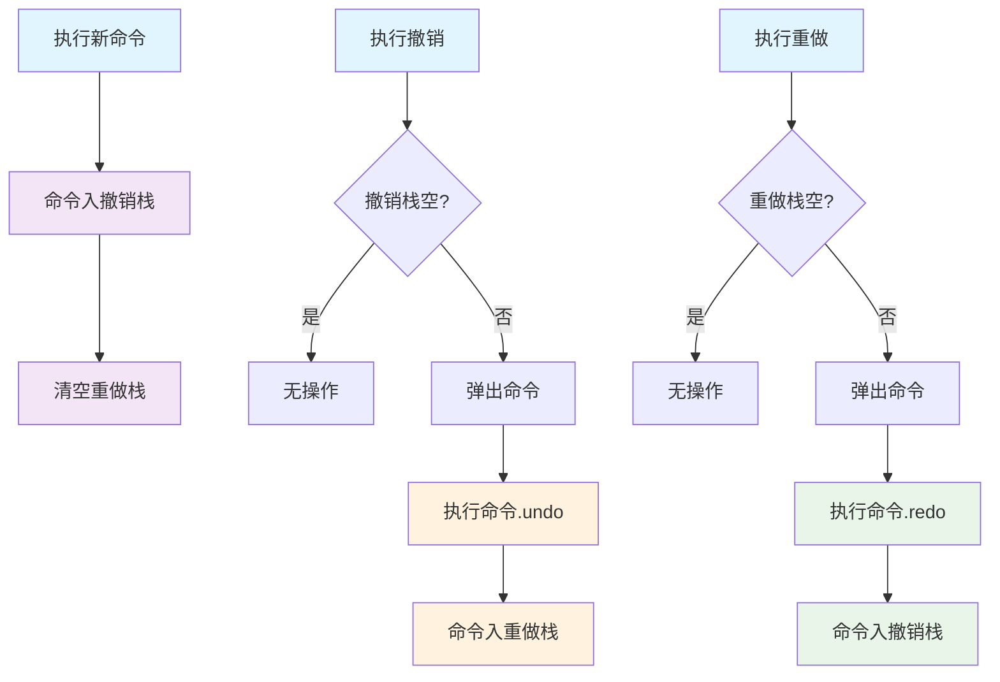
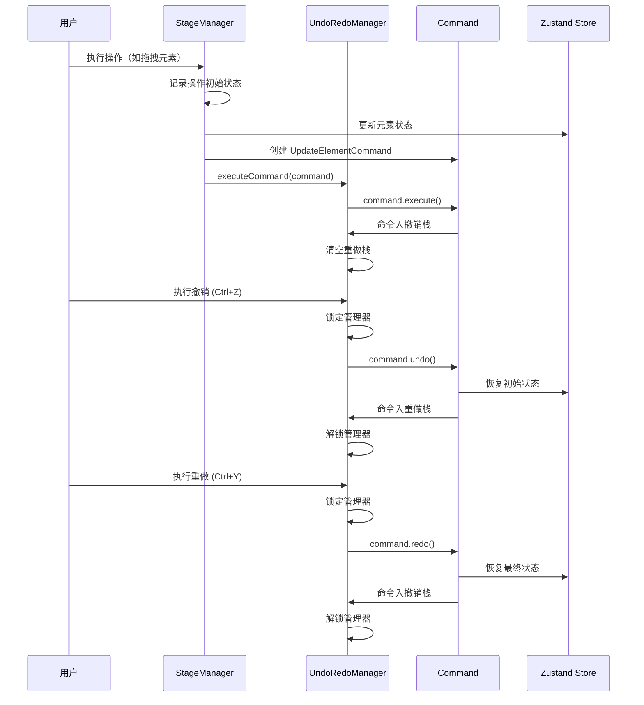
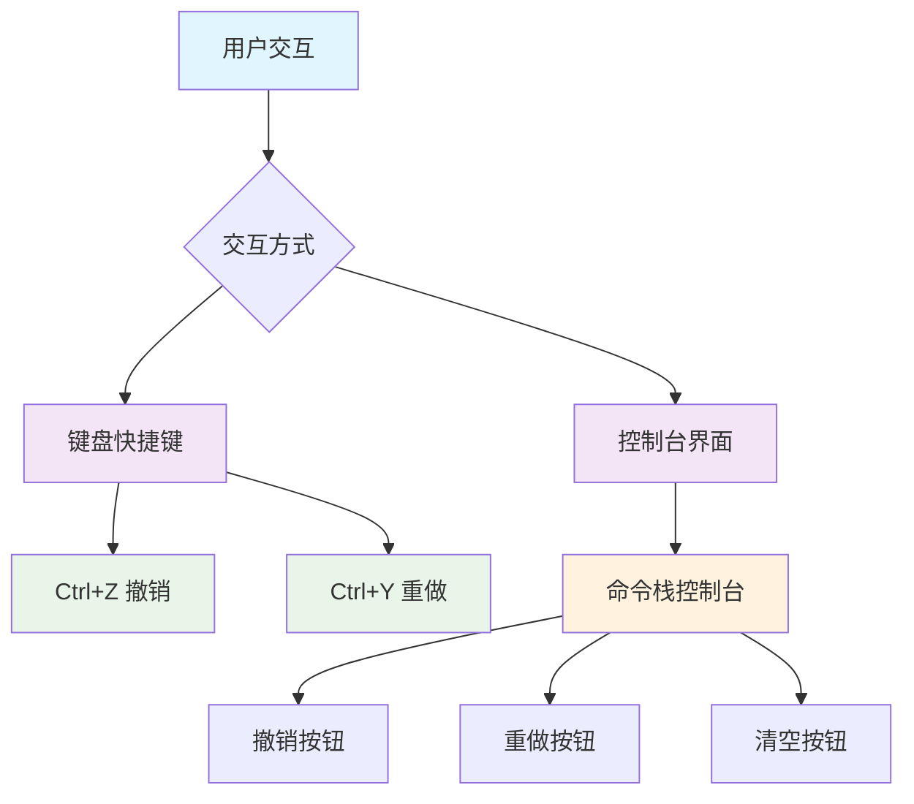

### 1. 模块摘要 (Executive Summary)

Undo/Redo 机制是画布应用中实现操作撤销和重做的核心功能模块。它基于命令模式（Command Pattern）实现来，管理操作历史、执行撤销/重做操作和防止操作冲突，通过维护撤销栈和重做栈来管理用户的操作历史。

- **项目结构树**：

  ```bash
  src/
  ├── lib/
  │   ├── UndoRedoManager.ts        # 撤销重做管理器核心实现
  │   └── UpdateElementCommand.ts   # 元素更新命令实现
  └── stores/
      └── canvasStore.ts            # 状态存储，命令操作的目标
  ```

  - `Command Pattern`：设计模式，用于封装操作命令
  - `Zustand`：状态管理库，作为命令操作的目标
  - `TypeScript`：提供类型安全和代码可维护性

### 2. Props 和相关类型定义

#### 2.1 UndoRedoManager 核心方法

撤销重做管理器提供了一系列核心方法用于管理操作命令。

| 方法名         | 参数             | 返回值  | 描述                       |
| -------------- | ---------------- | ------- | -------------------------- |
| executeCommand | command: Command | void    | 执行并记录命令             |
| undo           | 无               | void    | 执行撤销操作               |
| redo           | 无               | void    | 执行重做操作               |
| lock           | 无               | void    | 锁定管理器，防止记录新命令 |
| unlock         | 无               | void    | 解锁管理器                 |
| isLocked       | 无               | boolean | 检查管理器是否被锁定       |
| canUndo        | 无               | boolean | 检查是否可以撤销           |
| canRedo        | 无               | boolean | 检查是否可以重做           |

#### 2.2 核心类型定义

**[Command](/src/lib/UndoRedoManager.ts#L3-L7) 接口**：
定义了命令对象必须实现的方法。

```typescript
export interface Command {
  execute(): void // 执行命令
  undo(): void // 撤销命令
  redo(): void // 重做命令
}
```

**UpdateOperation 接口**：
定义了元素更新操作的数据结构。

```typescript
interface UpdateOperation {
  id: string // 元素ID
  initialAttrs: Partial<CanvasElement> // 修改前的属性
  finalAttrs: Partial<CanvasElement> // 修改后的属性
}
```

### 3. 核心状态管理 (State Architecture)

> ⚠️ 为防止在执行撤销/重做操作时记录新的命令，系统实现了锁定机制。在执行命令时会先锁定管理器，执行完成后再解锁，确保操作的原子性。

#### 3.1 内部状态 (Local State)

UndoRedoManager 维护以下内部状态用于管理操作历史：

| 状态名    | 类型      | 描述                                 |
| --------- | --------- | ------------------------------------ |
| undoStack | Command[] | 撤销命令栈，存储可以撤销的命令       |
| redoStack | Command[] | 重做命令栈，存储可以重做的命令       |
| locked    | boolean   | 锁定状态，防止在执行命令时记录新命令 |

#### 3.2 外部状态 (Global/Server State)

Undo/Redo 机制通过 Zustand 状态管理库操作外部状态：

| 状态名   | 类型                          | 描述                             |
| -------- | ----------------------------- | -------------------------------- |
| elements | Record<string, CanvasElement> | 所有画布元素数据，命令操作的目标 |

#### 3.3 状态同步机制



### 4. 命令管理机制

Undo/Redo 机制采用命令模式（Command Pattern）来管理操作命令，通过定义统一的接口和不同的实现类来处理各种操作。

#### 4.1 命令类型

系统中主要有两种命令类型：

1. **快照命令（SnapshotCommand）**：用于记录整个画布状态的变化，通常用于添加元素、删除元素等较大范围的操作，保存完整的状态快照

2. **更新元素命令（UpdateElementCommand）**：用于记录特定元素的属性变化，主要用于拖拽移动和调整大小操作，只保存相关元素的特定属性变化

#### 4.2 命令接口定义

所有命令都实现统一的 [Command](/src/lib/UndoRedoManager.ts#L3-L7) 接口：

```typescript
export interface Command {
  execute(): void // 执行命令
  undo(): void // 撤销命令
  redo(): void // 重做命令
}
```

#### 4.3 快照命令（SnapshotCommand）

快照命令用于记录整个画布状态的变化，适用于影响范围较大的操作。

**核心实现**：

```typescript
export class SnapshotCommand implements Command {
  private prevState: any
  private nextState: any
  private commandId: number
  private type: string

  constructor(prevState: any, nextState: any, type: any) {
    // 使用 structuredClone 进行深拷贝，确保状态隔离
    this.prevState = structuredClone(prevState)
    this.nextState = structuredClone(nextState)
    this.type = type
    // 生成唯一的命令ID用于调试
    this.commandId = Date.now() % 1000000
  }

  execute(): void {
    // execute在添加到命令栈之前已经执行了
  }

  undo(): void {
    // 恢复到之前的状态
    useStore.setState(this.prevState)
  }

  redo(): void {
    // 恢复到之后的状态
    useStore.setState(this.nextState)
  }
}
```

#### 4.4 更新元素命令（UpdateElementCommand）

更新元素命令用于记录特定元素的属性变化，适用于影响范围较小的精细操作。

**核心实现**：

```typescript
interface UpdateOperation {
  id: string
  initialAttrs: Partial<CanvasElement> // 修改前的属性
  finalAttrs: Partial<CanvasElement> // 修改后的属性
}

export class UpdateElementCommand implements Command {
  private commandId: string

  constructor(private operations: UpdateOperation[], private operationType: string = '更新元素') {
    // 生成唯一命令ID
    this.commandId = `UpdateElementCommand-${Math.random().toString(36).slice(2, 11)}`
  }

  execute(): void {
    // 应用最终状态
    const updates: Record<string, Partial<CanvasElement>> = {}
    this.operations.forEach((op) => {
      updates[op.id] = op.finalAttrs
    })

    useStore.setState((state) => {
      const newElements = { ...state.elements }
      Object.entries(updates).forEach(([id, attrs]) => {
        if (newElements[id]) newElements[id] = { ...newElements[id], ...attrs }
      })
      return { elements: newElements }
    })
  }

  undo(): void {
    // 撤销：恢复到 initialAttrs
    const updates: Record<string, Partial<CanvasElement>> = {}
    this.operations.forEach((op) => {
      updates[op.id] = op.initialAttrs
    })

    useStore.setState((state) => {
      const newElements = { ...state.elements }
      Object.entries(updates).forEach(([id, attrs]) => {
        if (newElements[id]) newElements[id] = { ...newElements[id], ...attrs }
      })
      return { elements: newElements }
    })
  }

  redo(): void {
    // 重做：恢复到 finalAttrs
    const updates: Record<string, Partial<CanvasElement>> = {}
    this.operations.forEach((op) => {
      updates[op.id] = op.finalAttrs
    })

    useStore.setState((state) => {
      const newElements = { ...state.elements }
      Object.entries(updates).forEach(([id, attrs]) => {
        if (newElements[id]) newElements[id] = { ...newElements[id], ...attrs }
      })
      return { elements: newElements }
    })
  }
}
```

#### 4.5 命令生命周期

命令的生命周期包括创建、执行、撤销和重做四个阶段：



### 5. 命令栈管理机制

撤销/重做机制使用两个栈来管理命令历史：

1. **撤销栈（Undo Stack）**：

存储用户可以撤销的操作命令，栈顶是最近执行的命令，执行新命令时，命令被推入此栈，执行撤销操作时，命令从此栈弹出并推入重做栈

2. **重做栈（Redo Stack）**：

存储用户可以重做的操作命令，在执行撤销操作时，被撤销的命令被推入此栈，执行重做操作时，命令从此栈弹出并推入撤销栈，执行新命令时，此栈被清空

#### 5.1 命令栈操作流程



#### 5.2 不同类型的命令

撤销栈中并不全是快照命令。系统中至少有两种不同类型的命令：

1. **快照命令（SnapshotCommand）**：

   - 用于记录整个画布状态的变化
   - 通常用于添加元素、删除元素等较大范围的操作
   - 保存完整的状态快照

2. **更新元素命令（UpdateElementCommand）**：
   - 用于记录特定元素的属性变化
   - 主要用于拖拽移动和调整大小操作
   - 只保存相关元素的特定属性变化

#### 5.3 操作序列和撤销栈状态变化示例

##### 初始状态

撤销栈：空  
重做栈：空

##### 1. 创建元素 A

当创建元素 A 时，系统会生成一个快照命令，记录整个画布状态的变化。  
撤销栈：[SnapshotCommand_A] (大小: 1)  
重做栈：空

##### 2. 移动 A 到一个位置

当移动元素 A 时，系统会生成一个更新元素命令（UpdateElementCommand），只记录 A 元素位置的变化。  
撤销栈：[SnapshotCommand_A, UpdateElementCommand_MoveA] (大小: 2)  
重做栈：空

##### 3. 创建元素 B

当创建元素 B 时，系统会生成另一个快照命令，记录添加 B 元素后的状态。  
撤销栈：[SnapshotCommand_A, UpdateElementCommand_MoveA, SnapshotCommand_B] (大小: 3)  
重做栈：空

##### 4. 缩放 B 到一个位置

当缩放元素 B 时，系统会生成一个更新元素命令，记录 B 元素尺寸和位置的变化。  
撤销栈：[SnapshotCommand_A, UpdateElementCommand_MoveA, SnapshotCommand_B, UpdateElementCommand_ResizeB] (大小: 4)  
重做栈：空

##### 5. 移动 B 到一个位置

当再次移动元素 B 时，系统会生成另一个更新元素命令，记录 B 元素位置的新变化。  
撤销栈：[SnapshotCommand_A, UpdateElementCommand_MoveA, SnapshotCommand_B, UpdateElementCommand_ResizeB, UpdateElementCommand_MoveB] (大小: 5)  
重做栈：空

#### 5.4 执行撤销操作时的状态变化

##### 第一次撤销（移动 B 操作）

1. 从撤销栈弹出最后一个命令：UpdateElementCommand_MoveB
2. 执行该命令的 undo()方法，将 B 元素恢复到缩放后的位置
3. 将该命令推入重做栈

撤销栈：[SnapshotCommand_A, UpdateElementCommand_MoveA, SnapshotCommand_B, UpdateElementCommand_ResizeB] (大小: 4)  
重做栈：[UpdateElementCommand_MoveB] (大小: 1)

##### 第二次撤销（缩放 B 操作）

1. 从撤销栈弹出最后一个命令：UpdateElementCommand_ResizeB
2. 执行该命令的 undo()方法，将 B 元素恢复到刚创建时的尺寸和位置
3. 将该命令推入重做栈

撤销栈：[SnapshotCommand_A, UpdateElementCommand_MoveA, SnapshotCommand_B] (大小: 3)  
重做栈：[UpdateElementCommand_MoveB, UpdateElementCommand_ResizeB] (大小: 2)

##### 第三次撤销（创建 B 操作）

1. 从撤销栈弹出最后一个命令：SnapshotCommand_B
2. 执行该命令的 undo()方法，将整个画布状态恢复到创建 B 之前的状态（即只包含 A 元素的状态）
3. 将该命令推入重做栈

撤销栈：[SnapshotCommand_A, UpdateElementCommand_MoveA] (大小: 2)  
重做栈：[UpdateElementCommand_MoveB, UpdateElementCommand_ResizeB, SnapshotCommand_B] (大小: 3)

##### 第四次撤销（移动 A 操作）

1. 从撤销栈弹出最后一个命令：UpdateElementCommand_MoveA
2. 执行该命令的 undo()方法，将 A 元素恢复到初始位置
3. 将该命令推入重做栈

撤销栈：[SnapshotCommand_A] (大小: 1)  
重做栈：[UpdateElementCommand_MoveB, UpdateElementCommand_ResizeB, SnapshotCommand_B, UpdateElementCommand_MoveA] (大小: 4)

##### 第五次撤销（创建 A 操作）

1. 从撤销栈弹出最后一个命令：SnapshotCommand_A
2. 执行该命令的 undo()方法，将整个画布状态恢复到初始状态（空画布）
3. 将该命令推入重做栈

撤销栈：空  
重做栈：[UpdateElementCommand_MoveB, UpdateElementCommand_ResizeB, SnapshotCommand_B, UpdateElementCommand_MoveA, SnapshotCommand_A] (大小: 5)

### 6. 逻辑流程 (Logic Flow)

#### 6.1 交互时序图 (Mermaid)



#### 6.2 核心函数解析

**executeCommand 函数**：当用户完成一个操作（如创建、更新、删除元素）时触发，执行命令并将命令添加到撤销栈，同时清空重做栈

```typescript
executeCommand(command: Command) {
  if (this.locked) {
    // 如果管理器被锁定，忽略命令
    return
  }

  // 执行命令
  command.execute()

  // 将命令添加到撤销栈
  this.undoStack.push(command)

  // 清空重做栈
  this.redoStack = []
}
```

**undo 函数**：当用户执行撤销操作（如按 Ctrl+Z）时触发，从撤销栈弹出命令，执行命令的 undo 方法，并将命令放入重做栈

```typescript
undo() {
  if (this.undoStack.length === 0) {
    // 撤销栈为空，无法撤销
    return
  }

  this.lock()  // 锁定管理器
  const command = this.undoStack.pop()!  // 弹出命令
  command.undo()  // 执行撤销
  this.redoStack.push(command)  // 命令入重做栈
  this.unlock()  // 解锁管理器
}
```

**redo 函数**：当用户执行重做操作（如按 Ctrl+Y）时触发，从重做栈弹出命令，执行命令的 redo 方法，并将命令放入撤销栈

```typescript
redo() {
  if (this.redoStack.length === 0) {
    // 重做栈为空，无法重做
    return
  }

  this.lock()  // 锁定管理器
  const command = this.redoStack.pop()!  // 弹出命令
  command.redo()  // 执行重做
  this.undoStack.push(command)  // 命令入撤销栈
  this.unlock()  // 解锁管理器
}
```

### 7. UI 与样式实现 (UI Implementation)

Undo/Redo 机制通过快捷键和控制台界面与用户交互：


