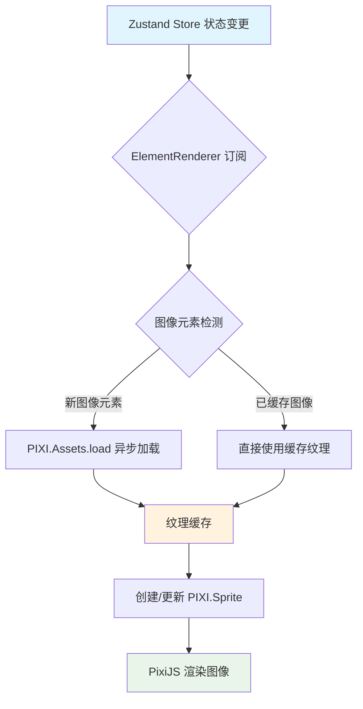
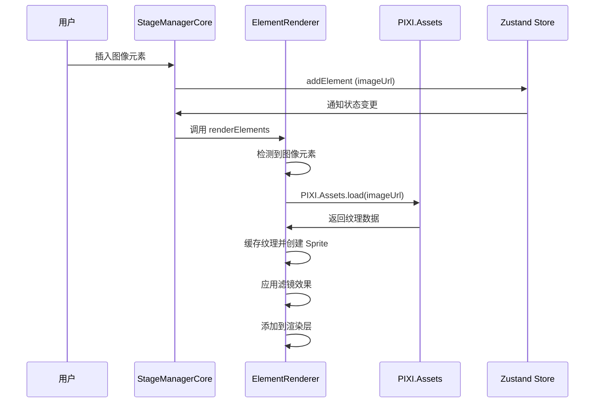
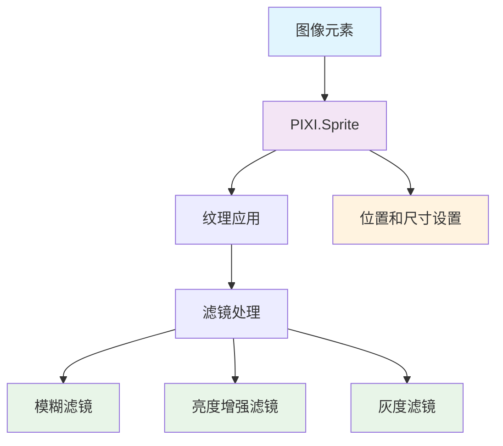

### 1. 模块摘要 (Executive Summary)

图像编辑机制是画布应用中处理图片元素显示、加载和交互的核心模块，处理图像元素的加载、渲染、滤镜应用和内存管理。它通过 ElementRenderer 类实现，主要负责图片资源的异步加载、纹理缓存管理、滤镜效果应用以及图像元素的渲染更新。

- **项目结构树**：

  ```bash
  src/
  └── pages/
      └── canvas/
          └── Pixi_STM_modules/
              └── rendering/
                  └── ElementRenderer.ts    # 图像渲染核心实现
  ```

  - `PixiJS`：WebGL 渲染引擎，提供图像渲染和滤镜支持
  - `PIXI.Assets`：资源加载系统，用于异步加载图像资源
  - `PIXI.Sprite`：用于显示图像的显示对象
  - `PIXI.Filter`：图像滤镜系统，支持模糊、亮度、灰度等效果

### 2. Props 和相关类型定义

#### 2.1 ElementRenderer.renderElements 参数

图像渲染通过 [renderElements](\src\pages\canvas\Pixi_STM_modules\rendering\ElementRenderer.ts#L57-L157) 方法实现。

| 参数名       | 类型                          | 必填 | 默认值 | 描述                       |
| ------------ | ----------------------------- | ---- | ------ | -------------------------- |
| elements     | Record<string, CanvasElement> | 是   | 无     | 包含所有画布元素的数据对象 |
| elementLayer | PIXI.Container                | 是   | 无     | 用于承载所有可视元素的容器 |
| destroyed    | boolean                       | 是   | false  | 标识组件是否已被销毁       |

```typescript
// 在 StageManagerCore.ts 中调用图像渲染
this.elementRenderer.renderElements(state.elements, this.elementLayer, this.state.destroyed)
```

#### 2.2 核心类型定义

**[CanvasElement](\src\pages\canvas\Pixi_STM_modules\core\types.ts#L15-L15) 图像相关属性**：
定义了图像元素特有的属性。

```typescript
interface CanvasElement {
  // ... 其他通用属性
  type: 'image' // 元素类型为图像
  imageUrl?: string // 图像资源 URL
  filter?: 'none' | 'blur' | 'brightness' | 'grayscale' // 图像滤镜
}
```

### 3. 核心状态管理 (State Architecture)

#### 3.1 内部状态 (Local State)

图像编辑机制维护以下内部状态用于优化性能和管理资源：

| 状态名            | 类型                                                  | 描述                                    |
| ----------------- | ----------------------------------------------------- | --------------------------------------- |
| spriteMap         | Map<string, PIXI.Graphics \| HTMLText \| PIXI.Sprite> | 存储元素 ID 到 PIXI 显示对象的映射      |
| textureCache      | Map<string, PIXI.Texture>                             | 图片纹理缓存，避免重复加载相同图片      |
| loadingSet        | Set<string>                                           | 正在加载中的图片 URL 集合，防止重复加载 |
| imageUpdateTimers | Map<string, NodeJS.Timeout>                           | 图像元素更新检查定时器映射              |

#### 3.2 外部状态 (Global/Server State)

图像编辑机制通过 Zustand 状态管理库订阅外部状态：

| 状态名   | 类型                          | 描述                           |
| -------- | ----------------------------- | ------------------------------ |
| elements | Record<string, CanvasElement> | 所有画布元素数据，包括图像元素 |

#### 3.3 状态同步机制



### 4. 逻辑流程 (Logic Flow)

#### 4.1 交互时序图 (Mermaid)



#### 4.2 核心函数解析

**图像加载与渲染函数**：当画布中添加或更新图像元素时触发，检查纹理缓存，如未缓存则异步加载图像资源，加载完成后创建 PIXI.Sprite 并应用滤镜

```typescript
// 处理 Image 类型元素
if (data.type === 'image' && data.imageUrl) {
  // 检查纹理缓存
  const texture = this.textureCache.get(data.imageUrl)

  if (!texture) {
    // 未缓存，异步加载
    if (!this.loadingSet.has(data.imageUrl)) {
      this.loadingSet.add(data.imageUrl)

      PIXI.Assets.load(data.imageUrl)
        .then((loadedTexture) => {
          // 加载完成，存入缓存
          this.textureCache.set(data.imageUrl, loadedTexture)
          this.loadingSet.delete(data.imageUrl)

          // 创建 Sprite 并应用滤镜
          const sprite = new PIXI.Sprite(loadedTexture)
          // ... 应用滤镜逻辑
        })
        .catch((err) => {
          // 处理加载错误
          this.loadingSet.delete(data.imageUrl)
        })
    }
  } else {
    // 已缓存，直接使用
    const sprite = new PIXI.Sprite(texture)
    // ... 应用滤镜逻辑
  }
}
```

- **特殊处理**:
  1. **纹理缓存**：避免重复加载相同图像资源
  2. **加载状态管理**：防止同一图像的重复加载请求
  3. **占位符**：在图像加载过程中显示占位符
  4. **滤镜**：支持模糊、亮度增强、灰度三种滤镜效果
  5. **内存管理**：及时清理不再使用的纹理和定时器

### 5. UI 与样式实现 (UI Implementation)

图像编辑机制通过 PIXI.Sprite 实现图像显示，并支持多种滤镜效果：



1. **模糊滤镜**：使用 PIXI.BlurFilter 实现
2. **亮度增强滤镜**：使用 PIXI.ColorMatrixFilter 的 brightness 方法实现
3. **灰度滤镜**：使用 PIXI.ColorMatrixFilter 的 grayscale 方法实现

> 图像元素采用异步加载机制，在网络较慢或图像较大时可能会出现短暂的占位符显示
