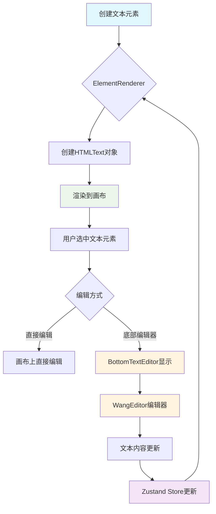
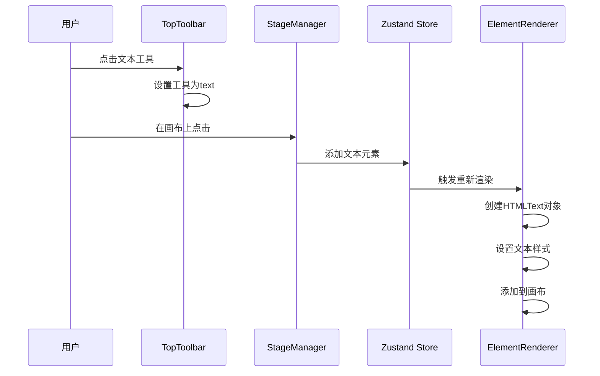
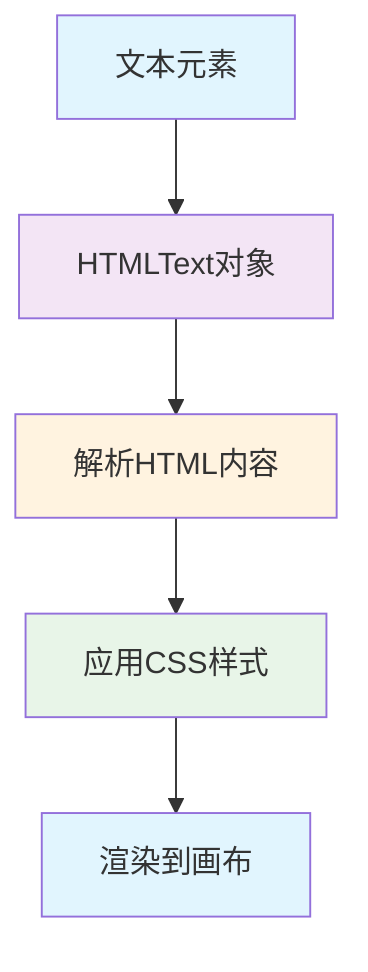

### 1. 模块摘要 (Executive Summary)

富文本文本元素处理机制是画布应用中实现文本元素创建、编辑和渲染的核心功能模块。它结合了 WangEditor 5 富文本编辑器和 PixiJS 的 HTMLText 组件，实现了所见即所得的文本编辑体验。用户可以通过工具栏创建文本元素，在画布上直接选中编辑，或通过底部的富文本编辑器进行详细编辑。

- **项目结构树**：

  ```bash
  src/
  ├── components/
  │   ├── Richtext_editor/
  │   │   ├── Richtext_editor.tsx      # 富文本编辑器组件
  │   │   └── BottomTextEditor.tsx     # 底部文本编辑器
  └── pages/
      └── canvas/
          └── Pixi_STM_modules/
              └── rendering/
                  └── ElementRenderer.ts   # 文本元素渲染器
  ```

  - `WangEditor 5`：富文本编辑器，提供文本编辑功能
  - `PIXI.HTMLText`：PixiJS 组件，用于在画布上渲染 HTML 文本
  - `Zustand`：状态管理，存储文本元素数据

### 2. 文本处理机制类型定义

#### 2.1 CanvasElement 文本相关属性

CanvasElement 接口中与文本相关的属性定义：

```typescript
interface CanvasElement {
  // ... 其他通用属性
  type: 'text' // 元素类型为文本
  text?: string // 存储 HTML 字符串
  fontSize?: number // 字体大小
  fontFamily?: string // 字体族
  textAlign?: 'left' | 'center' | 'right' // 文本对齐方式
}
```

#### 2.2 富文本编辑器组件 Props

富文本编辑器组件的属性定义：

| 属性名    | 类型                    | 必填 | 描述                      |
| --------- | ----------------------- | ---- | ------------------------- |
| value     | string                  | 是   | 当前文本内容（HTML 格式） |
| onChange  | (value: string) => void | 是   | 文本内容变化回调          |
| className | string                  | 否   | 自定义 CSS 类名           |

### 3. 文本处理机制架构

#### 3.1 内部状态 (Local State)

文本处理机制涉及多个组件的内部状态：

| 组件             | 状态名    | 类型                            | 描述                             |
| ---------------- | --------- | ------------------------------- | -------------------------------- |
| BottomTextEditor | localHtml | string                          | 本地中间状态，用于解决输入法冲突 |
| ElementRenderer  | spriteMap | Map<string, PIXI.DisplayObject> | 元素 ID 到显示对象的映射         |
| RichTextEditor   | editor    | IDomEditor                      | WangEditor 编辑器实例            |

#### 3.2 外部依赖 (External Dependencies)

文本处理机制依赖以下外部组件：

| 组件          | 类型            | 描述               |
| ------------- | --------------- | ------------------ |
| Zustand Store | CanvasState     | 存储文本元素数据   |
| PixiJS        | HTMLText        | 渲染文本元素       |
| WangEditor    | Editor, Toolbar | 提供富文本编辑功能 |

#### 3.3 文本处理流程



### 4. 文本元素处理流程

#### 4.1 文本元素创建

用户可以通过工具栏创建文本元素：



#### 4.2 文本元素渲染

ElementRenderer 负责将文本元素数据渲染为可视化的 HTMLText 对象：

```typescript
// 处理 Text 类型 (HTMLText)
if (data.type === 'text') {
  // 创建或更新 HTMLText 对象
  if (!graphic) {
    graphic = new HTMLText({
      text: '',
      style: {
        wordWrap: true,
        breakWords: true,
      },
    })
    // 设置标签和事件模式
    graphic.label = id
    graphic.eventMode = 'static'
    graphic.cursor = 'move'
    elementLayer.addChild(graphic)
    this.spriteMap.set(id, graphic)
  }

  const textObj = graphic as HTMLText

  // 设置文本内容
  const htmlContent = data.text || '<span style="color:#cccccc">请输入文本</span>'
  if (textObj.text !== htmlContent) {
    textObj.text = htmlContent
  }

  // 设置样式
  textObj.style = {
    wordWrap: true,
    wordWrapWidth: data.width || 400,
    fontSize: data.fontSize || 20,
    fontFamily: data.fontFamily || 'Arial',
    fill: data.fill || '#000000',
    align: data.textAlign || 'left',
    cssOverrides: ['p { margin: 0; padding: 0; }', 'span { display: inline; }'],
  }

  textObj.position.set(data.x, data.y)
}
```

#### 4.3 文本编辑处理


当用户选中文本元素时，底部自动显示富文本编辑器，使用编辑功能时编辑内容实时同步到 Zustand Store
用户可以直接在画布上选中文本元素进行位置调整，也可以用变换控制器调整文本元素的尺寸和位置

### 5. 核心组件解析

#### 5.1 ElementRenderer 文本渲染

ElementRenderer 负责将文本元素数据渲染为可视化的 HTMLText 对象：

当画布元素数据发生变更时触发，检查是否存在对应的 HTMLText 对象，如不存在则创建，否则更新其内容和样式

```typescript
// 处理 Text 类型元素
else if (data.type === 'text') {
  // 如果之前的 sprite 不是 HTMLText，销毁重建
  if (graphic && !(graphic instanceof HTMLText)) {
    elementLayer.removeChild(graphic)
    graphic.destroy({ children: true })
    graphic = undefined
  }

  if (!graphic) {
    // 创建 HTMLText
    graphic = new HTMLText({
      text: '',
      style: {
        wordWrap: true,
        breakWords: true,
      },
    })
    // ... 设置属性
  }

  const textObj = graphic as HTMLText
  // 更新文本内容和样式
}
```

#### 5.2 BottomTextEditor 底部编辑器

BottomTextEditor 是一个 React 组件，当用户选中文本元素时自动显示在底部：

当 Zustand Store 中的 selectedIds 变化且选中单个文本元素时显示，监听选中元素变化，同步元素文本内容到本地状态，通过 WangEditor 编辑后更新 Store

```typescript
// 当选中元素改变时，同步 Store 的值到本地状态
useEffect(() => {
  if (element && element.type === 'text') {
    setLocalHtml(element.text || '')
  }
}, [element?.id, element?.text])

const handleChange = (html: string) => {
  setLocalHtml(html)
  // 实时更新 Store，驱动 Canvas 重新渲染
  updateElement(element.id, { text: html })
}
```

#### 5.3 RichTextEditor 富文本编辑器

RichTextEditor 封装了 WangEditor 的功能，提供富文本编辑功能，包括加粗、斜体、下划线、字体、颜色等
通过 toolbarConfig 和 editorConfig 配置编辑器功能

```typescript
// 工具栏配置：仅保留基础文本样式
const toolbarConfig: Partial<IToolbarConfig> = {
  toolbarKeys: [
    'bold',
    'italic',
    'underline',
    'through',
    '|',
    'fontSize',
    'fontFamily',
    'color',
    'bgColor',
    '|',
    'justifyLeft',
    'justifyCenter',
    'justifyRight',
    '|',
    'undo',
    'redo',
  ],
}
```

### 6. UI 与 文本渲染样式实现

文本元素通过 PIXI.HTMLText 渲染，支持 HTML 标签和内联样式：




