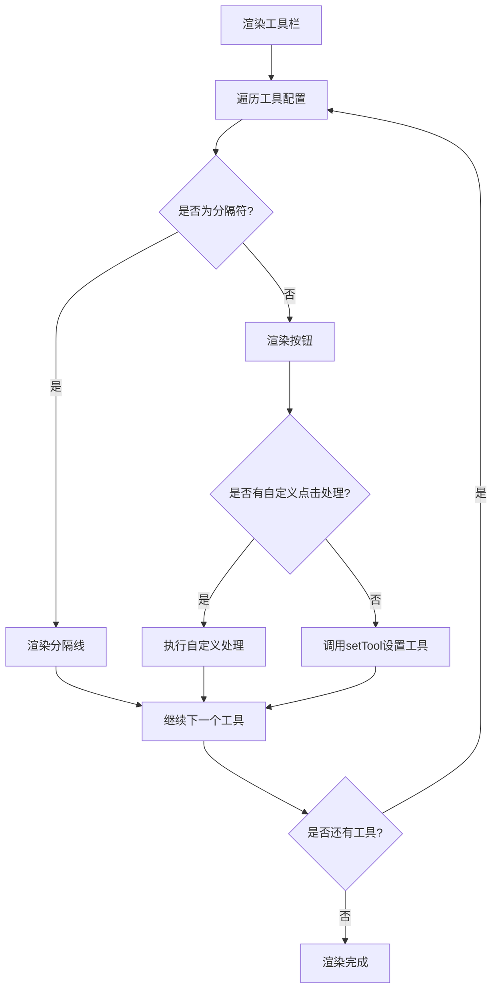

# 项目工具栏模块

工具栏提供用户界面以选择和切换不同的绘图工具，使用户能够在画布上执行各种操作，如选择、绘制、添加文本、插入图片等。它是用户与画布交互的主要入口之一。

### 1.2 结构

```
src/
├── components/
│   └── canvas_toolbar/
│       └── TopToolbar.tsx        # 顶部工具栏组件
├── stores/
│   └── canvasStore.ts            # 全局状态管理，包含工具类型定义和切换方法
└── pages/
    └── canvas/
        └── Pixi_STM_modules/
            └── core/
                └── StageManagerCore.ts  # 根据工具类型处理不同交互逻辑
```

### 1.3 DSF

- React：用于构建用户界面
- TypeScript：提供类型安全
- Zustand：全局状态管理
- Tailwind CSS：样式设计
- Lucide React：图标组件库

## 2. 类型定义

### 2.1 工具类型定义

在 [canvasStore.ts](/src/stores/canvasStore.ts) 中定义了完整的工具类型：

```typescript
export type ToolType =
  | 'select'
  | 'hand'
  | 'rect'
  | 'circle'
  | 'triangle'
  | 'diamond'
  | 'line'
  | 'arrow'
  | 'pencil'
  | 'text'
  | 'image'
  | 'eraser'
```

在 [TopToolbar.tsx](/src/components/canvas_toolbar/TopToolbar.tsx) 中也有一个局部的工具类型定义，但略有不同：

```typescript
type ToolType =
  | 'select'
  | 'hand'
  | 'rect'
  | 'diamond'
  | 'circle'
  | 'arrow'
  | 'line'
  | 'pencil'
  | 'text'
  | 'image'
  | 'eraser'
```

附：[TopToolbar.tsx](/src/components/canvas_toolbar/TopToolbar.tsx) 中没有定义 `triangle` 类型，这个某天会改

### 2.2 工具配置项定义

在 [TopToolbar.tsx](/src/components/canvas_toolbar/TopToolbar.tsx) 中定义了工具配置项接口：

```typescript
interface ToolItemConfig {
  type: ToolType | 'action' // action 代表锁、库等非绘图工具
  icon: React.ElementType
  label: string // 用于 tooltip
  value?: string // store 中的 tool 值
  shortcut?: string // 右下角快捷键提示
  isSeparator?: boolean // 是否是分隔符
}
```

## 3. 状态管理

工具栏选择机制的核心状态存储在 canvasStore 中：

```typescript
interface CanvasState {
  tool: ToolType // 当前选中的工具类型
  // ... 其他状态
}
```

工具切换方法：

```typescript
setTool: (tool: ToolType) => void
```

## 4. 工具分类与实现逻辑

### 4.1 工具分类

BDdraw 项目中的工具可以分为以下几类：

1. **导航与选择工具**

   - 手形工具（hand）：用于拖动画布
   - 选择工具（select）：用于选择和操作元素

2. **绘图工具**

   - 矩形工具（rect）
   - 菱形工具（diamond）
   - 圆形工具（circle）
   - 箭头工具（arrow）
   - 直线工具（line）
   - 铅笔工具（pencil）

3. **特殊内容工具**

   - 文本工具（text）：用于添加和编辑文本
   - 图片工具（image）：用于插入图片
   - 橡皮擦工具（eraser）：用于删除元素

4. **操作工具**
   - 撤销/重做工具：用于撤销或重做操作

### 4.2 工具实现逻辑

工具栏选择机制通过以下几套逻辑实现：

#### 4.2.1 工具栏 UI 渲染逻辑

工具栏在 [TopToolbar.tsx](/src/components/canvas_toolbar/TopToolbar.tsx) 中定义，采用配置驱动的方式：

```typescript
const tools = [
  {
    id: 'lock',
    type: 'action',
    icon: locked ? Lock : Unlock,
    label: locked ? 'Unlock (Ctrl+Shift+L)' : 'Lock (Ctrl+Shift+L)',
    onClick: () => setLocked(!locked),
  },
  { isSeparator: true },
  { id: 'hand', value: 'hand', icon: Hand, label: 'Hand tool (H)', shortcut: '' },
  { id: 'select', value: 'select', icon: MousePointer2, label: 'Selection (V)', shortcut: '1' },
  { id: 'rect', value: 'rect', icon: Square, label: 'Rectangle (R)', shortcut: '2' },
  { id: 'diamond', value: 'diamond', icon: Diamond, label: 'Diamond (D)', shortcut: '3' },
  { id: 'circle', value: 'circle', icon: Circle, label: 'Ellipse (E)', shortcut: '4' },
  { id: 'arrow', value: 'arrow', icon: ArrowRight, label: 'Arrow (A)', shortcut: '5' },
  { id: 'line', value: 'line', icon: Minus, label: 'Line (L)', shortcut: '6' },
  { id: 'pencil', value: 'pencil', icon: Pencil, label: 'Draw (P)', shortcut: '7' },
  { id: 'text', value: 'text', icon: Type, label: 'Text (T)', shortcut: '8' },
  {
    id: 'image',
    value: 'image',
    icon: ImageIcon,
    label: 'Insert image',
    shortcut: '9',
    onClick: () => setImageModalVisible(true),
  },
  { id: 'eraser', value: 'eraser', icon: Eraser, label: 'Eraser (E)', shortcut: '0' },
  { isSeparator: true },
  {
    id: 'library',
    type: 'action',
    icon: LayoutGrid,
    label: 'Library',
    onClick: () =>
      Notification.error({
        closable: false,
        title: 'DEV',
        content: 'lib功能还没完善',
      }),
  },
]
```

工具栏渲染逻辑：



#### 4.2.2 工具状态管理逻辑

工具状态管理通过 Zustand 实现：

1. 在 [canvasStore.ts](/src/stores/canvasStore.ts) 中定义工具状态和切换方法：

```typescript
interface CanvasState {
  tool: ToolType
  // ...
}

setTool: (tool: ToolType) => void
```

2. 实现工具切换方法：

```typescript
setTool: (tool) => originalSet({ tool, selectedIds: [], editingId: null })
```

每次切换工具时，都会清空当前选中的元素和正在编辑的元素 ID。

#### 4.2.3 工具交互逻辑

工具交互逻辑在 [StageManagerCore.ts](/src/pages/canvas/Pixi_STM_modules/core/StageManagerCore.ts) 中实现，根据当前工具类型处理不同的交互：

```typescript
private onPointerDown = (e: PIXI.FederatedPointerEvent) => {
  // ...
  const tool = state.tool
  // ...

  if (tool === 'hand' || this.state.isSpacePressed) return

  // 根据不同工具类型执行不同逻辑
  if (tool === 'eraser') {
    // 橡皮擦逻辑
  } else if (tool === 'text') {
    // 文本工具逻辑
  } else if (e.target && e.target.label && !e.target.label.startsWith('handle:')) {
    // 元素点击逻辑
  } else if (tool === 'select') {
    // 选择模式逻辑
  } else {
    // 绘制模式逻辑
  }
}
```

## 5. 核心函数解析

### 5.1 TopToolbar 组件

[TopToolbar.tsx](/src/components/canvas_toolbar/TopToolbar.tsx) 是工具栏的主要实现组件：

```typescript
export default function TopToolbar() {
  const { tool, setTool, undo, redo, canUndo, canRedo } = useStore()
  const [locked, setLocked] = useState(false)
  const [imageModalVisible, setImageModalVisible] = useState(false)

  // ...
}
```

组件主要功能：

1. 从 store 获取当前工具状态
2. 提供工具切换功能
3. 提供撤销/重做按钮
4. 处理图片插入模态框显示

### 5.2 工具按钮渲染逻辑

```typescript
{
  tools.map((item, index) => {
    // 渲染分隔线
    if (item.isSeparator) {
      return <div key={`sep-${index}`} className="mx-1 h-6 w-px bg-gray-200" />
    }

    // 渲染按钮
    const isActive = tool === item.value && item.type !== 'action'
    const Icon = item.icon

    return (
      <button
        key={item.id || index}
        title={item.label}
        onClick={() => {
          if (item.onClick) item.onClick()
          if (item.value) setTool(item.value as any)
        }}
        className={cls(
          'relative flex h-9 w-9 items-center justify-center transition-colors duration-100',
          // 选中状态：淡紫色背景，深紫色图标
          isActive ? 'bg-violet-100 text-violet-700' : 'bg-transparent text-gray-600 hover:bg-gray-100',
          // 锁的特殊样式
          item.id === 'lock' && locked ? 'text-gray-900' : '',
        )}
      >
        {Icon && <Icon className={cls('h-4 w-4', item.value === 'line' ? 'rotate-45' : '')} strokeWidth={2} />}

        {/* 右下角的快捷键数字 */}
        {item.shortcut && (
          <span className="absolute bottom-[2px] right-[2px] text-[9px] font-medium leading-none opacity-50">
            {item.shortcut}
          </span>
        )}
      </button>
    )
  })
}
```

### 5.3 工具切换逻辑

工具切换通过调用 store 的 [setTool](/src/stores/canvasStore.ts#L255-L255) 方法实现：

```typescript
setTool: (tool) => originalSet({ tool, selectedIds: [], editingId: null })
```

## 6. 特殊工具处理

### 6.1 图片工具

图片工具与其他工具不同，它不直接在画布上创建元素，而是打开一个模态框让用户选择图片：

```typescript
{
  id: 'image',
  value: 'image',
  icon: ImageIcon,
  label: 'Insert image',
  shortcut: '9',
  onClick: () => setImageModalVisible(true),
}
```

### 6.2 锁定工具

锁定工具是一个特殊操作工具，用于锁定/解锁画布：

```typescript
{
  id: 'lock',
  type: 'action',
  icon: locked ? Lock : Unlock,
  label: locked ? 'Unlock (Ctrl+Shift+L)' : 'Lock (Ctrl+Shift+L)',
  onClick: () => setLocked(!locked),
}
```

### 6.3 库工具

库工具是一个占位符，目前尚未实现：

```typescript
{
  id: 'library',
  type: 'action',
  icon: LayoutGrid,
  label: 'Library',
  onClick: () =>
    Notification.error({
      closable: false,
      title: 'DEV',
      content: 'lib功能还没完善',
    }),
}
```

## 7. 工具交互实现

不同工具在 [StageManagerCore.ts](/src/pages/canvas/Pixi_STM_modules/core/StageManagerCore.ts) 中有不同的交互实现：

### 7.1 选择工具 (select)

选择工具用于选择和操作画布上的元素：

```typescript
if (tool === 'select') {
  this.state.mode = 'selecting'
  state.setSelected([])
  return
}
```

### 7.2 手形工具 (hand)

手形工具用于拖动画布：

```typescript
if (tool === 'hand' || this.state.isSpacePressed) return
```

### 7.3 绘图工具 (rect, circle, diamond, arrow, line, pencil)

这些工具用于在画布上绘制相应形状：

```typescript
// Drawing Mode
this.state.mode = 'drawing'
const newId = nanoid()
this.state.currentId = newId
// ... 创建元素配置
state.addElement(commonProps)
```

### 7.4 文本工具 (text)

文本工具用于添加文本元素：

```typescript
if (tool === 'text') {
  const newId = nanoid()
  state.addElement({
    id: newId,
    type: 'text',
    x: worldPos.x,
    y: worldPos.y,
    width: 200,
    height: 40,
    fill: '#000000',
    stroke: '#000000',
    strokeWidth: 0,
    text: '<p>请输入文本</p>',
    fontSize: state.currentStyle.fontSize || 20,
    fontFamily: state.currentStyle.fontFamily || 'Arial',
  })
  state.setSelected([newId])
  state.setTool('select')
  return
}
```

### 7.5 橡皮擦工具 (eraser)

橡皮擦工具用于删除元素：

```typescript
if (tool === 'eraser') {
  this.state.mode = 'erasing'
  if (e.target && e.target.label) {
    const hitId = e.target.label
    state.removeElements([hitId])
  }
  return
}
```
