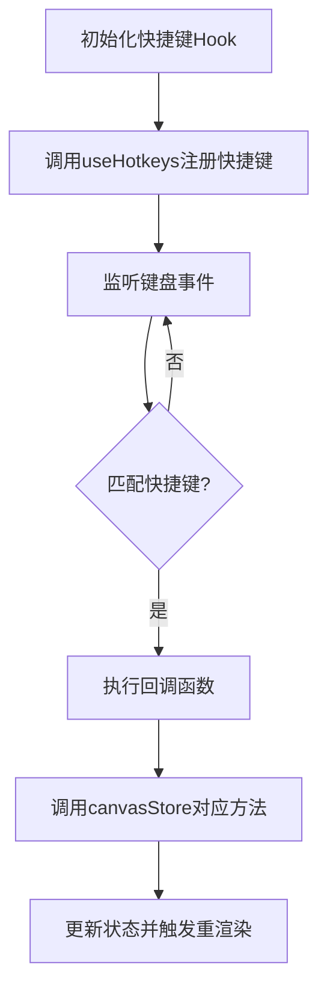

快捷键管理模块负责处理画布应用中的各种键盘快捷键操作，包括撤销/重做、元素操作（删除、复制、粘贴）以及工具切换等核心功能。该模块通过监听键盘事件，提供直观、高效的用户交互方式。

### 1. 项目结构

```
src/
├── hooks/
│   ├── useHotkeysManagement.ts        # 撤销/重做快捷键管理
│   └── use_React_hotkeys_management.ts # 画布操作快捷键管理
└── stores/
    └── canvasStore.ts                 # 提供快捷键操作对应的状态管理方法
```

### 2. 依赖库

- `react-hotkeys-hook`：用于监听和处理键盘快捷键的 React Hook
- `Zustand`：全局状态管理，提供操作实现方法

## 3. 核心状态管理

快捷键管理模块本身不维护独立状态，而是依赖于 canvasStore 中的状态：

- `selectedIds`：当前选中的元素 ID 列表
- `clipboard`：复制的元素数据
- `pasteOffset`：粘贴时的偏移量计数
- `tool`：当前选择的工具类型

## 4. 逻辑流程

### 4.1 整体架构

快捷键管理采用两个自定义 Hook 分别处理不同类型的快捷键操作：

1. [useHotkeysManagement](/src/hooks/useHotkeysManagement.ts#L5-L27)：专门处理撤销/重做快捷键
2. [useCanvasShortcuts](/src/hooks/use_React_hotkeys_management.ts#L10-L180)：处理画布操作相关快捷键

### 4.2 快捷键注册与处理流程



## 5. 核心函数解析

### 5.1 useHotkeysManagement Hook

该 Hook 专门处理撤销/重做相关的快捷键操作。

```typescript
export const useHotkeysManagement = () => {
  const { undo, redo } = useStore()

  // Ctrl+Z 撤销
  useHotkeys(
    'ctrl+z',
    (event) => {
      event.preventDefault()
      undo()
    },
    {},
    [undo],
  )

  // Ctrl+Shift+Z 或 Ctrl+Y 重做
  useHotkeys(
    'ctrl+y, ctrl+shift+z',
    (event) => {
      event.preventDefault()
      redo()
    },
    {},
    [redo],
  )
}
```

- 监听 `Ctrl+Z` 组合键触发撤销操作
- 监听 `Ctrl+Y` 或 `Ctrl+Shift+Z` 组合键触发重做操作
- 使用 [event.preventDefault()]() 阻止浏览器默认行为
- 依赖 canvasStore 提供的 [undo](/src/stores/canvasStore.ts#L281-L281) 和 [redo](/src/stores/canvasStore.ts#L282-L282) 方法

### 5.2 useCanvasShortcuts Hook

该 Hook 处理画布操作相关的快捷键，包括元素操作和工具切换。

```typescript
export const useCanvasShortcuts = ({ stageManagerRef }: UseCanvasShortcutsProps) => {
  const { selectedIds, removeElements, setTool, copyElements, pasteElements } = useStore()

  // 删除选中元素
  useHotkeys(
    'delete, backspace',
    () => {
      if (selectedIds.length > 0) {
        removeElements(selectedIds)
      }
    },
    {
      enableOnFormTags: false,
      ignoreEventWhen: (event) => event.target instanceof HTMLInputElement,
    },
    [selectedIds, removeElements],
  )

  // 复制元素
  useHotkeys(
    'ctrl+c, cmd+c',
    () => {
      if (selectedIds.length > 0) {
        copyElements(selectedIds)
      }
    },
    {
      enableOnFormTags: false,
      ignoreEventWhen: (event) => event.target instanceof HTMLInputElement,
    },
    [selectedIds, copyElements],
  )

  // 粘贴元素
  useHotkeys(
    'ctrl+v, cmd+v',
    () => {
      pasteElements()
    },
    {
      enableOnFormTags: false,
      ignoreEventWhen: (event) => event.target instanceof HTMLInputElement,
    },
    [pasteElements],
  )

  // 工具切换快捷键 (Shift+1 到 Shift+0)
  useHotkeys(
    'shift+1',
    () => {
      setTool('select')
    },
    {
      enableOnFormTags: false,
      ignoreEventWhen: (event) => event.target instanceof HTMLInputElement,
    },
    [setTool],
  )
  // ... 其他工具切换快捷键
}
```

主要功能包括：

**元素删除**：快捷键：`Delete` 或 `Backspace`，调用 [removeElements](/src/stores/canvasStore.ts#L271-L277) 删除选中元素

**元素复制**：快捷键：`Ctrl+C` (Windows) 或 `Cmd+C` (Mac)，操作：调用 [copyElements](/src/stores/canvasStore.ts#L257-L262) 将选中元素复制到剪贴板

**元素粘贴**：快捷键：`Ctrl+V` (Windows) 或 `Cmd+V` (Mac)，操作：调用 [pasteElements](/src/stores/canvasStore.ts#L263-L280) 从剪贴板粘贴元素

**工具切换**：

- `Shift+1`：切换到选择工具
- `Shift+2`：切换到矩形工具
- `Shift+3`：切换到菱形工具
- `Shift+4`：切换到圆形工具
- `Shift+5`：切换到箭头工具
- `Shift+6`：切换到直线工具
- `Shift+7`：切换到铅笔工具
- `Shift+8`：切换到文字工具
- `Shift+9`：切换到图像工具
- `Shift+0`：切换到橡皮擦工具

配置参数说明：

- [enableOnFormTags](/node_modules/react-hotkeys-hook/dist/useHotkeys.d.ts#L7-L7)：设置为 `false` 表示在表单元素上不启用快捷键
- [ignoreEventWhen](/node_modules/react-hotkeys-hook/dist/useHotkeys.d.ts#L8-L8)：当目标元素是 HTMLInputElement 时不处理事件，防止在输入框中使用快捷键

## 6. 快捷键操作实现

### 6.1 撤销/重做操作

撤销/重做操作通过调用 canvasStore 中的 [undo](/src/stores/canvasStore.ts#L281-L281) 和 [redo](/src/stores/canvasStore.ts#L282-L282) 方法实现，这些方法进一步委托给 [undoRedoManager](/src/lib/UndoRedoManager.ts#L171-L171) 实例处理。

### 6.2 元素操作

元素操作包括删除、复制和粘贴：

1. **删除操作**：

   ```typescript
   removeElements: (ids) =>
     originalSet((state) => {
       const newElements = { ...state.elements }
       ids.forEach((id) => delete newElements[id])
       return { elements: newElements, selectedIds: [] }
     })
   ```

2. **复制操作**：

   ```typescript
   copyElements: (ids) =>
     originalSet((state) => {
       const elementsToCopy = ids.map((id) => state.elements[id]).filter(Boolean)
       return { clipboard: elementsToCopy }
     })
   ```

3. **粘贴操作**：

   ```typescript
   pasteElements: () =>
     originalSet((state) => {
       if (!state.clipboard || state.clipboard.length === 0) return state

       // 增加粘贴偏移量
       const newOffset = state.pasteOffset + 1

       const newElements: Record<string, CanvasElement> = {}
       const newIds: string[] = []

       state.clipboard.forEach((element) => {
         const newId = nanoid()
         const randomSign = Math.random() > 0.5 ? 1 : -1 // 随机选择正负
         const randomOffset = Math.random() * 20 // 0-20的随机偏移量
         newIds.push(newId)
         newElements[newId] = {
           ...element,
           id: newId,
           // 每次粘贴都在前一次的基础上继续偏移
           x: element.x + randomOffset * randomSign,
           y: element.y + randomOffset * randomSign,
         }
       })

       return {
         elements: { ...state.elements, ...newElements },
         selectedIds: newIds,
         pasteOffset: newOffset,
       }
     })
   ```

### 6.3 工具切换

工具切换通过调用 canvasStore 的 [setTool](/src/stores/canvasStore.ts#L255-L255) 方法实现，更新当前选择的工具类型并清除选中状态。

## 7. 特殊处理与优化

### 7.1 表单元素兼容性处理

为了避免在输入框等表单元素中意外触发快捷键，所有快捷键都配置了以下选项：

```typescript
{
  enableOnFormTags: false,
  ignoreEventWhen: (event) => event.target instanceof HTMLInputElement,
}
```

### 7.2 粘贴偏移处理

为了区分多次粘贴的元素，每次粘贴时会给新元素添加一个随机偏移量：

```typescript
const randomSign = Math.random() > 0.5 ? 1 : -1 // 随机选择正负
const randomOffset = Math.random() * 20 // 0-20的随机偏移量
// ...
x: element.x + randomOffset * randomSign,
y: element.y + randomOffset * randomSign,
```

TODO:后续会新增一个自定义快捷键功能
