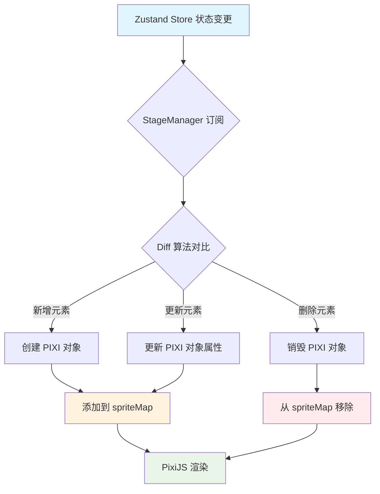
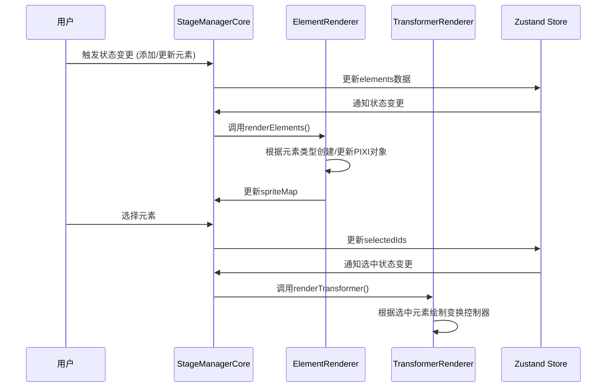
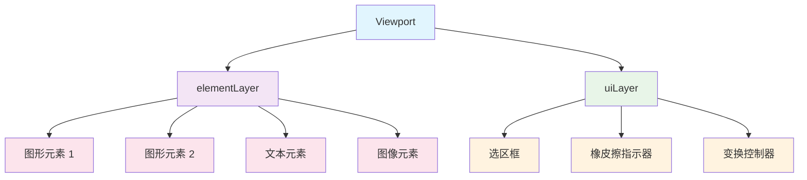

## 1. 模块摘要 (Executive Summary)

渲染层是基于 PixiJS 构建的可视化层，负责将存储在 Zustand 状态管理器中的画布元素数据转化为可视化的图形界面，并处理用户的交互操作。它主要包括元素渲染（ElementRenderer）和变换控制器渲染（TransformerRenderer）两大部分，分别负责绘制元素本身和元素的选中状态、控制手柄等辅助 UI。

其项目结构树如下：

```
src/
└── pages/
    └── canvas/
        ├── Pixi_stageManager.ts               # 整合StageManager各模块的入口文件
        ├── index.tsx                          # 画布页面组件，整合渲染层到React组件中
        └── Pixi_STM_modules/                  # StageManager模块目录
            ├── STM_modules.md                 # 模块设计文档
            ├── core/
            │   ├── StageManagerCore.ts        # 核心类，整合渲染、交互和状态管理
            │   └── types.ts                   # 类型定义文件
            ├── rendering/
            │   ├── ElementRenderer.ts         # 元素渲染器，负责渲染各类画布元素
            │   └── TransformerRenderer.ts     # 变换控制器渲染器，负责渲染选中元素的手柄等
            ├── interaction/
            │   └── InteractionHandler.ts      # 交互处理器，绑定和处理各种交互事件
            └── utils/
                └── cursorUtils.ts             # 光标工具函数
```

该模块主要负责将状态管理层的数据渲染成可视化图形，并处理用户交互反馈

- `pixi.js`：WebGL 渲染引擎
- `pixi-viewport`：视口管理插件
- `zustand`：状态管理库（虽然不是渲染层直接依赖，但与其紧密协作）

## 2. Props 和相关类型定义

渲染层接收来自逻辑层的 props 参数，用于驱动元素渲染和交互控制。这些参数主要包括元素数据、状态信息和事件回调函数。

### 2.1 ElementRenderer.renderElements 方法参数

ElementRenderer 负责将画布元素数据渲染为 PIXI 可视化对象，其 [renderElements](src/pages/canvas/Pixi_STM_modules/rendering/ElementRenderer.ts#L57-L157) 方法接收以下参数：

| 字段名       | 类型                          | 必填 | 默认值 | 描述                       |
| :----------- | :---------------------------- | :--- | :----- | :------------------------- |
| elements     | Record<string, CanvasElement> | 是   | 无     | 包含所有画布元素的数据对象 |
| elementLayer | PIXI.Container                | 是   | 无     | 用于承载所有可视元素的容器 |
| destroyed    | boolean                       | 是   | false  | 标识组件是否已被销毁       |

```
// elements对象结构示例
{
  "element1": {
    id: "element1",
    type: "rect",
    x: 100,
    y: 100,
    width: 200,
    height: 150,
    fill: "#ff0000"
  },
  "element2": {
    id: "element2",
    type: "text",
    x: 50,
    y: 50,
    width: 300,
    height: 100,
    text: "<p>示例文本</p>"
  }
}
```

[elementLayer](src/pages/canvas/Pixi_STM_modules/core/StageManagerCore.ts#L36-L36): PIXI.Container - PIXI.js 中的容器对象，用于承载所有画布元素的可视化对象。ElementRenderer 会将创建的 PIXI 对象添加到这个容器中，以便在画布上显示。

```
// 在StageManagerCore.ts中创建elementLayer
private elementLayer: PIXI.Container = new PIXI.Container()
// 然后传给ElementRenderer
this.elementRenderer.renderElements(elements, this.elementLayer, this.state.destroyed)
```

destroyed: boolean - 标识渲染器是否已被销毁。当组件被销毁时，此参数防止在销毁后继续执行渲染操作，避免内存泄漏。

```ts
public renderElements(elements: Record<string, CanvasElement>, elementLayer: PIXI.Container, destroyed: boolean) {
  if (destroyed) return; // 如果已销毁，直接返回不执行渲染
  // ... 其他渲染逻辑
}
```

### 2.2 TransformerRenderer.renderTransformer 方法参数

TransformerRenderer 负责渲染选中元素的变换控制器（手柄、边框等），其 [renderTransformer](src/pages/canvas/Pixi_STM_modules/rendering/TransformerRenderer.ts#L31-L182) 方法接收以下参数：

| 参数名        | 类型                            | 描述                             |
| :------------ | :------------------------------ | :------------------------------- |
| elements      | Record<string, CanvasElement>   | 所有画布元素的数据               |
| selectedIds   | string[]                        | 当前选中元素的 ID 数组           |
| spriteMap     | Map<string, PIXI.DisplayObject> | 元素 ID 到 PIXI 可视化对象的映射 |
| onHandleDown  | Function                        | 手柄按下事件的回调函数           |
| viewportScale | number                          | 当前视口的缩放比例               |

elements: Record<string, CanvasElement> - 与 ElementRenderer 中的 elements 相同，提供所有画布元素的数据。TransformerRenderer 需要访问元素数据来计算选中元素的边界框和位置信息。

selectedIds: string[] - 包含当前选中元素 ID 的数组。TransformerRenderer 根据这个数组决定是否以及如何绘制变换控制器（选中框和手柄）。

```
// selectedIds数组示例
;['element1', 'element3'] // 表示element1和element3被选中
```

spriteMap: Map<string, PIXI.Graphics | PIXI.HTMLText | PIXI.Sprite> - 提供元素 ID 到 PIXI 可视化对象的映射。TransformerRenderer 需要访问实际的 PIXI 对象来准确计算元素的边界（特别是文本元素）。

```
// spriteMap结构示例
Map(2) {
  "element1" => Graphics {},     // 矩形元素的PIXI.Graphics对象
  "element2" => HTMLText {}      // 文本元素的PIXI.HTMLText对象
}
```

onHandleDown: Function - 手柄按下事件的回调函数。当用户点击变换控制器上的手柄时，会调用这个函数开始变换操作（如缩放、旋转）。

```
// 在StageManagerCore.ts中定义并传递给TransformerRenderer
private onHandleDown = (e: PIXI.FederatedPointerEvent, handle: HandleType | 'p0' | 'p1', elementId: string) => {
  // 处理手柄按下事件
  this.state.mode = 'resizing';
  this.state.activeHandle = handle as HandleType | null;
  // ... 其他逻辑
}
```

viewportScale: number - 当前视口的缩放比例。TransformerRenderer 使用这个值来调整手柄和控制器的大小，确保在不同缩放级别下都有合适的尺寸。

```
// 在StageManagerCore.ts中获取并传递视口缩放比例
this.transformerRenderer.renderTransformer(
  elements,
  selectedIds,
  this.elementRenderer.getSpriteMap(),
  this.onHandleDown,
  this.viewport.scale.x, // 传递视口缩放比例
)
```

### 2.3 核心类型定义

渲染层涉及到的关键类型定义如下：

#### CanvasElement 类型

定义了画布元素的基本属性和可选属性：

```typescript
interface CanvasElement {
  id: string
  type: 'rect' | 'circle' | 'triangle' | 'text' | 'image' | 'line' | 'arrow' | 'pencil'
  x: number
  y: number
  width: number
  height: number
  fill: string
  stroke: string
  strokeWidth: number
  // 根据元素类型可能包含额外属性
  text?: string // 文本元素
  imageUrl?: string // 图片元素
  points?: number[][] // 线条/铅笔元素
  fontSize?: number // 文本元素
  fontFamily?: string // 文本元素
  alpha?: number // 透明度
  radius?: number // 圆角矩形
}
```

#### HandleType 类型

定义了变换控制器上各种手柄的类型：

```typescript
type HandleType =
  | 'tl' // top-left 左上角
  | 't' // top 顶部中间
  | 'tr' // top-right 右上角
  | 'r' // right 右侧中间
  | 'br' // bottom-right 右下角
  | 'b' // bottom 底部中间
  | 'bl' // bottom-left 左下角
  | 'l' // left 左侧中间
  | 'p0' // 线段起点
  | 'p1' // 线段终点
  | 'rotate' // 旋转手柄
```

---

### 2.2 暴露方法 (Ref/ForwardRef)

无

## 3. 核心状态管理 (State Architecture)

渲染层采用内外结合的状态管理模式，既维护自身的局部状态，又与外部的 Zustand 状态管理库协同工作。

### 3.1 内部状态 (Local State)

渲染层维护一组局部状态，用于管理 PIXI 对象和渲染优化：

| 状态名               | 类型                                                         | 描述                                                           |
| :------------------- | :----------------------------------------------------------- | :------------------------------------------------------------- |
| `spriteMap`          | `Map<string, PIXI.Graphics \| PIXI.HTMLText \| PIXI.Sprite>` | 存储元素 ID 到 PIXI 图形对象的映射关系，用于快速查找和更新元素 |
| `textureCache`       | `Map<string, PIXI.Texture>`                                  | 图片纹理缓存，避免重复加载相同图片                             |
| `loadingSet`         | `Set<string>`                                                | 正在加载中的图片 URL 集合，防止重复加载                        |
| `imageUpdateTimers`  | `Map<string, NodeJS.Timeout>`                                | 图像元素更新检查定时器映射                                     |
| `transformerGraphic` | `PIXI.Graphics`                                              | 用于绘制变换控制器（选中框、手柄等）的图形对象                 |

```typescript
// ElementRenderer 内部状态示例
private spriteMap: Map<string, PIXI.DisplayObject> = new Map()
private textureCache: Map<string, PIXI.Texture> = new Map()
private loadingSet: Set<string> = new Set()
private imageUpdateTimers: Map<string, NodeJS.Timeout> = new Map()

// TransformerRenderer 内部状态示例
private transformerGraphic: PIXI.Graphics = new PIXI.Graphics()

```

### 3.2 外部状态 (Global/Server State)

渲染层通过订阅 Zustand 状态管理库中的 [canvasStore](src/stores/canvasStore.ts#L35-L136) 来获取画布元素数据和选中状态：

| 状态名        | 类型                            | 描述                   |
| :------------ | :------------------------------ | :--------------------- |
| `elements`    | `Record<string, CanvasElement>` | 所有画布元素的数据对象 |
| `selectedIds` | `string[]`                      | 当前选中元素的 ID 数组 |

```typescript
// StageManagerCore.ts 中订阅外部状态的方式
useStore.subscribe(
  (state) => ({ elements: state.elements, selectedIds: state.selectedIds }),
  ({ elements, selectedIds }) => {
    // 当 elements 或 selectedIds 发生变化时触发重新渲染
    this.render()
  },
  { equalityFn: shallow },
)
```

### 3.3 状态同步机制

渲染层通过增量更新（Diffing）算法实现高效的状态同步：



> ℹ️ ：渲染层的局部状态主要用于优化性能和管理 PIXI 对象的生命周期，而业务数据则完全由外部 Zustand 状态管理库维护，实现了关注点分离。

> ⚠️ ：需要注意及时清理局部状态，特别是在组件销毁时，应清除所有定时器、销毁 PIXI 对象并释放纹理资源，避免内存泄漏。

## 4. 关键逻辑流程 (Logic Flow)

### 4.1 交互时序图 (Mermaid)



---

### 4.2 核心函数解析

- **[ElementRenderer.renderElements()](/src/pages/canvas/Pixi_STM_modules/rendering/ElementRenderer.ts#L57-L157)**:

  - **触发时机**: 当画布元素数据发生变更时，通过状态订阅机制触发。每当 Zustand store 中的 [elements](/src/stores/canvasStore.ts#L44-L44) 对象发生变化时，StageManagerCore 会调用此方法进行重新渲染。

  - **逻辑闭环**: 遍历所有元素数据，根据元素类型创建或更新对应的 PIXI 对象，并将其添加到容器中。通过 diff 算法比较现有 spriteMap 和新元素数据（遍历 spriteMap 中的所有元素 ID，检查哪些元素在新的 elements 数据中不存在，这些元素需要被删除，遍历新的 elements 数据中的所有元素 ID，检查哪些是新增的元素需要创建，哪些是已存在的元素需要更新），确定需要创建、更新或删除的元素，最终保持 PIXI 对象与数据状态同步。

  - **核心实现**:

    ```typescript
    // 核心渲染逻辑
    public renderElements(
      elements: Record<string, CanvasElement>,
      elementLayer: PIXI.Container,
      destroyed: boolean
    ) {
      if (destroyed) return;

      // 获取当前所有元素ID
      const elementIds = Object.keys(elements);

      // 删除已移除的元素
      for (const id of this.spriteMap.keys()) {
        if (!elementIds.includes(id)) {
          const sprite = this.spriteMap.get(id)!;
          sprite.destroy({ children: true });
          this.spriteMap.delete(id);
        }
      }

      // 更新或创建元素
      for (const id of elementIds) {
        const data = elements[id];
        if (this.spriteMap.has(id)) {
          // 更新现有元素
          this.updateElement(data, this.spriteMap.get(id)!);
        } else {
          // 创建新元素
          const sprite = this.createElement(data);
          elementLayer.addChild(sprite);
          this.spriteMap.set(id, sprite);
        }
      }
    }
    ```

  - **差异化渲染处理**:

    ```typescript
    // 根据不同类型元素进行差异化渲染处理
    private createElement(data: CanvasElement): PIXI.DisplayObject {
      switch (data.type) {
        case 'rect':
        case 'circle':
        case 'triangle':
          // 几何图形处理逻辑：使用Graphics API绘制形状
          return this.createGraphicsElement(data);

        case 'text':
          // 文本元素处理逻辑：使用HTMLText组件渲染富文本
          return this.createTextElement(data);

        case 'image':
          // 图片元素处理逻辑：加载纹理并创建Sprite
          return this.createImageElement(data);

        case 'line':
        case 'arrow':
        case 'pencil':
          // 线条/铅笔元素处理逻辑：使用Graphics API绘制线条
          return this.createLineElement(data);

        default:
          throw new Error(`Unsupported element type: ${data.type}`);
      }
    }
    ```

- **[TransformerRenderer.renderTransformer()](/src/pages/canvas/Pixi_STM_modules/rendering/TransformerRenderer.ts#L31-L182)**:

  - **触发时机**: 当选中元素发生变更时触发。每当 Zustand store 中的 [selectedIds](/src/stores/canvasStore.ts#L45-L45) 数组发生变化时，StageManagerCore 会调用此方法更新变换控制器的显示。

  - **逻辑闭环**: 根据选中元素的数量和类型，绘制相应的变换控制器（如缩放手柄、旋转手柄等）。通过清除之前的控制器图形并根据当前选中状态重新绘制，保持变换控制器与选中状态同步。

  - **核心实现**:

    ```typescript
    // 变换控制器渲染逻辑
    public renderTransformer(
      elements: Record<string, CanvasElement>,
      selectedIds: string[],
      spriteMap: Map<string, PIXI.DisplayObject>,
      onHandleDown: (
        e: PIXI.FederatedPointerEvent,
        handle: HandleType | 'p0' | 'p1',
        elementId: string
      ) => void,
      viewportScale: number
    ) {
      // 清除之前的变换控制器
      this.transformerGraphic.clear();

      if (selectedIds.length === 0) return;

      if (selectedIds.length === 1) {
        // 单个元素选中逻辑
        const element = elements[selectedIds[0]];
        const sprite = spriteMap.get(selectedIds[0]);
        if (sprite) {
          this.drawSingleElementTransformer(element, sprite, onHandleDown, viewportScale);
        }
      } else {
        // 多个元素选中逻辑
        this.drawMultiElementTransformer(elements, selectedIds, spriteMap, onHandleDown, viewportScale);
      }
    }
    ```

#### UI 与样式实现 (UI Implementation)

- **布局策略**: 使用 PIXI 的容器系统进行布局管理，分为 [elementLayer](file:///e:/ADF-workbase/BDdraw_DEV/src/pages/canvas/Pixi_STM_modules/core/StageManagerCore.ts#L36-L36)（元素层）和 [uiLayer](file:///e:/ADF-workbase/BDdraw_DEV/src/pages/canvas/Pixi_STM_modules/core/StageManagerCore.ts#L37-L37)（UI 层）两个层级，通过坐标系统定位元素

  - **[elementLayer](file:///e:/ADF-workbase/BDdraw_DEV/src/pages/canvas/Pixi_STM_modules/core/StageManagerCore.ts#L36-L36)**: 用于承载所有画布元素的容器层，包括矩形、圆形、文本、图像等各种元素的 PIXI 对象都添加到这一层。这是渲染层的主要内容，负责显示用户创建的所有图形元素。

  - **[uiLayer](file:///e:/ADF-workbase/BDdraw_DEV/src/pages/canvas/Pixi_STM_modules/core/StageManagerCore.ts#L37-L37)**: 用于承载所有 UI 元素的容器层，包括选区框、橡皮擦指示器、变换控制器等辅助 UI 元素。这一层位于元素层之上，确保 UI 元素始终显示在图形元素的前面。

  ```typescript
  // 在 StageManagerCore.ts 中创建两个容器层
  private elementLayer: PIXI.Container = new PIXI.Container()
  private uiLayer: PIXI.Container = new PIXI.Container()

  // 将两个容器层添加到视口中
  this.viewport.addChild(this.elementLayer)
  this.viewport.addChild(this.uiLayer)
  ```

- **样式方案**:

  - 几何图形使用 PIXI 的绘图 API 进行绘制，支持描边、填充、透明度等样式
  - 文本元素使用 HTMLText 组件支持富文本渲染
  - 图片元素使用 PIXI.Sprite 并支持滤镜效果（模糊、亮度、灰度等）
  - 变换控制器统一使用紫色 (#8b5cf6) 作为主题色

- **条件渲染**:

  - 根据元素类型选择不同的渲染方式
  - 根据选中状态决定是否显示变换控制器
  - 根据选中元素数量显示不同的控制器形态（单选手柄 vs 群组控制器）


