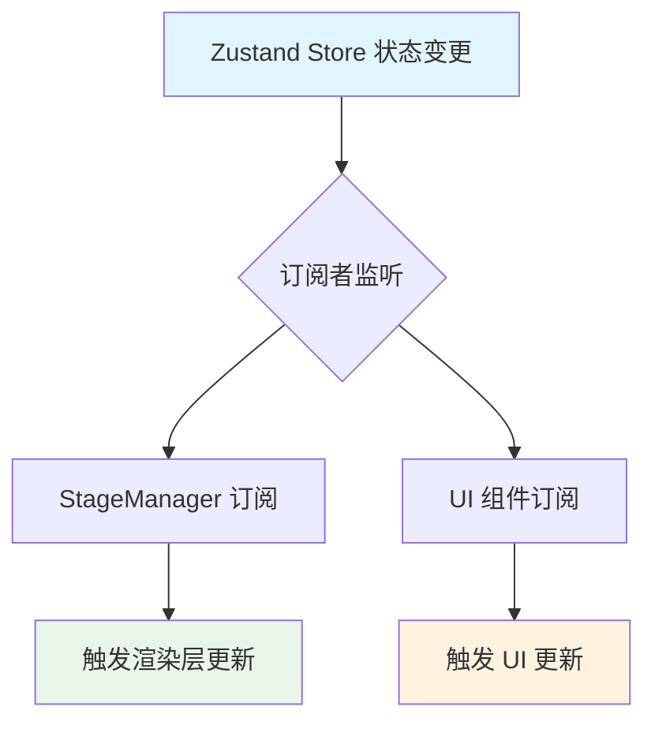
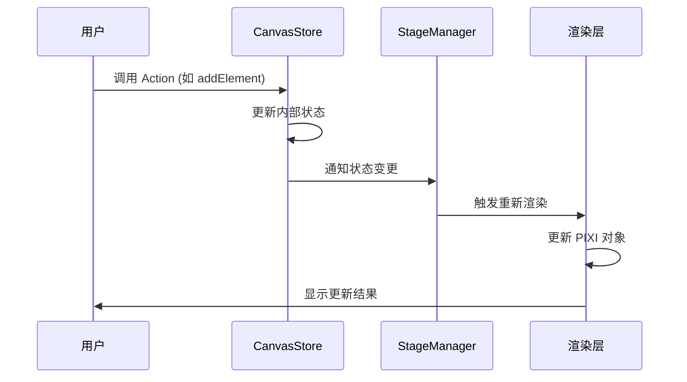

### 1. 模块摘要 (Executive Summary)

状态管理层管理画布元素数据、选中状态、工具状态、剪贴板数据等核心业务数据，是整个画布应用的数据核心，负责维护所有画布元素的状态信息和用户交互相关的全局状态。它采用了 Zustand 作为状态管理库，实现了数据的集中管理和状态变更的响应式更新

- **项目结构树**：

  ```bash
  src/
  └── stores/
      └── canvasStore.ts        # Zustand 状态管理核心文件
  ```

  - `Zustand`：轻量级状态管理库，用于管理全局状态
  - `nanoid`：用于生成唯一 ID
  - `structuredClone`：用于深拷贝状态数据

### 2. Props 和相关类型定义

#### 2.1 useStore 参数

状态管理模块通过 [useStore](/src/stores/canvasStore.ts#L35-L136) Hook 提供状态访问和更新功能。

| 参数名         | 类型     | 必填 | 默认值 | 描述                   |
| -------------- | -------- | ---- | ------ | ---------------------- |
| setTool        | Function | 是   | 无     | 设置当前使用的工具类型 |
| addElement     | Function | 是   | 无     | 添加新元素到画布       |
| updateElement  | Function | 是   | 无     | 更新指定元素的属性     |
| removeElements | Function | 是   | 无     | 从画布中移除指定元素   |
| setSelected    | Function | 是   | 无     | 设置当前选中的元素     |
| setEditingId   | Function | 是   | 无     | 设置当前正在编辑的元素 |
| copyElements   | Function | 是   | 无     | 复制指定元素到剪贴板   |
| pasteElements  | Function | 是   | 无     | 从剪贴板粘贴元素到画布 |

代码示例：

```typescript
// 设置工具类型
useStore.getState().setTool('rect')

// 添加元素
useStore.getState().addElement({
  id: 'element1',
  type: 'rect',
  x: 100,
  y: 100,
  width: 200,
  height: 150,
  fill: '#ff0000',
  stroke: '#000000',
  strokeWidth: 2,
})

// 更新元素
useStore.getState().updateElement('element1', { fill: '#00ff00' })

// 移除元素
useStore.getState().removeElements(['element1'])
```

#### 2.2 核心类型定义

**[CanvasElement](/src/pages/canvas/Pixi_STM_modules/core/types.ts#L15-L15) 类型**：
定义了画布上所有元素的基本属性和可选属性。

```typescript
interface CanvasElement {
  id: string // 元素唯一标识符
  type: ToolType // 元素类型
  x: number // 元素左上角 x 坐标
  y: number // 元素左上角 y 坐标
  width: number // 元素宽度
  height: number // 元素高度
  fill: string // 填充颜色
  stroke: string // 描边颜色
  strokeWidth: number // 描边宽度
  alpha?: number // 透明度
  points?: number[][] // 点坐标数组（用于线条类元素）
  rotation?: number // 旋转角度（弧度制）
  text?: string // 文本内容（HTML 格式）
  fontSize?: number // 字体大小
  fontFamily?: string // 字体族
  textAlign?: 'left' | 'center' | 'right' // 文本对齐方式
  imageUrl?: string // 图片 URL
  filter?: 'none' | 'blur' | 'brightness' | 'grayscale' // 图片滤镜
  radius?: number // 圆角半径
}
```

**[ToolType](/src/stores/canvasStore.ts#L6-L21) 类型**：
定义了用户可选择的工具类型。

```typescript
type ToolType =
  | 'select' // 选择工具
  | 'hand' // 手型工具
  | 'rect' // 矩形工具
  | 'circle' // 圆形工具
  | 'triangle' // 三角形工具
  | 'diamond' // 菱形工具
  | 'line' // 直线工具
  | 'arrow' // 箭头工具
  | 'pencil' // 铅笔工具
  | 'text' // 文本工具
  | 'image' // 图片工具
  | 'eraser' // 橡皮擦工具
```

### 3. 核心状态管理 (State Architecture)

状态管理层维护以下内部状态：

| 状态名       | 类型                                                                                      | 描述                   |
| ------------ | ----------------------------------------------------------------------------------------- | ---------------------- |
| tool         | [ToolType](/src/stores/canvasStore.ts#L6-L21)                                             | 当前选中的工具类型     |
| elements     | Record<string, [CanvasElement](/src/pages/canvas/Pixi_STM_modules/core/types.ts#L15-L15)> | 所有画布元素的集合     |
| selectedIds  | string[]                                                                                  | 当前选中的元素 ID 数组 |
| editingId    | string \| null                                                                            | 当前正在编辑的元素 ID  |
| clipboard    | [CanvasElement](/src/pages/canvas/Pixi_STM_modules/core/types.ts#L15-L15)[] \| null       | 剪贴板数据             |
| pasteOffset  | number                                                                                    | 粘贴偏移计数           |
| currentStyle | Object                                                                                    | 当前样式设置           |

#### 3.3 状态同步机制



### 4. 逻辑流程 (Logic Flow)

#### 4.1 交互时序图 (Mermaid)



#### 4.2 核心函数

**addElement 函数**：当用户创建新元素时调用，创建新元素并添加到 elements 集合中

```typescript
addElement: (el) =>
  originalSet((state) => ({
    elements: { ...state.elements, [el.id]: el },
  }))
```

**updateElement 函数**：当用户修改元素属性时调用，更新指定元素的属性并保持其他元素不变

```typescript
updateElement: (id, attrs) =>
  originalSet((state) => {
    if (!state.elements[id]) return state
    return {
      elements: {
        ...state.elements,
        [id]: { ...state.elements[id], ...attrs },
      },
    }
  })
```

状态管理层作为纯数据层，不直接涉及 UI 和样式实现，但为上层 UI 提供了必要的状态支持，通过状态结构支持上层组件的布局逻辑和状态中的样式属性支持上层组件的样式实现
