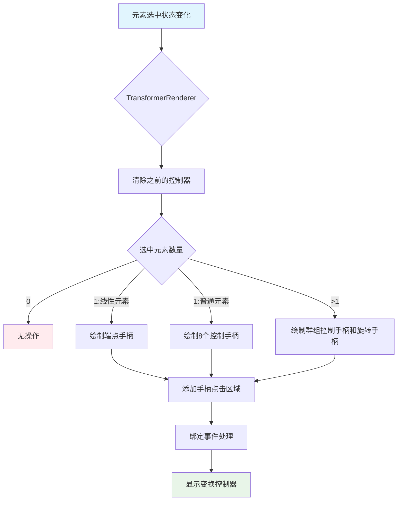
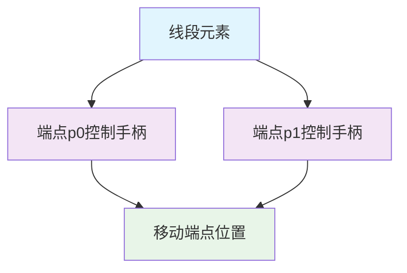
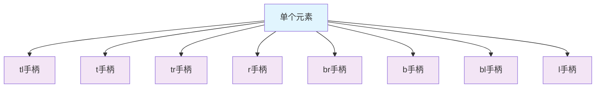
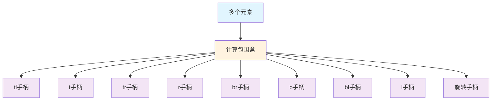
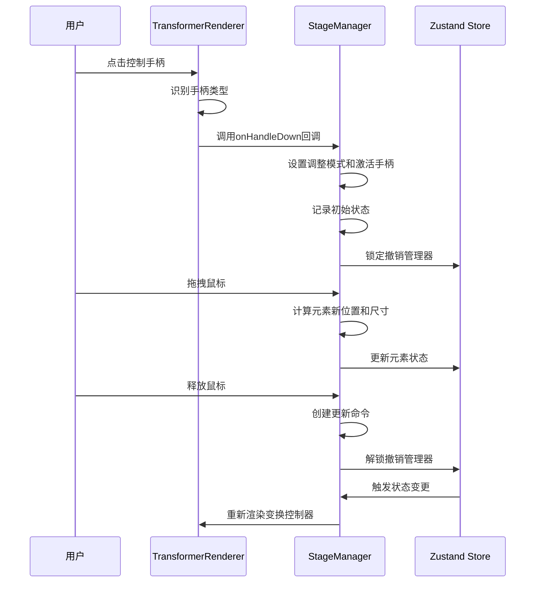
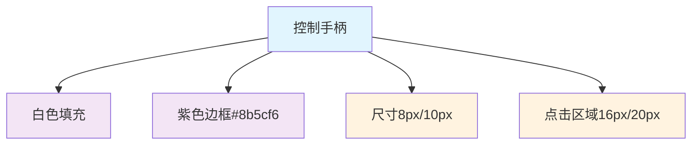

### 1. 模块摘要 (Executive Summary)

画布元素控制调整机制是画布应用中实现元素选中、变换和调整的核心功能模块。它通过变换控制器渲染器([TransformerRenderer](/src/pages/canvas/Pixi_STM_modules/rendering/TransformerRenderer.ts#L5-L212))实现，在用户选中元素时显示控制手柄和边界框，并处理用户的调整操作，支持单个元素和多个元素的控制调整

- **项目结构**：

  ```bash
  src/
  └── pages/
      └── canvas/
          └── Pixi_STM_modules/
              └── rendering/
                  └── TransformerRenderer.ts    # 变换控制器渲染器实现
  ```

  依赖库

  - `PixiJS`：WebGL 渲染引擎，用于绘制控制手柄和边界框
  - `PIXI.Graphics`：用于绘制变换控制器的图形对象
  - `TypeScript`：提供类型安全和代码可维护性

### 2. 控制调整机制类型定义

#### 2.1 HandleType 类型

定义了变换控制器上各种手柄的类型：

```typescript
type HandleType =
  | 'tl' // top-left 左上角
  | 't' // top 顶部中间
  | 'tr' // top-right 右上角
  | 'r' // right 右侧中间
  | 'br' // bottom-right 右下角
  | 'b' // bottom 底部中间
  | 'bl' // bottom-left 左下角
  | 'l' // left 左侧中间
  | 'p0' // 线段起点
  | 'p1' // 线段终点
  | 'rotate' // 旋转手柄
```

#### 2.2 TransformerRenderer.renderTransformer 参数

变换控制器渲染方法的参数定义：

| 参数名        | 类型                            | 描述                       |
| ------------- | ------------------------------- | -------------------------- |
| elements      | Record<string, CanvasElement>   | 所有画布元素的数据         |
| selectedIds   | string[]                        | 当前选中元素的 ID 数组     |
| spriteMap     | Map<string, PIXI.DisplayObject> | 元素 ID 到 PIXI 对象的映射 |
| onHandleDown  | Function                        | 手柄按下事件的回调函数     |
| viewportScale | number                          | 当前视口的缩放比例         |

### 3. 控制调整机制架构

#### 3.1 内部状态 (Local State)

TransformerRenderer 维护以下内部状态：

| 状态名             | 类型          | 描述                         |
| ------------------ | ------------- | ---------------------------- |
| transformerGraphic | PIXI.Graphics | 用于绘制变换控制器的图形对象 |

#### 3.2 外部依赖 (External Dependencies)

控制调整机制依赖以下外部组件：

| 组件         | 类型                            | 描述                 |
| ------------ | ------------------------------- | -------------------- |
| elements     | Record<string, CanvasElement>   | 画布元素数据         |
| selectedIds  | string[]                        | 选中元素 ID 数组     |
| spriteMap    | Map<string, PIXI.DisplayObject> | 元素到显示对象的映射 |
| onHandleDown | Function                        | 手柄事件处理回调     |

#### 3.3 控制调整机制流程



### 4. 控制调整类型

控制调整机制根据选中元素的不同类型和数量，提供不同的控制方式：

#### 4.1 线性元素控制（单个线段/箭头）

对于线段和箭头元素，提供两个端点控制手柄：



#### 4.2 单个元素控制

对于单个普通元素（矩形、圆形、文本等），提供 8 个控制手柄：



#### 4.3 多个元素控制

对于多个选中元素，提供群组控制手柄和旋转手柄：



### 5. 控制调整交互流程

#### 5.1 交互时序图



#### 5.2 核心函数解析

**renderTransformer 函数**：

当选中元素发生变化时触发，根据选中元素的类型和数量，绘制相应的控制手柄和边界框

```typescript
public renderTransformer(
  elements: Record<string, CanvasElement>,
  selectedIds: string[],
  spriteMap: Map<string, PIXI.DisplayObject>,
  onHandleDown: Function,
  viewportScale: number
) {
  // 清除之前的控制器
  this.transformerGraphic.clear()
  this.transformerGraphic.removeChildren()

  if (selectedIds.length === 0) return

  // 根据选中元素类型和数量绘制不同的控制器
  if (isLinearElement) {
    // 绘制线性元素控制器
  } else if (selectedIds.length === 1) {
    // 绘制单个元素控制器
  } else {
    // 绘制多个元素控制器
  }
}
```

### 6. UI 与样式实现

#### 6.1 控制手柄样式

控制手柄使用统一的视觉样式：



#### 6.2 光标样式

不同类型的控制手柄提供不同的光标样式，提升用户体验：

| 手柄类型 | 光标样式    |
| -------- | ----------- |
| tl, br   | nwse-resize |
| tr, bl   | nesw-resize |
| t, b     | ns-resize   |
| l, r     | ew-resize   |
| rotate   | grab        |
| p0, p1   | move        |

> 控制调整机制通过 hitZone（点击区域）来处理用户交互
