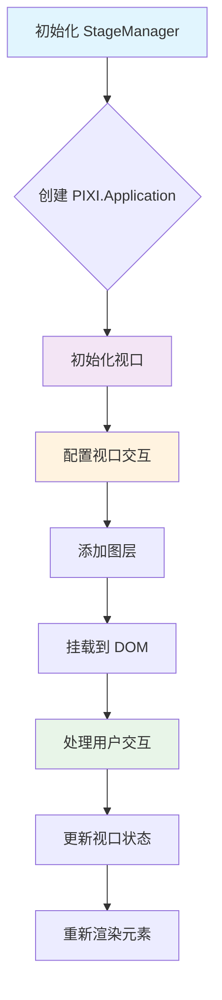
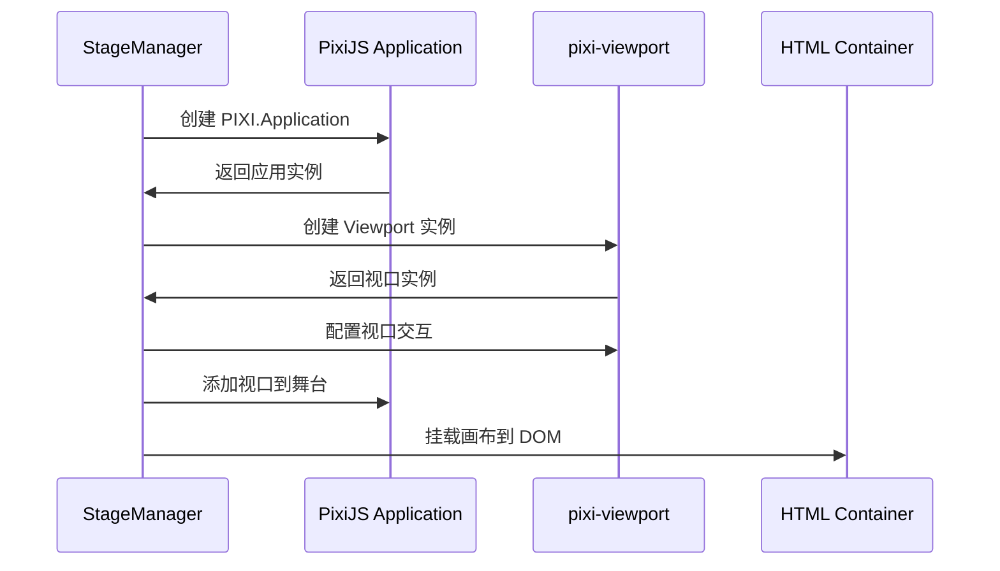
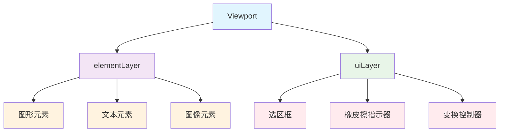

### 1. 模块摘要 (Executive Summary)

视口管理机制是画布应用中实现无限画布、缩放、拖拽等交互功能的核心模块。它基于 pixi-viewport 库实现，提供了完整的视口控制功能，包括平移、缩放、手势控制等。实现了管理画布视口、处理用户交互、实现无限画布功能

- **项目结构树**：

  ```bash
  src/
  └── pages/
      └── canvas/
          └── Pixi_STM_modules/
              └── core/
                  └── StageManagerCore.ts    # 视口管理核心实现
  ```

  - `pixi-viewport`：视口管理库，提供平移、缩放、手势等交互功能
  - `PixiJS`：WebGL 渲染引擎，作为视口的渲染基础
  - `TypeScript`：提供类型安全和代码可维护性

### 2. 视口管理机制类型定义

#### 2.1 Viewport 相关配置

pixi-viewport 库的主要配置参数：

```typescript
interface ViewportOptions {
  screenWidth: number // 视口宽度
  screenHeight: number // 视口高度
  worldWidth: number // 世界宽度
  worldHeight: number // 世界高度
  events: any // 事件系统
}
```

#### 2.2 视口交互配置

pixi-viewport 支持的交互配置：

| 方法         | 描述             |
| ------------ | ---------------- |
| drag()       | 启用拖拽功能     |
| pinch()      | 启用捏合缩放功能 |
| wheel()      | 启用滚轮缩放功能 |
| clampZoom()  | 限制缩放范围     |
| decelerate() | 启用惯性滚动     |

### 3. 视口管理机制架构

#### 3.1 内部状态 (Local State)

视口管理机制维护以下内部状态：

| 状态名       | 类型             | 描述               |
| ------------ | ---------------- | ------------------ |
| viewport     | Viewport         | pixi-viewport 实例 |
| app          | PIXI.Application | PixiJS 应用实例    |
| elementLayer | PIXI.Container   | 元素图层容器       |
| uiLayer      | PIXI.Container   | UI 图层容器        |

#### 3.2 外部依赖 (External Dependencies)

视口管理机制依赖以下外部组件：

| 组件                | 类型                | 描述                            |
| ------------------- | ------------------- | ------------------------------- |
| HTML Container      | HTMLElement         | 用于挂载 PixiJS 画布的 DOM 元素 |
| ElementRenderer     | ElementRenderer     | 元素渲染器                      |
| TransformerRenderer | TransformerRenderer | 变换控制器渲染器                |

#### 3.3 视口管理流程



### 4. 视口初始化与配置

#### 4.1 视口初始化流程



#### 4.2 核心函数解析

**setupViewport 函数**：在 StageManager 初始化时调用，创建并配置 pixi-viewport 实例，设置交互功能

```typescript
private setupViewport(container: HTMLElement) {
  // 创建视口实例
  this.viewport = new Viewport({
    screenWidth: container.clientWidth,
    screenHeight: container.clientHeight,
    worldWidth: 1000,
    worldHeight: 1000,
    events: this.app.renderer.events,
  })

  // 添加视口到 Pixi 舞台
  this.app.stage.addChild(this.viewport)

  // 配置视口交互功能
  this.viewport
    .drag({ mouseButtons: 'middle' })  // 鼠标中键拖拽
    .pinch()                           // 触摸捏合缩放
    .wheel()                           // 滚轮缩放
}
```

### 5. 视口交互功能

#### 5.1 拖拽功能

用户可以通过鼠标中键拖拽画布，实现视口平移：

```typescript
// 鼠标中键拖拽
this.viewport.drag({ mouseButtons: 'middle' })

// 空格键+左键拖拽（手型工具）
this.viewport.drag({ mouseButtons: 'all' })
```

#### 5.2 缩放功能

支持多种缩放方式：

1. **滚轮缩放**：

   ```typescript
   this.viewport.wheel() // 鼠标滚轮缩放
   ```

2. **手势缩放**：
   ```typescript
   this.viewport.pinch() // 触摸设备捏合缩放
   ```

#### 5.3 视口状态更新

根据当前工具和用户操作更新视口状态：

```typescript
public updateViewportState(tool: ToolType) {
  if (!this.viewport) return
  const isHandMode = tool === 'hand' || this.state.isSpacePressed
  if (isHandMode) {
    // 手型工具或按下空格键时，启用全键拖拽
    this.viewport.drag({ mouseButtons: 'all' })
    this.viewport.cursor = 'grab'
  } else {
    // 默认情况下，仅启用中键拖拽
    this.viewport.drag({ mouseButtons: 'middle' })
    this.viewport.cursor = 'default'
  }
}
```

### 6. UI 与样式实现

#### 6.1 视口层次结构

视口内部采用分层结构管理不同类型的元素：



#### 6.2 光标样式管理

根据不同状态和工具显示不同的光标样式：

| 状态/工具 | 光标样式  |
| --------- | --------- |
| 默认状态  | default   |
| 手型工具  | grab      |
| 拖拽中    | grabbing  |
| 选择工具  | default   |
| 绘制工具  | crosshair |
