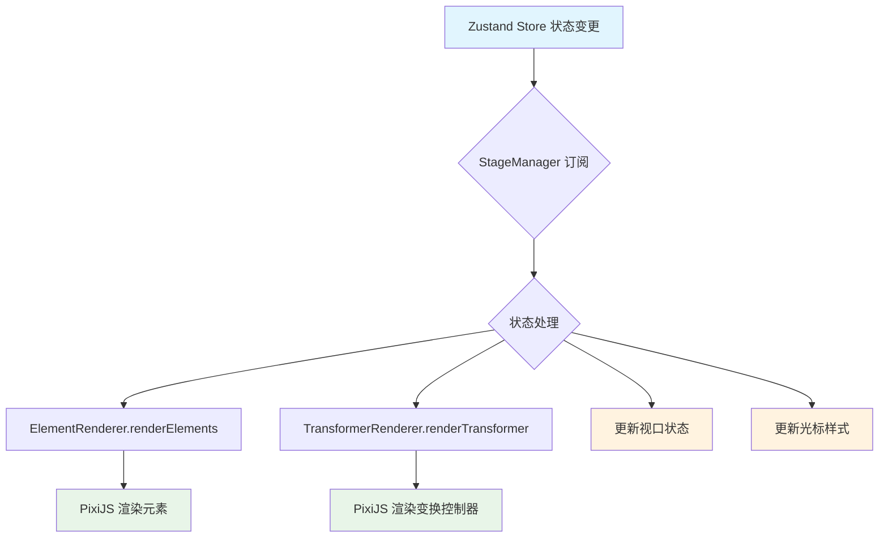
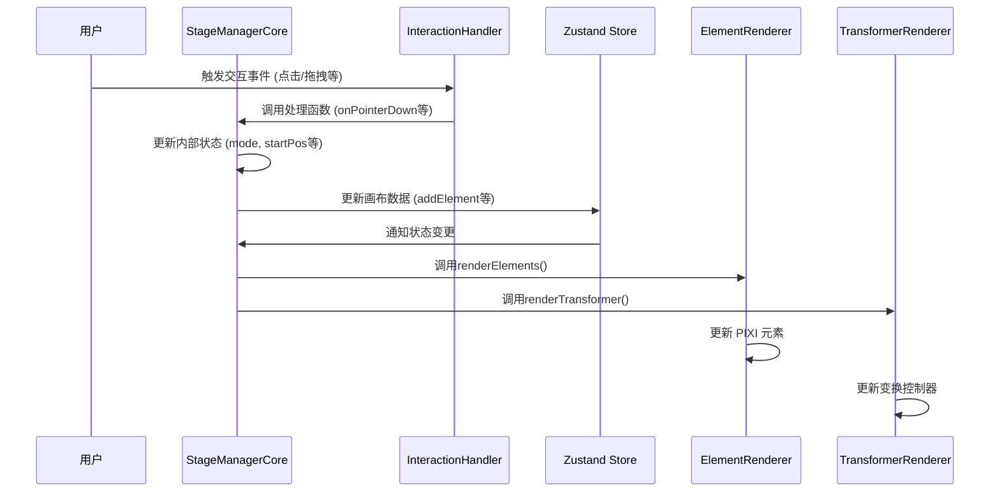
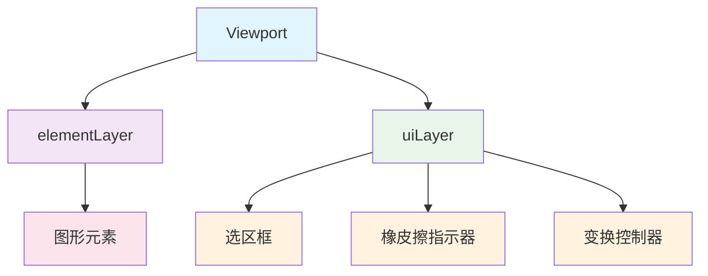

### 1. 模块摘要 (Executive Summary)

逻辑层是整个画布应用的中枢神经系统，负责协调状态管理层和渲染层之间的交互。它通过 StageManagerCore 类实现，主要处理用户交互、协调状态更新、管理渲染流程、维护交互状态

- **项目结构树**：

  ```bash
  src/
  └── pages/
      └── canvas/
          ├── Pixi_stageManager.ts               # StageManager 入口文件
          └── Pixi_STM_modules/                  # StageManager 模块目录
              ├── core/
              │   ├── StageManagerCore.ts        # 核心类
              │   └── types.ts                   # 类型定义文件
              ├── rendering/
              │   ├── ElementRenderer.ts         # 元素渲染器
              │   └── TransformerRenderer.ts     # 变换控制器渲染器
              ├── interaction/
              │   └── InteractionHandler.ts      # 交互处理器
              └── utils/
                  └── cursorUtils.ts             # 光标工具函数
  ```

  - `PixiJS`：WebGL 渲染引擎，负责图形渲染
  - `pixi-viewport`：视口管理插件，处理画布缩放和平移
  - `Zustand`：状态管理库，与状态管理层对接
  - `nanoid`：用于生成唯一 ID

### 2. Props 和相关类型定义

#### 2.1 StageManagerCore 构造函数参数

StageManagerCore 类通过构造函数接收容器元素参数。

| 参数名    | 类型        | 必填 | 默认值 | 描述                            |
| --------- | ----------- | ---- | ------ | ------------------------------- |
| container | HTMLElement | 是   | 无     | 用于挂载 PixiJS 应用的 DOM 容器 |

代码示例：

```typescript
// 创建 StageManager 实例
const stageManager = new StageManagerCore(containerElement)
```

#### 2.2 核心类型定义

**[StageManagerState](/src/pages/canvas/Pixi_STM_modules/core/types.ts#L11-L38) 类型**：
定义了 StageManager 的核心状态。

```typescript
interface StageManagerState {
  mode: InteractionMode // 当前交互模式
  startPos: { x: number; y: number } // 起始坐标
  currentId: string | null // 当前操作元素 ID
  initialElementsMap: Record<string, Partial<CanvasElement>> | null // 初始元素映射
  initialGroupBounds: { x: number; y: number; width: number; height: number } | null // 初始群组边界
  initialElementState: Partial<CanvasElement> | null // 初始元素状态
  resizeInitialStates: Record<string, Partial<CanvasElement>> | null // 调整大小初始状态
  dragInitialStates: Record<string, Partial<CanvasElement>> | null // 拖拽初始状态
  activeHandle: HandleType | null // 激活的手柄
  isSpacePressed: boolean // 空格键是否按下
  destroyed: boolean // 是否已销毁
}
```

**[InteractionMode](/src/pages/canvas/Pixi_STM_modules/core/types.ts#L3-L8) 类型**：
定义了用户与画布交互的各种模式。

```typescript
type InteractionMode =
  | 'idle' // 空闲状态
  | 'panning' // 画布平移
  | 'selecting' // 选择元素
  | 'dragging' // 拖拽元素
  | 'resizing' // 调整元素大小
  | 'drawing' // 绘制元素
  | 'texting' // 文本编辑
  | 'erasing' // 擦除元素
```

### 3. 核心状态管理 (State Architecture)

#### 3.1 内部状态 (Local State)

StageManagerCore 维护以下内部状态：

| 状态名               | 类型                | 描述                 |
| -------------------- | ------------------- | -------------------- |
| app                  | PIXI.Application    | PixiJS 应用实例      |
| viewport             | Viewport            | pixi-viewport 实例   |
| elementLayer         | PIXI.Container      | 元素图层容器         |
| uiLayer              | PIXI.Container      | UI 图层容器          |
| elementRenderer      | ElementRenderer     | 元素渲染器实例       |
| transformerRenderer  | TransformerRenderer | 变换控制器渲染器实例 |
| interactionHandler   | InteractionHandler  | 交互处理器实例       |
| state                | StageManagerState   | 交互状态对象         |
| selectionRectGraphic | PIXI.Graphics       | 选区框图形对象       |
| eraserGraphic        | PIXI.Graphics       | 橡皮擦指示器图形对象 |

#### 3.2 外部状态 (Global/Server State)

逻辑层通过 Zustand 状态管理库订阅外部状态：

| 状态名      | 类型                          | 描述                   |
| ----------- | ----------------------------- | ---------------------- |
| elements    | Record<string, CanvasElement> | 所有画布元素数据       |
| selectedIds | string[]                      | 当前选中的元素 ID 数组 |
| tool        | ToolType                      | 当前工具类型           |

#### 3.3 状态同步机制



### 4. 逻辑流程 (Logic Flow)

#### 4.1 交互时序图 (Mermaid)



#### 4.2 核心函数解析

**onPointerDown 函数**：当用户在画布上按下鼠标时触发，根据当前工具和点击位置处理不同的交互逻辑（选择、绘制、拖拽等）

```typescript
private onPointerDown = (e: PIXI.FederatedPointerEvent) => {
  // 处理防抖
  this.triggerDebounceSnapshot()

  // 获取当前状态
  const state = useStore.getState()
  const tool = state.tool
  const worldPos = e.getLocalPosition(this.viewport)

  // 根据工具类型处理不同逻辑
  if (tool === 'text') {
    // 处理文本工具
  } else if (tool === 'eraser') {
    // 处理橡皮擦工具
  } else if (e.target && e.target.label) {
    // 处理元素点击
  } else {
    // 处理绘制或选择
  }
}
```

**onPointerMove 函数**：当用户在画布上移动鼠标时触发，根据当前交互模式处理不同的移动逻辑（绘制、拖拽、调整大小等）

```typescript
private onPointerMove = (e: PIXI.FederatedPointerEvent) => {
  // 处理防抖
  this.triggerDebounceSnapshot()

  if (this.state.mode === 'idle') return

  const state = useStore.getState()
  const currentPos = e.getLocalPosition(this.viewport)

  switch (this.state.mode) {
    case 'selecting':
      // 处理选择框绘制
      break
    case 'erasing':
      // 处理橡皮擦操作
      break
    case 'dragging':
      // 处理元素拖拽
      break
    case 'resizing':
      // 处理元素调整大小
      break
    case 'drawing':
      // 处理元素绘制
      break
  }
}
```

### 5. UI 与样式实现 (UI Implementation)

逻辑层通过管理不同图层来实现 UI 布局：



使用 PixiJS 的容器系统管理图层，分为元素层和 UI 层，通过 PIXI.Graphics API 实现图形绘制，通过 CSS 控制光标样式
