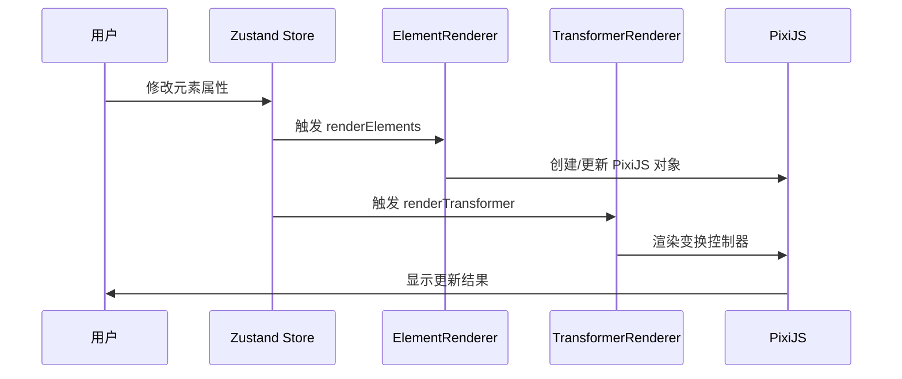
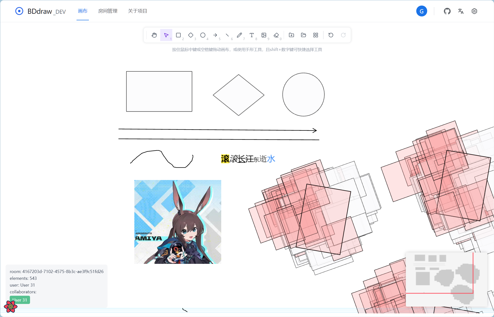

## P0-基础渲染实现

### DSP

基础渲染系统是 BDdraw_DEV 项目的核心组件之一，它负责将画布元素状态转化为视觉呈现。该系统主要基于 PixiJS v8 构建，充分利用 WebGL 的高性能渲染能力。

**系统支持不同图形如矩形、菱形，圆形（含椭圆），箭头，直线，画笔工具的渲染**

矩形工具 - 通过计算起始点和结束点来确定矩形的位置和尺寸
菱形工具 - 通过计算四个关键点来构造菱形形状
圆形（含椭圆）工具 - 根据宽高比例绘制圆形或椭圆
箭头工具 - 绘制带箭头的线段，包含主线段和箭头部分
直线工具 - 绘制简单的直线
画笔工具 - 通过记录鼠标移动轨迹来绘制自由线条

**支持图形的背景色、边框宽度、边框颜色，边框圆角等属性配置**

fill: 控制图形的背景色/填充色
stroke: 控制图形的边框颜色
strokeWidth: 控制图形的边框宽度
radius: 控决矩形的圆角大小

**支持图片渲染**

支持 PNG、JPEG 格式，提供模糊、亮度增强、灰度三种滤镜效果

**支持富文本文字渲染**

支持字体、字号、颜色、背景色以及 BIUS（加粗、斜体、下划线、删除线）等文本属性

主要涉及的代码文件和模块如下：

```bash
src/
└── pages/
    └── canvas/
        └── Pixi_STM_modules/
            ├── core/
            │   ├── ElementRender.ts          # 元素渲染核心类
            │   ├── TF_controler_Renderer.ts  # 变换控制器渲染器
            │   └── Core_StageManager.ts      # 舞台管理核心类
            ├── interaction/
            │   ├── Base_InteractionHandler.ts # 基础交互处理器
            │   └── Stage_InteractionHandler.ts # 舞台交互处理器
            ├── shared/
            │   └── types.ts                  # 共享类型定义
            └── utils/
                ├── renderUtils.ts            # 渲染相关工具函数
                └── stateUtils.ts             # 状态相关工具函数
```

### 状态架构与数据建模 (State Architecture)

基础渲染系统的核心状态模型围绕着 [CanvasElement] 接口构建，这是一个联合类型，可以表示多种类型的元素：

```ts
class CanvasElement { // 画布元素类 - 表示画布上的单个元素
+id: string // 元素唯一标识符
+type: ToolType // 元素类型（如矩形、圆形、文本等）
+x: number // 元素在画布上的 X 坐标位置
+y: number // 元素在画布上的 Y 坐标位置
+width: number // 元素宽度
+height: number // 元素高度
+fill: string // 填充颜色
+stroke: string // 描边颜色
+strokeWidth: number // 描边宽度
+alpha: number // 透明度 (0-1)
+points: number[][] // 点坐标数组 (用于路径或多边形等)
+rotation: number // 旋转角度
+text: string // 文本内容 (仅对文本元素有效)
+fontSize: number // 字体大小
+fontFamily: string // 字体族
+textAlign: 'left'|'center'|'right' // 文本对齐方式
+imageUrl: string // 图片 URL (仅对图片元素有效)
+filter: 'none'|'blur'|'brightness'|'grayscale' // 滤镜效果
+radius: number // 圆角半径
+groupId: string // 所属组的 ID (用于分组功能)
}

class CanvasState { // 画布状态类 - 管理整个画布的状态
+tool: ToolType // 当前选择的工具类型
+elements: Record<string, CanvasElement> // 所有画布元素的记录，以 ID 为键
+selectedIds: string[] // 被选中元素的 ID 列表
+editingId: string | null // 正在编辑的元素 ID，如果没有则为 null
+clipboard: CanvasElement[] | null // 剪贴板内容，用于复制粘贴功能
+pasteOffset: number // 粘贴时的偏移量，防止元素重叠
+status: 'loading' | 'idle' // 画布当前状态 (加载中或空闲)
+currentStyle: object // 当前样式设置
}

CanvasState --> CanvasElement // CanvasState 包含多个 CanvasElement

class ElementRenderer { // 元素渲染器类 - 负责将 CanvasElement 渲染到 PIXI 舞台
-spriteMap: Map<string, PIXI.DisplayObject> // 存储元素 ID 与 PIXI 显示对象映射关系
-textureCache: Map<string, PIXI.Texture> // 纹理缓存，避免重复创建相同纹理
}

ElementRenderer --> CanvasElement // ElementRenderer 使用 CanvasElement 进行渲染

class StageManagerCore { // 舞台管理核心类 - 管理 PIXI 应用和视口
+app: PIXI.Application // PIXI 应用程序实例
+viewport: Viewport // 视口组件，用于处理缩放和平移
+elementLayer: PIXI.Container // 元素容器层
}

StageManagerCore --> CanvasElement // StageManagerCore 管理 CanvasElement 的显示

```

状态数据主要分为两类：

1. **Domain Data（领域数据）**：[elements]对象，存储所有画布元素的实际数据
2. **UI State（界面状态）**：[selectedIds]、[tool] 等，控制界面交互状态

### 交互时序图 (Mermaid)



### 核心函数解析

##### 矩形工具实现

矩形工具通过计算起始点和结束点来确定矩形的位置和尺寸。具体实现步骤如下：

1. 当用户按下鼠标左键时，记录起始点坐标作为矩形的一个角点
2. 当用户拖动鼠标时，实时计算当前鼠标位置与起始点形成的矩形区域，并显示预览效果
3. 当用户释放鼠标时，确定最终的矩形参数并创建矩形元素

```typescript
// 矩形工具核心实现
class RectangleTool {
  private isDrawing: boolean = false
  private startPoint: { x: number; y: number } | null = null

  // 鼠标按下事件处理
  onMouseDown(x: number, y: number) {
    this.isDrawing = true
    this.startPoint = { x, y }
  }

  // 鼠标移动事件处理（绘制预览）
  onMouseMove(x: number, y: number) {
    if (!this.isDrawing || !this.startPoint) return

    // 计算矩形参数
    const minX = Math.min(this.startPoint.x, x)
    const minY = Math.min(this.startPoint.y, y)
    const width = Math.abs(x - this.startPoint.x)
    const height = Math.abs(y - this.startPoint.y)

    // 更新预览
    this.updatePreview(minX, minY, width, height)
  }

  // 鼠标释放事件处理
  onMouseUp(x: number, y: number) {
    if (!this.isDrawing || !this.startPoint) return

    this.isDrawing = false

    // 计算最终矩形参数
    const minX = Math.min(this.startPoint.x, x)
    const minY = Math.min(this.startPoint.y, y)
    const width = Math.abs(x - this.startPoint.x)
    const height = Math.abs(y - this.startPoint.y)

    // 创建矩形元素
    const rectangleElement: CanvasElement = {
      id: generateUniqueId(),
      type: 'rectangle',
      x: minX,
      y: minY,
      width: width,
      height: height,
      fill: currentStyle.fill,
      stroke: currentStyle.stroke,
      strokeWidth: currentStyle.strokeWidth,
      // 其他属性...
    }

    // 添加到画布
    canvasStore.addElement(rectangleElement)

    // 清除预览
    this.clearPreview()
  }

  private updatePreview(x: number, y: number, width: number, height: number) {
    // 更新矩形预览显示
    // 实现细节...
  }

  private clearPreview() {
    // 清除预览显示
    // 实现细节...
  }
}
```

##### 菱形工具实现

菱形工具通过计算四个关键点来构造菱形形状。具体实现步骤如下：

1. 当用户按下鼠标左键时，记录起始点坐标作为菱形的参考点
2. 当用户拖动鼠标时，根据起始点和当前点计算菱形的四个顶点，并显示预览效果
3. 当用户释放鼠标时，确定最终的菱形参数并创建菱形元素

```typescript
// 菱形工具核心实现
class DiamondTool {
  private isDrawing: boolean = false
  private startPoint: { x: number; y: number } | null = null

  // 鼠标按下事件处理
  onMouseDown(x: number, y: number) {
    this.isDrawing = true
    this.startPoint = { x, y }
  }

  // 鼠标移动事件处理（绘制预览）
  onMouseMove(x: number, y: number) {
    if (!this.isDrawing || !this.startPoint) return

    // 计算菱形四个顶点
    const points = this.calculateDiamondPoints(this.startPoint.x, this.startPoint.y, x, y)

    // 更新预览
    this.updatePreview(points)
  }

  // 鼠标释放事件处理
  onMouseUp(x: number, y: number) {
    if (!this.isDrawing || !this.startPoint) return

    this.isDrawing = false

    // 计算最终菱形参数
    const points = this.calculateDiamondPoints(this.startPoint.x, this.startPoint.y, x, y)

    // 计算边界
    const xs = points.map((p) => p[0])
    const ys = points.map((p) => p[1])
    const minX = Math.min(...xs)
    const minY = Math.min(...ys)
    const width = Math.max(...xs) - minX
    const height = Math.max(...ys) - minY

    // 创建菱形元素
    const diamondElement: CanvasElement = {
      id: generateUniqueId(),
      type: 'diamond',
      x: minX,
      y: minY,
      width: width,
      height: height,
      points: points,
      fill: currentStyle.fill,
      stroke: currentStyle.stroke,
      strokeWidth: currentStyle.strokeWidth,
      // 其他属性...
    }

    // 添加到画布
    canvasStore.addElement(diamondElement)

    // 清除预览
    this.clearPreview()
  }

  // 计算菱形四个顶点坐标
  private calculateDiamondPoints(startX: number, startY: number, endX: number, endY: number): number[][] {
    const width = Math.abs(endX - startX)
    const height = Math.abs(endY - startY)
    const x = Math.min(startX, endX)
    const y = Math.min(startY, endY)

    return [
      [x + width / 2, y], // 顶部点
      [x + width, y + height / 2], // 右侧点
      [x + width / 2, y + height], // 底部点
      [x, y + height / 2], // 左侧点
    ]
  }

  private updatePreview(points: number[][]) {
    // 更新菱形预览显示
    // 实现细节...
  }

  private clearPreview() {
    // 清除预览显示
    // 实现细节...
  }
}
```

##### 圆形（含椭圆）工具实现

圆形（含椭圆）工具根据宽高比例绘制圆形或椭圆。具体实现步骤如下：

1. 当用户按下鼠标左键时，记录起始点坐标作为圆形/椭圆的参考点
2. 当用户拖动鼠标时，根据起始点和当前点计算圆形/椭圆的边界框，并显示预览效果
3. 当用户释放鼠标时，确定最终的圆形/椭圆参数并创建元素

```typescript
// 圆形/椭圆工具核心实现
class EllipseTool {
  private isDrawing: boolean = false
  private startPoint: { x: number; y: number } | null = null

  // 鼠标按下事件处理
  onMouseDown(x: number, y: number) {
    this.isDrawing = true
    this.startPoint = { x, y }
  }

  // 鼠标移动事件处理（绘制预览）
  onMouseMove(x: number, y: number) {
    if (!this.isDrawing || !this.startPoint) return

    // 计算圆形/椭圆参数
    const minX = Math.min(this.startPoint.x, x)
    const minY = Math.min(this.startPoint.y, y)
    const width = Math.abs(x - this.startPoint.x)
    const height = Math.abs(y - this.startPoint.y)

    // 更新预览
    this.updatePreview(minX, minY, width, height)
  }

  // 鼠标释放事件处理
  onMouseUp(x: number, y: number) {
    if (!this.isDrawing || !this.startPoint) return

    this.isDrawing = false

    // 计算最终圆形/椭圆参数
    const minX = Math.min(this.startPoint.x, x)
    const minY = Math.min(this.startPoint.y, y)
    const width = Math.abs(x - this.startPoint.x)
    const height = Math.abs(y - this.startPoint.y)

    // 创建圆形/椭圆元素
    const ellipseElement: CanvasElement = {
      id: generateUniqueId(),
      type: 'ellipse',
      x: minX,
      y: minY,
      width: width,
      height: height,
      radius: Math.min(width, height) / 2,
      fill: currentStyle.fill,
      stroke: currentStyle.stroke,
      strokeWidth: currentStyle.strokeWidth,
      // 其他属性...
    }

    // 添加到画布
    canvasStore.addElement(ellipseElement)

    // 清除预览
    this.clearPreview()
  }

  private updatePreview(x: number, y: number, width: number, height: number) {
    // 更新圆形/椭圆预览显示
    // 实现细节...
  }

  private clearPreview() {
    // 清除预览显示
    // 实现细节...
  }
}
```

##### 箭头工具实现

箭头工具绘制带箭头的线段，包含主线段和箭头部分。具体实现步骤如下：

1. 当用户按下鼠标左键时，记录起始点坐标作为箭头的起点
2. 当用户拖动鼠标时，根据起始点和当前点计算箭头的主体线段和箭头头部，并显示预览效果
3. 当用户释放鼠标时，确定最终的箭头参数并创建箭头元素

```typescript
// 箭头工具核心实现
class ArrowTool {
  private isDrawing: boolean = false
  private startPoint: { x: number; y: number } | null = null

  // 鼠标按下事件处理
  onMouseDown(x: number, y: number) {
    this.isDrawing = true
    this.startPoint = { x, y }
  }

  // 鼠标移动事件处理（绘制预览）
  onMouseMove(x: number, y: number) {
    if (!this.isDrawing || !this.startPoint) return

    // 计算箭头路径点
    const points = this.calculateArrowPoints(this.startPoint.x, this.startPoint.y, x, y)

    // 更新预览
    this.updatePreview(points)
  }

  // 鼠标释放事件处理
  onMouseUp(x: number, y: number) {
    if (!this.isDrawing || !this.startPoint) return

    this.isDrawing = false

    // 计算最终箭头参数
    const points = this.calculateArrowPoints(this.startPoint.x, this.startPoint.y, x, y)

    // 计算边界
    const xs = points.map((p) => p[0])
    const ys = points.map((p) => p[1])
    const minX = Math.min(...xs)
    const minY = Math.min(...ys)
    const width = Math.max(...xs) - minX
    const height = Math.max(...ys) - minY

    // 创建箭头元素
    const arrowElement: CanvasElement = {
      id: generateUniqueId(),
      type: 'arrow',
      x: minX,
      y: minY,
      width: width,
      height: height,
      points: points,
      stroke: currentStyle.stroke,
      strokeWidth: currentStyle.strokeWidth,
      // 其他属性...
    }

    // 添加到画布
    canvasStore.addElement(arrowElement)

    // 清除预览
    this.clearPreview()
  }

  // 计算箭头路径点（主体线段和箭头头部）
  private calculateArrowPoints(startX: number, startY: number, endX: number, endY: number): number[][] {
    // 计算箭头主体线段
    const lineLength = Math.sqrt(Math.pow(endX - startX, 2) + Math.pow(endY - startY, 2))

    // 箭头头部参数
    const headLength = Math.min(20, lineLength * 0.2) // 箭头长度为线段长度的20%或最大20像素
    const headAngle = Math.PI / 6 // 箭头角度30度

    // 计算箭头头部的两个点
    const angle = Math.atan2(endY - startY, endX - startX)
    const headPoint1 = {
      x: endX - headLength * Math.cos(angle - headAngle),
      y: endY - headLength * Math.sin(angle - headAngle),
    }

    const headPoint2 = {
      x: endX - headLength * Math.cos(angle + headAngle),
      y: endY - headLength * Math.sin(angle + headAngle),
    }

    // 箭头由三部分组成：主线段和两个箭头线段
    return [
      [startX, startY],
      [endX, endY],
      [headPoint1.x, headPoint1.y],
      [endX, endY],
      [headPoint2.x, headPoint2.y],
    ]
  }

  private updatePreview(points: number[][]) {
    // 更新箭头预览显示
    // 实现细节...
  }

  private clearPreview() {
    // 清除预览显示
    // 实现细节...
  }
}
```

##### 直线工具实现

直线工具绘制简单的直线。具体实现步骤如下：

1. 当用户按下鼠标左键时，记录起始点坐标作为直线的起点
2. 当用户拖动鼠标时，根据起始点和当前点确定直线的终点，并显示预览效果
3. 当用户释放鼠标时，确定最终的直线参数并创建直线元素

```typescript
// 直线工具核心实现
class LineTool {
  private isDrawing: boolean = false
  private startPoint: { x: number; y: number } | null = null

  // 鼠标按下事件处理
  onMouseDown(x: number, y: number) {
    this.isDrawing = true
    this.startPoint = { x, y }
  }

  // 鼠标移动事件处理（绘制预览）
  onMouseMove(x: number, y: number) {
    if (!this.isDrawing || !this.startPoint) return

    // 更新预览
    this.updatePreview(this.startPoint.x, this.startPoint.y, x, y)
  }

  // 鼠标释放事件处理
  onMouseUp(x: number, y: number) {
    if (!this.isDrawing || !this.startPoint) return

    this.isDrawing = false

    // 计算最终直线参数
    const minX = Math.min(this.startPoint.x, x)
    const minY = Math.min(this.startPoint.y, y)
    const width = Math.abs(x - this.startPoint.x)
    const height = Math.abs(y - this.startPoint.y)

    // 创建直线元素
    const lineElement: CanvasElement = {
      id: generateUniqueId(),
      type: 'line',
      x: minX,
      y: minY,
      width: width,
      height: height,
      points: [
        [this.startPoint.x, this.startPoint.y],
        [x, y],
      ],
      stroke: currentStyle.stroke,
      strokeWidth: currentStyle.strokeWidth,
      // 其他属性...
    }

    // 添加到画布
    canvasStore.addElement(lineElement)

    // 清除预览
    this.clearPreview()
  }

  private updatePreview(startX: number, startY: number, endX: number, endY: number) {
    // 更新直线预览显示
    // 实现细节...
  }

  private clearPreview() {
    // 清除预览显示
    // 实现细节...
  }
}
```

##### 画笔工具实现

画笔工具通过记录鼠标移动轨迹来绘制自由线条。具体实现步骤如下：

1. 当用户按下鼠标左键时，开始记录轨迹点，并标记绘制状态为进行中
2. 当用户拖动鼠标时，持续记录鼠标位置点，并实时显示绘制轨迹的预览效果
3. 当用户释放鼠标时，结束记录轨迹点，根据收集的所有点创建画笔元素

```typescript
// 画笔工具核心实现
class BrushTool {
  private isDrawing: boolean = false
  private points: number[][] = []

  // 鼠标按下事件处理
  onMouseDown(x: number, y: number) {
    this.isDrawing = true
    this.points = [[x, y]] // 初始化轨迹点数组
  }

  // 鼠标移动事件处理（记录轨迹点并绘制预览）
  onMouseMove(x: number, y: number) {
    if (!this.isDrawing) return

    // 添加新点到轨迹中
    this.points.push([x, y])

    // 更新预览
    this.updatePreview([...this.points])
  }

  // 鼠标释放事件处理
  onMouseUp() {
    if (!this.isDrawing) return

    this.isDrawing = false

    // 如果点数太少，则不创建元素
    if (this.points.length < 2) {
      this.clearPreview()
      return
    }

    // 计算边界
    const xs = this.points.map((p) => p[0])
    const ys = this.points.map((p) => p[1])
    const minX = Math.min(...xs)
    const minY = Math.min(...ys)
    const width = Math.max(...xs) - minX
    const height = Math.max(...ys) - minY

    // 创建画笔元素
    const brushElement: CanvasElement = {
      id: generateUniqueId(),
      type: 'brush',
      x: minX,
      y: minY,
      width: width,
      height: height,
      points: [...this.points], // 复制点数组
      stroke: currentStyle.stroke,
      strokeWidth: currentStyle.strokeWidth,
      // 其他属性...
    }

    // 添加到画布
    canvasStore.addElement(brushElement)

    // 清除预览和重置轨迹点
    this.clearPreview()
    this.points = []
  }

  private updatePreview(points: number[][]) {
    // 更新画笔轨迹预览显示
    // 实现细节...
  }

  private clearPreview() {
    // 清除预览显示
    // 实现细节...
  }
}
```

#### 图形属性配置实现

**样式属性定义**

在 CanvasElement 接口中定义了相关的样式属性：

_fill: 控制图形的背景色/填充色_
_stroke: 控制图形的边框颜色_
_strokeWidth: 控制图形的边框宽度_
_radius: 控决矩形的圆角大小_

这些属性在创建元素时从当前样式状态 (currentStyle) 中获取默认值：

```typescript
// 在 interactionUtils.ts 中
const commonProps = {
  // ... 其他属性
  fill: state.currentStyle.fill,
  stroke: state.currentStyle.stroke,
  strokeWidth: state.currentStyle.strokeWidth,
  // ...
}
```

**渲染层面的支持**
在 ElementRenderer 类中，根据不同元素类型使用 PixiJS 的 API 来应用这些样式属性：

背景色/填充色 (fill)

```typescript
// ElementRender.ts
const fillColor = new PIXI.Color(data.fill)
// ...
g.fill({ color: fillColor, alpha })
```

边框颜色(stroke)

```typescript
// ElementRender.ts
const strokeColor = new PIXI.Color(data.stroke)
// ...
g.stroke({ width: strokeWidth, color: strokeColor, cap: 'round', join: 'round' })
```

边框宽度(strokeWidth)

```typescript
// ElementRender.ts
const strokeWidth = data.strokeWidth ?? 2
// ...
g.stroke({ width: strokeWidth, color: strokeColor, cap: 'round', join: 'round' })
```

圆角(radius)

```typescript
// ElementRender.ts - 仅适用于矩形
if (data.type === 'rect') {
  // 添加圆角支持
  if (data.radius && data.radius > 0) {
    g.roundRect(0, 0, data.width, data.height, data.radius)
    // ...
  } else {
    g.rect(0, 0, data.width, data.height)
    // ...
  }
}
```

#### 图像元素支持与滤镜实现

在 [image-insert-modal/index.tsx]() 中，通过检查文件的 MIME 类型来确保只允许 PNG 和 JPEG 格式的图像：

```ts
typescript // image-insert-modal/index.tsx
if (file && (file.type === 'image/png' || file.type === 'image/jpeg' || file.type === 'image/jpg')) {
  // 处理有效的图像文件
} else {
  Message.info('请上传PNG或JPG格式的图片')
}
```

图像数据处理使用 [FileReader]() API 读取图像文件并转换为 Data URL 格式：

```ts
typescriptconst reader = new FileReader()
reader.onload = (event) => {
  if (event.target?.result) {
    const imageDataUrl = event.target.result as string
    setSelectedImage(imageDataUrl)
    // ...
  }
}
reader.readAsDataURL(file)
```

滤镜效果实现通过 PixiJS 的滤镜系统实现三种滤镜效果：模糊、亮度增强和灰度。这些效果在 [ElementRender.ts]() 中实现。

**数据结构支持**

在 [CanvasElement]() 接口中定义了 [filter]() 属性来存储滤镜类型：

```typescript
// canvasStore.ts
export interface CanvasElement {
  // ...
  filter?: 'none' | 'blur' | 'brightness' | 'grayscale'
  // ...
}
```

**滤镜应用**

在 [ElementRenderer]() 类中，根据不同滤镜类型创建相应的 PixiJS 滤镜对象并应用到图像上：

```typescript
// ElementRender.ts
// 应用滤镜
const filters: PIXI.Filter[] = []
switch (data.filter) {
  case 'blur':
    filters.push(new PIXI.BlurFilter())
    break
  case 'brightness': {
    const brightnessFilter = new PIXI.ColorMatrixFilter()
    brightnessFilter.brightness(1.5, false)
    filters.push(brightnessFilter)
    break
  }
  case 'grayscale': {
    const grayscaleFilter = new PIXI.ColorMatrixFilter()
    grayscaleFilter.grayscale(1, false)
    filters.push(grayscaleFilter)
    break
  }
}
graphic.filters = filters
```

**滤镜实现：**

1. 模糊滤镜：

   ```typescript
   case 'blur':
     filters.push(new PIXI.BlurFilter())
     break
   ```

2. 亮度增强滤镜：

   ```typescript
   case 'brightness': {
     const brightnessFilter = new PIXI.ColorMatrixFilter()
     brightnessFilter.brightness(1.5, false)
     filters.push(brightnessFilter)
     break
   }
   ```

3. 灰度滤镜：

   ```typescript
   case 'grayscale': {
     const grayscaleFilter = new PIXI.ColorMatrixFilter()
     grayscaleFilter.grayscale(1, false)
     filters.push(grayscaleFilter)
     break
   }
   ```

#### 富文本编辑器实现

项目使用 WangEditor 5 作为富文本编辑器，支持各种文本样式：

**文本渲染实现**

使用 PixiJS 的 HTMLText 类来渲染富文本：

```typescript
// ElementRender.ts
// === 处理 Text 类型 (HTMLText) ===
else if (data.type === 'text') {
  // 如果之前的 sprite 不是 HTMLText，销毁重建
  if (graphic && !(graphic instanceof HTMLText)) {
    elementLayer.removeChild(graphic)
    ;(graphic as PIXI.Graphics | HTMLText | PIXI.Sprite).destroy({ children: true })
    graphic = undefined
  }

  if (!graphic) {
    // 创建 HTMLText
    graphic = new HTMLText({
      text: '',
      // 定义基础样式，具体的颜色/加粗由 HTML 字符串内的 style 决定
      style: {
        wordWrap: true, // 开启换行
        breakWords: true,
      },
    })
    graphic.label = id
    graphic.eventMode = 'static'
    graphic.cursor = 'move'
    elementLayer.addChild(graphic)
    this.spriteMap.set(id, graphic)
  }

  const textObj = graphic as HTMLText

  // 直接赋值 HTML 字符串
  // HTMLText 会自动解析 span, strong, style 等标签
  const htmlContent = data.text || '<span style="color:#cccccc">请输入文本</span>'

  if (textObj.text !== htmlContent) {
    textObj.text = htmlContent
  }

  // 更新样式配置 (主要是宽高限制和默认字体)
  // 注意：HTMLText 的 style 实际上是生成 CSS 注入到 foreignObject 中
  textObj.style = {
    wordWrap: true,
    wordWrapWidth: data.width || 400, // 宽度受控于 Store
    fontSize: data.fontSize || 20, // 默认字体大小 (会被 HTML 内联样式覆盖)
    fontFamily: data.fontFamily || 'Arial',
    fill: data.fill || '#000000', // 默认颜色 (会被 HTML 内联样式覆盖)
    align: data.textAlign || ('left' as 'left' | 'center' | 'right'),
    // CSS 重置，消除 p 标签自带的 margin
    cssOverrides: ['p { margin: 0; padding: 0; }', 'span { display: inline; }'],
  }

  textObj.position.set(data.x, data.y)
}
```

BIUS 样式实现：完整支持字体、字号、颜色、背景色以及 BIUS（加粗、斜体、下划线、删除线）等各种文本属性，样式都被包含在 [text] 属性的 HTML 字符串中，当 HTMLText 渲染时会自动解析这些样式。

整个文本编辑和渲染的数据流向如下：

1. 用户在底部富文本编辑器中编辑文本并应用样式
2. 编辑器生成包含样式的 HTML 字符串
3. HTML 字符串通过 [handleChange]() 函数保存到元素的 [text]() 属性中
4. 当元素重新渲染时，HTML 字符串被传递给 HTMLText 对象进行渲染
5. HTMLText 解析 HTML 字符串中的样式并正确显示文本

### UI 实现

效果图


