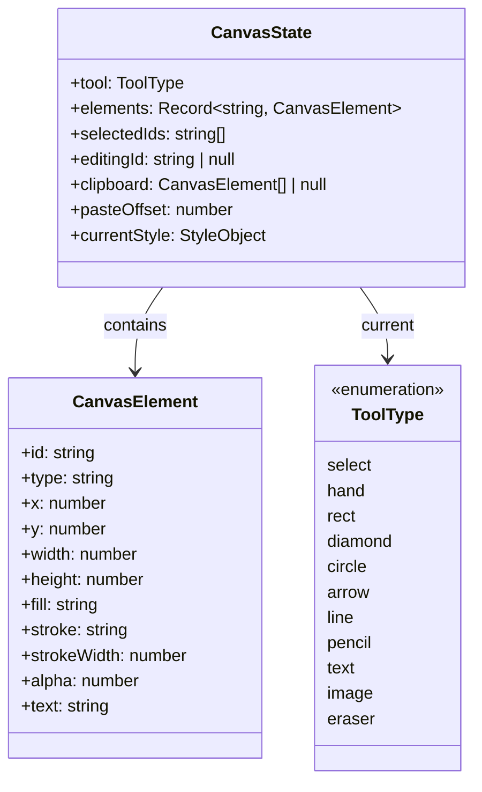
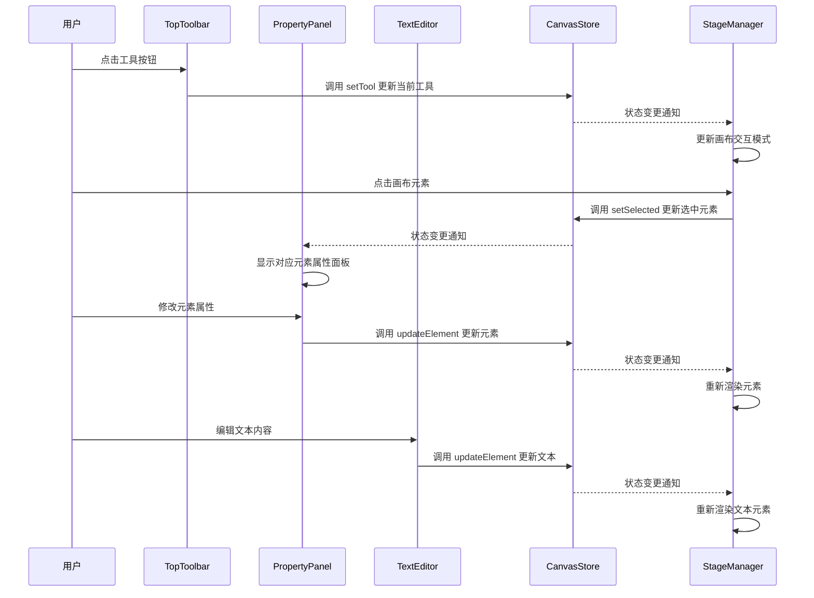
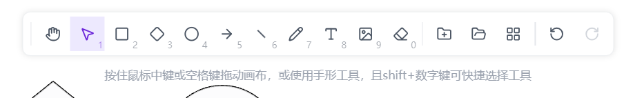
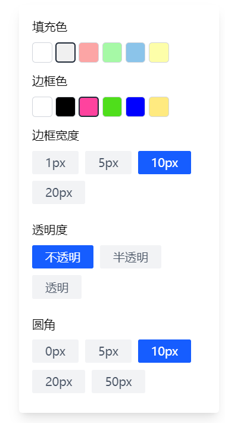
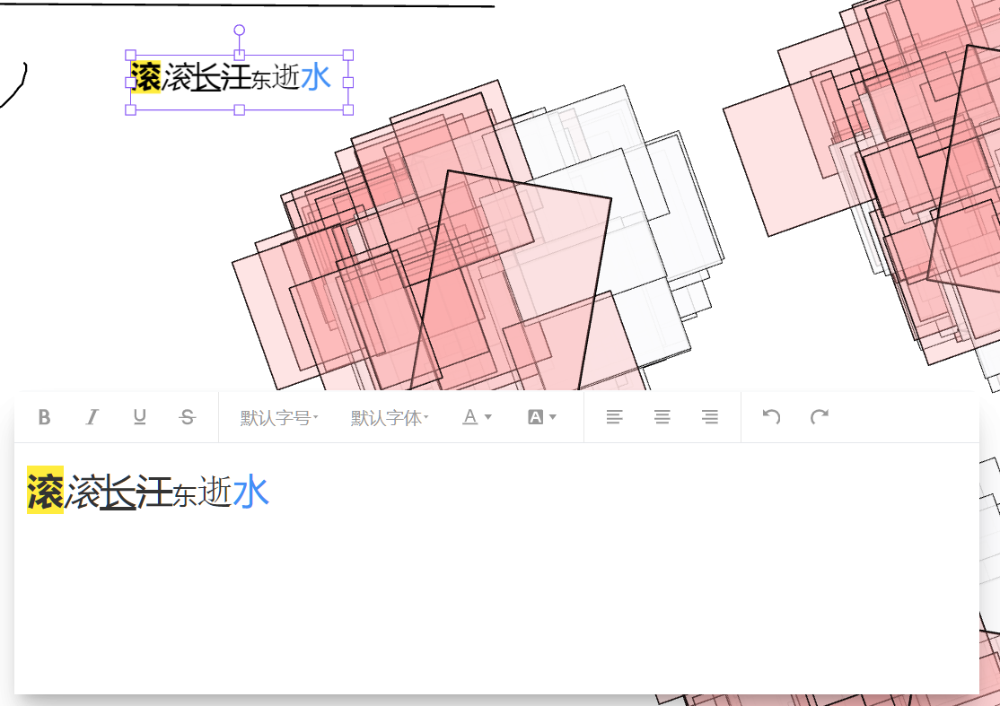
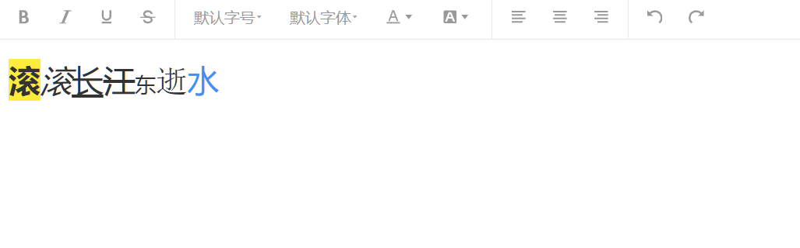

## 1. DSP

本文档主要讲的是调参工具栏的实现，包括浮动工具栏的实现、文本元素选中时的上方工具栏、图形元素选中时的属性设置、文本元素局部样式编辑的实现方式

调参工具栏相关的组件：

```
src/
├── components/
│   ├── canvas_toolbar/
│   │   └── TopToolbar.tsx           # 顶部主工具栏，包含绘图工具选择
│   ├── property-panel/
│   │   └── index.tsx                # 右侧属性面板，用于设置图形元素属性
│   ├── Richtext_editor/
│   │   ├── Richtext_editor.tsx      # 富文本编辑器组件
│   │   └── BottomTextEditor.tsx     # 底部文本编辑器容器
│   └── ui/                          # UI 图标组件
└── stores/
    └── canvasStore.ts               # 状态管理，存储元素和选中状态
```

调参工具栏模块实现了两种类型的工具栏：

1. 浮动于画布上方的上下文工具栏，根据选中元素类型动态显示
2. 固定在界面右侧的属性面板，用于设置图形元素的具体属性

提供填充色，边框色，边框宽度，透明度，圆角等属性的设置


## 2. 组件 Props 定义

TopToolbar 组件无外部传入 props。

PropertyPanel 组件无外部传入 props。

RichTextEditor 组件接口如下：

| 字段名    | 类型                    | 必填 | 默认值 | 描述             |
| :-------- | :---------------------- | :--- | :----- | :--------------- |
| value     | string                  | 是   | 无     | 编辑器的初始内容 |
| onChange  | (value: string) => void | 是   | 无     | 内容变化回调函数 |
| className | string                  | 否   | 无     | 自定义 CSS 类名  |

## 3. 核心状态管理 (State Architecture)

### 3.1 状态架构与数据建模

项目使用 Zustand 作为状态管理库，核心状态模型如下：



状态分为两类：

1. 核心业务数据：elements（画布元素集合）、selectedIds（选中元素 ID 列表）
2. UI 交互状态：tool（当前工具类型）、editingId（正在编辑的元素 ID）

初始状态中，elements 初始化为空对象，selectedIds 初始化为空数组

### 3.2 流程

| Action 名称   | 触发源 (Trigger)                 | 处理逻辑 (Sync/Async) | 影响的 State 字段 | 副作用 (Side Effects)    |
| :------------ | :------------------------------- | :-------------------- | :---------------- | :----------------------- |
| setTool       | TopToolbar 点击工具按钮          | Sync                  | tool              | 更新当前工具类型         |
| updateElement | 属性面板或文本编辑器修改元素属性 | Sync                  | elements          | 触发画布重新渲染         |
| setSelected   | 画布元素选择操作                 | Sync                  | selectedIds       | 触发工具栏和属性面板更新 |

## 4. 逻辑流程 (Logic Flow)

### 4.1 交互时序图 (Mermaid)



### 4.2 核心函数

- **`TopToolbar组件`**:



应用启动时渲染，用户交互时更新，提供工具选择功能，通过调用 [setTool](file://E:/ADF-workbase/BDdraw_DEV/src/stores/canvasStore.ts#L183-L185) 更新当前工具状态

TopToolbar 组件主要用于提供绘图工具的选择功能，其核心实现包括：

工具配置定义所有可用的工具项，包括分隔线、各种绘图工具和操作按钮

```typescript
const tools = [
  { isSeparator: true },
  { id: 'hand', value: 'hand', icon: Hand, label: 'Hand tool (H)', shortcut: '' },
  { id: 'select', value: 'select', icon: MousePointer2, label: 'Selection (V)', shortcut: '1' },
  { id: 'rect', value: 'rect', icon: Square, label: 'Rectangle (R)', shortcut: '2' },
  // ...其他工具项
]
```

TopToolbar 通过 map 遍历 tools 数组来渲染每个工具按钮：

```tsx
{
  tools.map((item, index) => {
    // 处理分隔线
    if (item.isSeparator) {
      return <div key={`sep-${index}`} className="mx-1 h-6 w-px bg-gray-200" />
    }

    // 渲染按钮
    const isActive = tool === item.value && item.type !== 'action'
    const Icon = item.icon

    return (
      <button
        key={item.id || index}
        title={item.label}
        onClick={() => {
          if (item.onClick) item.onClick()
          if (item.value) setTool(item.value as any)
        }}
        className={cls(
          'relative flex h-9 w-9 items-center justify-center transition-colors duration-100',
          isActive ? 'bg-violet-100 text-violet-700' : 'bg-transparent text-gray-600 hover:bg-gray-100',
        )}
      >
        {Icon && <Icon className={cls('h-4 w-4', item.value === 'line' ? 'rotate-45' : '')} strokeWidth={2} />}

        {/* 快捷键提示 */}
        {item.shortcut && (
          <span className="absolute bottom-[2px] right-[2px] text-[9px] font-medium leading-none opacity-50">
            {item.shortcut}
          </span>
        )}
      </button>
    )
  })
}
```

工具切换核心功能是通过 [setTool](<javascript:void(0)>) 函数切换当前工具：

```typescript
const { tool, setTool, undo, redo, canUndo, canRedo } = useStore()

// 在按钮点击事件中调用
onClick={() => {
  if (item.onClick) item.onClick()
  if (item.value) setTool(item.value as any)
}}
```

工具栏还提供了撤销和重做功能：

```tsx
<button
  title="撤销 (Ctrl+Z)"
  onClick={undo}
  disabled={!canUndo()}
  className={cls(
    'relative flex h-9 w-9 items-center justify-center transition-colors duration-100',
    canUndo() ? 'text-gray-600 hover:bg-gray-100' : 'cursor-not-allowed text-gray-300',
  )}
>
  <RotateCcw className="h-4 w-4" />
</button>

<button
  title="重做 (Ctrl+Y)"
  onClick={redo}
  disabled={!canRedo()}
  className={cls(
    'relative flex h-9 w-9 items-center justify-center transition-colors duration-100',
    canRedo() ? 'text-gray-600 hover:bg-gray-100' : 'cursor-not-allowed text-gray-300',
  )}
>
  <RotateCw className="h-4 w-4" />
</button>
```

TopToolbar 还包含了元素分组和取消分组的功能：

```typescript
{
  id: 'group',
  type: 'action',
  icon: FolderPlus,
  label: 'Group Elements (Ctrl+G)',
  onClick: () => {
    const state = useStore.getState()
    if (state.selectedIds.length > 1) {
      groupElements(state.selectedIds)
    } else {
      Notification.warning({
        closable: false,
        title: '无法分组',
        content: '请选择至少两个元素进行分组',
      })
    }
  },
}
```

通过模态框实现图片插入功能：

```typescript{
  id: 'image',
  value: 'image',
  icon: ImageIcon,
  label: 'Insert image',
  shortcut: '9',
  onClick: () => setImageModalVisible(true),
}
```

- **`PropertyPanel组件`**:



当画布中选中单个非文本、非图像元素时自动显示，根据元素类型显示相应的属性设置控件，用户修改后通过 [updateElement](file://E:/ADF-workbase/BDdraw_DEV/src/stores/canvasStore.ts#L187-L195) 更新状态

```typescript
// 只处理选中单个元素的情况
if (selectedIds.length !== 1) return null
const id = selectedIds[0]
const element = elements[id]

// 如果元素不存在或者为图片/文本类型，不显示属性面板
if (!element) return null
if (element.type === 'image') return null
if (element.type === 'text') return null

const handleChange = (key: string, val: any) => {
  // 记录更改前的属性值
  const oldValue = element[key as keyof typeof element]

  // 更新元素
  updateElement(id, { [key]: val })

  // 创建并执行更新命令以支持撤销/重做
  const updateCommand = new UpdateElementPropertyCommand(
    {
      id,
      property: key,
      oldValue,
      newValue: val,
    },
    `修改元素${key}`,
  )
  undoRedoManager.executeCommand(updateCommand)
}
```

- **`BottomTextEditor组件`**:

当画布中选中文本元素时自动显示，显示富文本编辑器，用户编辑内容后实时更新元素文本属性



```typescript
if (!element || element.type !== 'text') {
  return null
}

const handleChange = (html: string) => {
  setLocalHtml(html)
  // 记录更改前的属性值
  const initialText = element.text || ''

  // 实时更新 Store，驱动 Canvas 重新渲染
  updateElement(element.id, { text: html })

  // 创建并执行更新命令以支持撤销/重做
  const updateCommand = new UpdateElementPropertyCommand(
    {
      id: element.id,
      property: 'text',
      oldValue: initialText,
      newValue: html,
    },
    '修改文本内容',
  )
  undoRedoManager.executeCommand(updateCommand)
}
```

- **`RichTextEditor组件`**:

在 BottomTextEditor 中使用，提供富文本编辑功能，基于 wangEditor 实现，提供基础文本样式编辑功能



```tsx
// 工具栏配置：仅保留基础文本样式
const toolbarConfig: Partial<IToolbarConfig> = {
  toolbarKeys: [
    'bold',
    'italic',
    'underline',
    'through',
    '|',
    'fontSize',
    'fontFamily',
    'color',
    'bgColor',
    '|',
    'justifyLeft',
    'justifyCenter',
    'justifyRight',
    '|',
    'undo',
    'redo',
  ],
}

return (
  <div className={`flex flex-col border-t border-gray-50 bg-white shadow-xl ${className || ''}`}>
    {/* 工具栏 */}
    <Toolbar
      editor={editor}
      defaultConfig={toolbarConfig}
      mode="simple"
      className="border-b border-gray-100"
      style={{ borderBottom: '1px solid #e5e7eb' }}
    />
    {/* 编辑区域：高度固定较小，形成底部面板感 */}
    <Editor
      defaultConfig={editorConfig}
      value={value}
      onCreated={setEditor}
      onChange={(editor) => onChange(editor.getHtml())}
      mode="simple"
      style={{ height: '200px', overflowY: 'auto' }}
    />
  </div>
)
```
