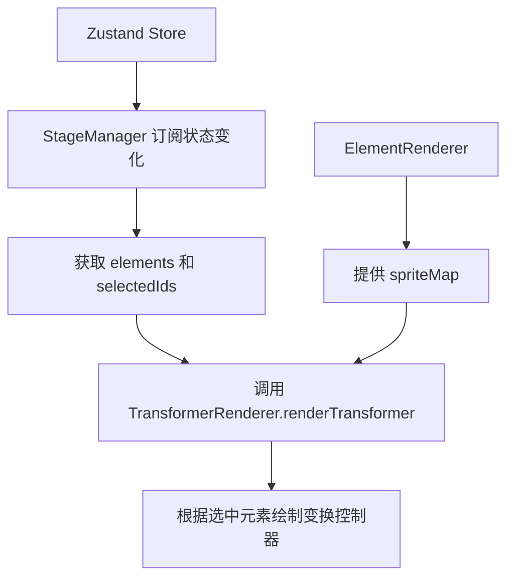
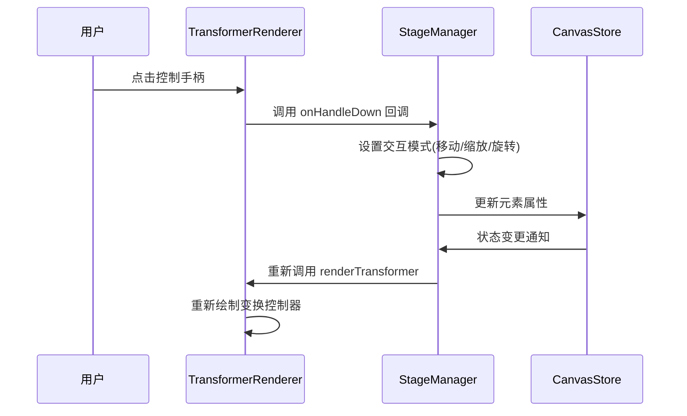
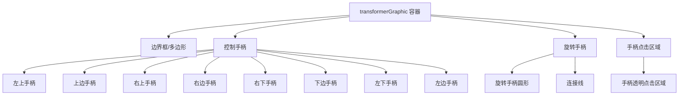

# TransformerRenderer 设计

TransformerRenderer 模块负责渲染画布中选中元素的变换控制器（选择框和控制手柄），包括：

- 绘制元素选择边界框
- 显示控制手柄（用于移动、缩放、旋转等操作）
- 处理用户与控制手柄的交互

### 项目结构树

```
src/
└── pages/
    └── canvas/
        └── Pixi_STM_modules/
            └── rendering/
                └── TransformerRenderer.ts
```

|               | 作用                                      |
| ------------- | ----------------------------------------- |
| PixiJS        | 2D 渲染引擎，用于绘制图形元素和交互控制器 |
| TypeScript    | 提供类型安全和更好的开发体验              |
| CanvasElement | 数据模型，提供元素属性用于渲染            |

## 2. Props 和相关类型定义

### 2.1 renderTransformer 参数

| 参数名        | 类型                                                                                             | 必填 | 默认值 | 描述                           |
| ------------- | ------------------------------------------------------------------------------------------------ | ---- | ------ | ------------------------------ |
| elements      | `Record<string, CanvasElement>`                                                                  | 是   | -      | 所有画布元素的集合             |
| selectedIds   | `string[]`                                                                                       | 是   | -      | 当前选中元素的 ID 数组         |
| spriteMap     | `Map<string, PIXI.Graphics \| PIXI.HTMLText \| PIXI.Sprite>`                                     | 是   | -      | 元素 ID 到 Pixi 图形对象的映射 |
| onHandleDown  | `(e: PIXI.FederatedPointerEvent, handle: HandleType \| 'p0' \| 'p1', elementId: string) => void` | 是   | -      | 控制手柄按下时的回调函数       |
| viewportScale | `number`                                                                                         | 是   | -      | 视口缩放比例，用于调整手柄大小 |

```typescript
transformerRenderer.renderTransformer(
  elements, // 所有画布元素
  selectedIds, // 选中元素ID数组
  spriteMap, // 元素到图形对象的映射
  onHandleDown, // 手柄按下回调
  viewport.scale.x, // 视口缩放比例
)
```

### 2.2 类型定义

#### CanvasElement 类型

```typescript
export interface CanvasElement {
  id: string
  type: ToolType
  x: number
  y: number
  width: number
  height: number
  fill: string
  stroke: string
  strokeWidth: number
  alpha?: number
  points?: number[][]
  rotation?: number // 旋转角度（弧度）
  // 其他文本和图像相关属性...
}
```

字段说明：

- `id`: 元素唯一标识符
- `type`: 元素类型（如'rect', 'circle', 'text'等）
- `x, y`: 元素位置坐标
- `width, height`: 元素尺寸
- `fill, stroke, strokeWidth`: 填充色、边框色和边框宽度
- `alpha`: 透明度
- `points`: 点集（用于 pencil, line, arrow 等）
- `rotation`: 旋转角度（弧度制）

#### HandleType 类型

```typescript
export type HandleType = 'tl' | 't' | 'tr' | 'r' | 'br' | 'b' | 'bl' | 'l' | 'p0' | 'p1' | 'rotate'
```

各控制手柄类型含义：

- `tl`, `t`, `tr`, `r`, `br`, `b`, `bl`, `l`: 八个方向的缩放手柄
- `p0`, `p1`: 线段两个端点的移动手柄
- `rotate`: 旋转手柄

## 3. 状态管理 (State Architecture)

### 3.1 内部状态 (Local State)

| 状态名             | 类型            | 描述                               |
| ------------------ | --------------- | ---------------------------------- |
| transformerGraphic | `PIXI.Graphics` | 用于绘制变换控制器的 Pixi 图形对象 |

### 3.2 外部状态 (Global/Server State)

TransformerRenderer 是一个纯渲染模块，不直接管理外部状态。它通过以下方式接收外部状态：

1. `elements`: 从 Zustand store 获取的所有画布元素
2. `selectedIds`: 从 Zustand store 获取的当前选中元素 ID 数组
3. `spriteMap`: 从 ElementRenderer 获取的元素到图形对象的映射

### 3.3 状态同步机制



## 4. 逻辑流程 (Logic Flow)

### 4.1 交互时序图



### 4.2 核心函数解析

#### renderTransformer 函数:

当画布元素或选中状态发生变化时，由 StageManager 调用，接收当前所有元素和选中元素 ID，根据选中元素类型和状态决定绘制方式，调用相应方法绘制变换控制器

```typescript
public renderTransformer(
  elements: Record<string, CanvasElement>,
  selectedIds: string[],
  spriteMap: Map<string, PIXI.Graphics | PIXI.HTMLText | PIXI.Sprite>,
  onHandleDown: (e: PIXI.FederatedPointerEvent, handle: HandleType | 'p0' | 'p1', elementId: string) => void,
  viewportScale: number,
) {
  // 清空之前的绘制内容
  this.transformerGraphic.clear()
  this.transformerGraphic.removeChildren()

  if (selectedIds.length === 0) return

  // 根据选中元素类型决定绘制方式
  const el = elements[selectedIds[0]]
  const isLinearElement = selectedIds.length === 1 && (el.type === 'line' || el.type === 'arrow') && el.points?.length === 2

  if (isLinearElement) {
    // 绘制线段控制手柄
    this.drawLinearHandles(el, selectedIds, onHandleDown, viewportScale)
  } else {
    // 绘制包围盒控制手柄
    this.drawBoundingBoxHandles(elements, selectedIds, spriteMap, onHandleDown, viewportScale)
  }
}
```

一些处理

- 区分线性元素（line/arrow）和普通元素的不同控制手柄绘制方式
- 根据是否有旋转属性决定绘制普通边界框还是旋转边界框
- 根据选中元素数量决定是否显示控制手柄

#### drawRotatedBounds 函数:

当选中元素具有旋转属性时，在 renderTransformer 中被调用，接收边界框信息和旋转角度，计算旋转后各角点坐标，绘制旋转后的边界框和控制手柄


```typescript
private drawRotatedBounds(
  bounds: { x: number; y: number; width: number; height: number },
  rotation: number,
  viewportScale: number,
  selectedIds: string[],
  onHandleDown: (e: PIXI.FederatedPointerEvent, handle: HandleType | 'p0' | 'p1', elementId: string) => void,
) {
  const centerX = bounds.x + bounds.width / 2
  const centerY = bounds.y + bounds.height / 2

  // 计算旋转后的四个角点
  const halfWidth = bounds.width / 2
  const halfHeight = bounds.height / 2

  const corners = [
    { x: -halfWidth, y: -halfHeight }, // 左上
    { x: halfWidth, y: -halfHeight },  // 右上
    { x: halfWidth, y: halfHeight },   // 右下
    { x: -halfWidth, y: halfHeight }   // 左下
  ]

  // 应用旋转矩阵计算实际坐标
  const rotatedCorners = corners.map(corner => {
    const cos = Math.cos(rotation)
    const sin = Math.sin(rotation)
    return {
      x: centerX + corner.x * cos - corner.y * sin,
      y: centerY + corner.x * sin + corner.y * cos
    }
  })

  // 绘制旋转后的边界框
  this.transformerGraphic.poly(rotatedCorners)
  this.transformerGraphic.stroke({ width: 1, color: 0x8b5cf6 })
  this.transformerGraphic.closePath()

  // 绘制控制手柄和其他UI元素
  // ...
}
```

- 使用三角函数计算旋转后坐标
- 正确放置旋转手柄位置，使其始终位于边界框上方
- 保持手柄与边界框一同旋转

## 5. UI 与样式实现 (UI Implementation)

### 布局策略



### 样式方案

TransformerRenderer 使用 PixiJS 的 Graphics API 进行绘制：

1. **边界框样式**:

   - 颜色: 紫色 (#8b5cf6)
   - 线宽: 1px

2. **控制手柄样式**:

   - 形状: 矩形
   - 填充色: 白色
   - 边框色: 紫色 (#8b5cf6)
   - 边框宽度: 1px

3. **旋转手柄样式**:

   - 形状: 圆形
   - 填充色: 白色
   - 边框色: 紫色 (#8b5cf6)
   - 边框宽度: 1px

4. **手柄大小自适应**:
   根据视口缩放比例调整手柄大小:
   ```typescript
   const handleSize = 8 / viewportScale
   ```

### 元素操作机制实现

#### 旋转操作

1. 检测元素是否有 rotation 属性
2. 计算元素中心点和旋转后各角点坐标
3. 绘制旋转后的边界框
4. 旋转手柄位置通过以下方式计算:

   ```typescript
   // 计算未旋转时顶部中心点
   const topCenterX = centerX
   const topCenterY = bounds.y

   // 将顶部中心点也进行旋转
   const rotatedTopCenterX =
     centerX + (topCenterX - centerX) * Math.cos(rotation) - (topCenterY - centerY) * Math.sin(rotation)
   const rotatedTopCenterY =
     centerY + (topCenterX - centerX) * Math.sin(rotation) + (topCenterY - centerY) * Math.cos(rotation)
   ```

#### 缩放操作

1. 根据手柄类型确定缩放方向
2. 通过拖拽距离计算新的元素尺寸
3. 更新元素的 width/height 属性

#### 移动操作

1. 通过拖拽偏移量更新元素的 x/y 属性
2. 对于多选元素，保持相对位置不变

#### 元素打组机制

当前实现中，多元素选择时:

1. 计算所有选中元素的包围盒
2. 在包围盒周围显示控制手柄
3. 操作时同时影响所有选中元素
