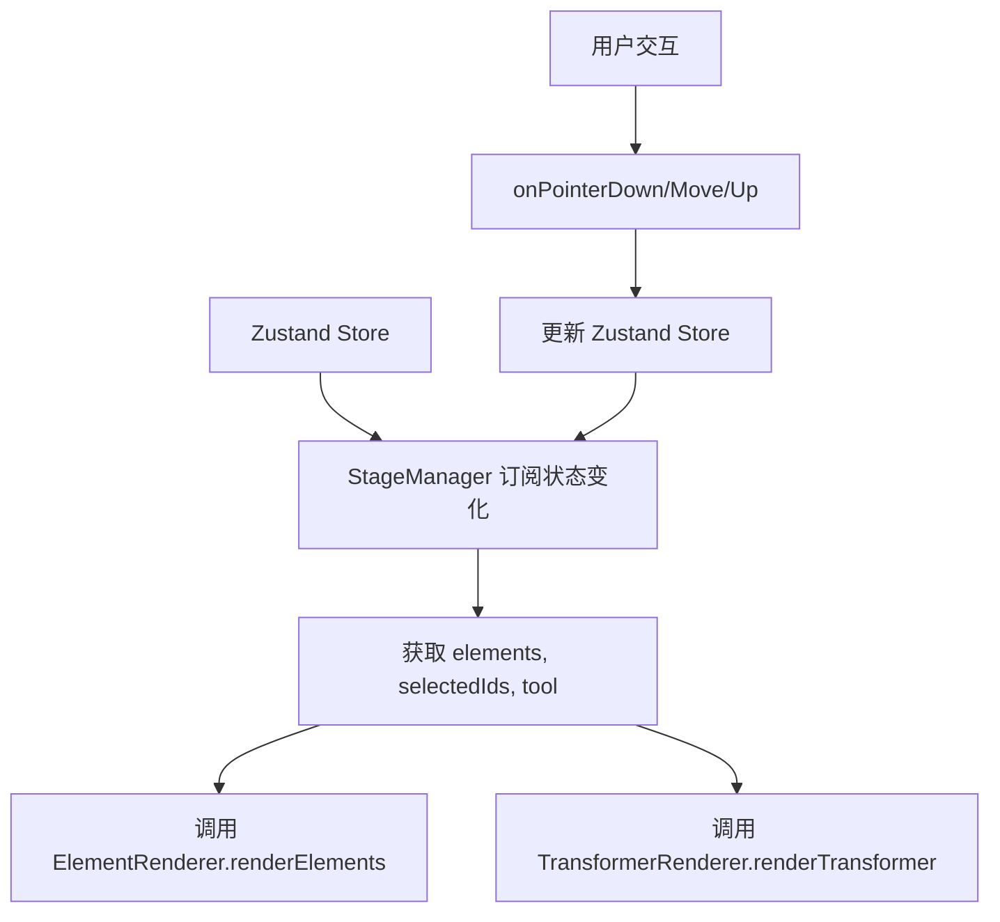
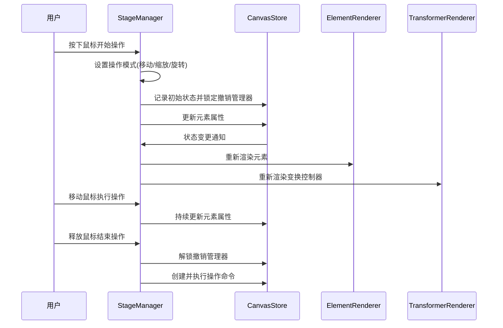

# 元素操作机制和元素打组机制实现文档

## 1. DES

元素操作机制（移动、缩放、旋转）和元素打组机制的实现方案，包括数据结构、交互逻辑、状态管理和相关组件的实现细节。

### 项目结构树

```
src/
├── pages/
│   └── canvas/
│       └── Pixi_STM_modules/
│           ├── core/
│           │   └── StageManagerCore.ts     # 主要操作逻辑实现
│           ├── rendering/
│           │   ├── ElementRenderer.ts      # 元素渲染
│           │   └── TransformerRenderer.ts  # 选择框和控制手柄渲染
│           └── core/
│               └── types.ts                # 相关类型定义
├── stores/
│   └── canvasStore.ts                      # CanvasElement 接口定义和状态管理
└── lib/
    └── UpdateElementCommand.ts             # 撤销/重做命令实现
```

|               | 作用                                      |
| ------------- | ----------------------------------------- |
| PixiJS        | 2D 渲染引擎，用于绘制图形元素和交互控制器 |
| pixi-viewport | 提供无限画布支持和视口控制                |
| TypeScript    | 提供类型安全和更好的开发体验              |
| Zustand       | 全局状态管理                              |
| nanoid        | 生成元素唯一标识符                        |

## 2. Props 和相关类型定义

### 2.1 核心方法参数

StageManagerCore 交互方法：

#### onPointerDown 方法

处理指针按下事件，开始各种操作

| 参数名 | 类型                         | 必填 | 默认值 | 描述                |
| ------ | ---------------------------- | ---- | ------ | ------------------- |
| e      | `PIXI.FederatedPointerEvent` | 是   | -      | PixiJS 指针事件对象 |

#### onPointerMove 方法

处理指针移动事件，执行操作过程

| 参数名 | 类型                         | 必填 | 默认值 | 描述                |
| ------ | ---------------------------- | ---- | ------ | ------------------- |
| e      | `PIXI.FederatedPointerEvent` | 是   | -      | PixiJS 指针事件对象 |

#### onPointerUp 方法

处理指针释放事件，结束操作

| 参数名 | 类型 | 必填 | 默认值 | 描述   |
| ------ | ---- | ---- | ------ | ------ |
| 无参数 | -    | -    | -      | 无参数 |

### 代码示例

```typescript
// 在 StageManagerCore 中注册指针事件处理
this.interactionHandler = new InteractionHandler(
  this.viewport,
  this.onPointerDown, // 指针按下处理
  this.onPointerMove, // 指针移动处理
  this.onPointerUp, // 指针释放处理
)
```

### 2.2 类型定义

#### StageManagerState 类型

```typescript
export interface StageManagerState {
  mode: InteractionMode // 当前交互模式
  startPos: { x: number; y: number } // 操作起始位置
  currentId: string | null // 当前操作元素ID
  initialElementsMap: Record<string, Partial<CanvasElement>> | null // 调整大小初始状态
  initialGroupBounds: { x: number; y: number; width: number; height: number } | null // 群组初始边界
  activeHandle: HandleType | null // 激活的控制手柄
  isSpacePressed: boolean // 空格键是否按下
  destroyed: boolean // 是否已销毁
  resizeInitialStates: Record<string, Partial<CanvasElement>> | null // 缩放初始状态
  dragInitialStates: Record<string, Partial<CanvasElement>> | null // 拖拽初始状态
  rotationInitialStates: Record<
    string,
    {
      // 旋转初始状态
      x: number
      y: number
      width: number
      height: number
      rotation: number
      cx: number
      cy: number
    }
  > | null
  rotationCenter: { x: number; y: number } | null // 旋转中心点
  startRotationAngle: number | null // 起始旋转角度
}
```

#### InteractionMode 类型

```typescript
export type InteractionMode =
  | 'idle' // 空闲状态
  | 'panning' // 画布平移
  | 'selecting' // 选择元素
  | 'dragging' // 拖拽元素
  | 'resizing' // 调整大小
  | 'drawing' // 绘制元素
  | 'texting' // 文本编辑
  | 'erasing' // 擦除元素
  | 'rotating' // 旋转元素
```

#### HandleType 类型

```typescript
export type HandleType =
  | 'tl'
  | 't'
  | 'tr' // 上方三个手柄
  | 'r' // 右侧手柄
  | 'br'
  | 'b'
  | 'bl' // 下方三个手柄
  | 'l' // 左侧手柄
  | 'p0'
  | 'p1' // 线段端点手柄
  | 'rotate' // 旋转手柄
```

## 3. 状态管理 (State Architecture)

### 3.1 内部状态 (Local State)

| 状态名                | 类型                                    | 描述           |
| --------------------- | --------------------------------------- | -------------- | ---------------- |
| mode                  | `InteractionMode`                       | 当前交互模式   |
| startPos              | `{ x: number; y: number }`              | 操作起始位置   |
| currentId             | `string                                 | null`          | 当前操作元素 ID  |
| activeHandle          | `HandleType                             | null`          | 激活的控制手柄   |
| isSpacePressed        | `boolean`                               | 空格键是否按下 |
| destroyed             | `boolean`                               | 是否已销毁     |
| resizeInitialStates   | `Record<string, Partial<CanvasElement>> | null`          | 缩放操作初始状态 |
| dragInitialStates     | `Record<string, Partial<CanvasElement>> | null`          | 拖拽操作初始状态 |
| rotationInitialStates | `Record<...>                            | null`          | 旋转操作初始状态 |
| rotationCenter        | `{ x: number; y: number }               | null`          | 旋转中心点       |
| startRotationAngle    | `number                                 | null`          | 起始旋转角度     |

### 3.2 外部状态 (Global/Server State)

StageManagerCore 订阅了 Zustand store 中的状态：

1. `elements`: 所有画布元素
2. `selectedIds`: 当前选中元素 ID 数组
3. `tool`: 当前工具类型

### 3.3 状态同步机制



## 4. 逻辑流程 (Logic Flow)

### 4.1 交互时序图



### 4.2 核心函数解析

#### onPointerDown 函数:

用户在画布上按下鼠标时触发
根据当前工具和鼠标位置确定操作类型,设置相应的操作模式和初始状态,为后续的 onPointerMove 操作做准备

**核心实现**:

```typescript
private onPointerDown = (e: PIXI.FederatedPointerEvent) => {
  // 省略部分代码...

  if (e.target && e.target.label && !e.target.label.startsWith('handle:')) {
    const hitId = e.target.label;
    // 如果我们不在选择模式，切换到选择模式
    if (tool !== 'select') {
      state.setTool('select');
    }
    // 选择元素并开始拖拽
    this.state.mode = 'dragging';
    this.state.currentId = hitId;
    if (!state.selectedIds.includes(hitId)) {
      state.setSelected([hitId]);
    }

    // 捕获所有选中元素在拖拽前的初始状态
    const initialDragMap: Record<string, Partial<CanvasElement>> = {};
    state.selectedIds.forEach((id) => {
      const el = state.elements[id];
      if (el) {
        // 记录 x, y (如果是直线/箭头，可能也需要记录 points)
        initialDragMap[id] = {
          x: el.x,
          y: el.y,
          points: el.points ? [...el.points.map((p) => [...p])] : undefined,
        };
      }
    });
    this.state.dragInitialStates = initialDragMap;

    // 开始拖拽时锁定撤销/重做管理器
    undoRedoManager.lock();
    return;
  }

  // 省略部分代码...
}
```

**特殊处理**:

- 区分不同的操作类型（拖拽、缩放、旋转）
- 记录操作前的初始状态用于撤销/重做
- 锁定撤销管理器防止中间状态被记录

#### onHandleDown 函数:

**触发时机**: 用户点击控制手柄时触发

**逻辑闭环**:

1. 根据手柄类型确定操作类型（缩放或旋转）
2. 设置相应的操作模式和初始状态
3. 为后续的 onPointerMove 操作做准备

**核心实现**:

```typescript
private onHandleDown = (
  e: PIXI.FederatedPointerEvent,
  handle: HandleType | 'p0' | 'p1' | 'rotate',
  elementId: string,
) => {
  e.stopPropagation();

  // 旋转逻辑分支
  if (handle === 'rotate') {
    this.state.mode = 'rotating';
    this.state.currentId = elementId;

    const state = useStore.getState();
    const { elements, selectedIds } = state;
    const mousePos = e.getLocalPosition(this.viewport);

    // 1. 计算旋转中心（选中元素的包围盒中心）
    const bounds = this.getSelectionBounds(selectedIds, elements);
    if (!bounds) return;

    const centerX = bounds.x + bounds.width / 2;
    const centerY = bounds.y + bounds.height / 2;
    this.state.rotationCenter = { x: centerX, y: centerY };

    // 2. 计算鼠标起始角度（相对于中心点）
    this.state.startRotationAngle = Math.atan2(mousePos.y - centerY, mousePos.x - centerX);

    // 3. 记录所有选中元素的初始状态
    const initialMap: Record<string, any> = {};
    selectedIds.forEach((id) => {
      const el = elements[id];
      if (el) {
        initialMap[id] = {
          x: el.x,
          y: el.y,
          width: el.width,
          height: el.height,
          rotation: el.rotation || 0,
          // 记录元素自身的中心点，方便后续计算
          cx: el.x + el.width / 2,
          cy: el.y + el.height / 2,
        };
      }
    });
    this.state.rotationInitialStates = initialMap;

    undoRedoManager.lock();
    return;
  }

  // 缩放逻辑
  this.state.mode = 'resizing';
  this.state.activeHandle = handle as HandleType | null;
  this.state.currentId = elementId;
  this.state.startPos = e.getLocalPosition(this.viewport);

  const state = useStore.getState();
  const { elements, selectedIds } = state;

  // 捕捉所有选中元素的初始状态
  const initialMap: Record<string, Partial<CanvasElement>> = {};
  selectedIds.forEach((id) => {
    const el = elements[id];
    if (el) {
      initialMap[id] = {
        x: el.x,
        y: el.y,
        width: el.width,
        height: el.height,
        type: el.type,
        points: el.points ? el.points.map((p) => [...p]) : undefined,
      };
    }
  });
  this.state.resizeInitialStates = initialMap;

  // 计算初始的群组包围盒
  this.state.initialGroupBounds = this.getSelectionBounds(selectedIds, elements);

  // 保存初始元素映射用于调整大小计算
  this.state.initialElementsMap = initialMap;

  // 开始调整大小时锁定撤销/重做管理器
  undoRedoManager.lock();
}
```

**特殊处理**:

- 特殊处理旋转操作，计算旋转中心和起始角度
- 记录所有选中元素的完整初始状态
- 为多元素操作计算群组边界

#### onPointerMove 函数:

**触发时机**: 用户在按住鼠标移动时触发

**逻辑闭环**:

1. 根据当前操作模式执行相应的操作逻辑
2. 持续更新元素属性
3. 触发重新渲染

**核心实现**:

```typescript
private onPointerMove = (e: PIXI.FederatedPointerEvent) => {
  // 省略部分代码...

  } else if (this.state.mode === 'dragging') {
    const dx = currentPos.x - this.state.startPos.x;
    const dy = currentPos.y - this.state.startPos.y;

    if (state.selectedIds.length > 0) {
      state.selectedIds.forEach((id) => {
        const el = state.elements[id];
        state.updateElement(id, { x: el.x + dx, y: el.y + dy });
      });
      // 重置起点，使 dx/dy 成为增量
      this.state.startPos = { x: currentPos.x, y: currentPos.y };
    }
  } else if (this.state.mode === 'resizing' && this.state.initialElementsMap && this.state.initialGroupBounds) {
    // 修复后的 Resize 逻辑
    const selectedIds = state.selectedIds;
    const initBounds = this.state.initialGroupBounds;
    const handle = this.state.activeHandle;

    // 处理单个线段/箭头的端点拖拽 (特例)
    const singleId = selectedIds[0];
    const singleEl = this.state.initialElementsMap[singleId];
    if (
      selectedIds.length === 1 &&
      singleEl &&
      (singleEl.type === 'line' || singleEl.type === 'arrow') &&
      (handle === 'p0' || handle === 'p1')
    ) {
      // 省略具体实现...
    }

    // 通用群组缩放逻辑
    // 计算鼠标相对于点击时的位移
    const totalDx = currentPos.x - this.state.startPos.x;
    const totalDy = currentPos.y - this.state.startPos.y;

    // 基于初始包围盒计算新的包围盒
    let finalL = initBounds.x;
    let finalR = initBounds.x + initBounds.width;
    let finalT = initBounds.y;
    let finalB = initBounds.y + initBounds.height;

    // 根据手柄方向应用位移
    if (handle?.includes('l')) finalL += totalDx;
    if (handle?.includes('r')) finalR += totalDx;
    if (handle?.includes('t')) finalT += totalDy;
    if (handle?.includes('b')) finalB += totalDy;

    // 处理翻转（如果拉过了头）
    if (finalR < finalL) {
      [finalL, finalR] = [finalR, finalL];
    }
    if (finalB < finalT) {
      [finalT, finalB] = [finalB, finalT];
    }

    const newBoundsW = finalR - finalL;
    const newBoundsH = finalB - finalT;

    // 计算缩放比例
    const scaleX = initBounds.width === 0 ? 1 : newBoundsW / initBounds.width;
    const scaleY = initBounds.height === 0 ? 1 : newBoundsH / initBounds.height;

    // 应用到所有选中的元素
    selectedIds.forEach((id) => {
      const initEl = this.state.initialElementsMap![id];
      if (!initEl) return;

      // 计算新位置：新原点 + (相对位移 * 缩放)
      const relX = initEl.x! - initBounds.x;
      const relY = initEl.y! - initBounds.y;

      const finalElX = finalL + relX * scaleX;
      const finalElY = finalT + relY * scaleY;
      const finalElW = initEl.width! * scaleX;
      const finalElH = initEl.height! * scaleY;

      const updatePayload: any = {
        x: finalElX,
        y: finalElY,
        width: finalElW,
        height: finalElH,
      };

      // 如果有内部点集，也需要缩放
      if (initEl.points) {
        updatePayload.points = initEl.points.map((p) => [p[0] * scaleX, p[1] * scaleY]);
      }

      state.updateElement(id, updatePayload);
    });
  } else if (
    this.state.mode === 'rotating' &&
    this.state.rotationInitialStates &&
    this.state.rotationCenter &&
    this.state.startRotationAngle !== null
  ) {
    // 旋转逻辑
    const { x: cx, y: cy } = this.state.rotationCenter;

    // 1. 计算当前鼠标角度
    const currentAngle = Math.atan2(currentPos.y - cy, currentPos.x - cx);

    // 2. 计算旋转增量（当前角度 - 起始角度）
    const deltaAngle = currentAngle - this.state.startRotationAngle;

    // 3. 更新每一个选中元素
    state.selectedIds.forEach((id) => {
      const initEl = this.state.rotationInitialStates![id];
      if (!initEl) return;

      // A. 计算新的自转角度
      const newRotation = initEl.rotation + deltaAngle;

      // B. 计算新的位置 (公转)
      // 将元素的中心点 (initEl.cx, initEl.cy) 绕着 组中心 (cx, cy) 旋转 deltaAngle
      const newCenter = this.rotatePoint(initEl.cx, initEl.cy, cx, cy, deltaAngle);

      // C. 根据新的中心点反推 x, y (x = center.x - width/2)
      const newX = newCenter.x - initEl.width / 2;
      const newY = newCenter.y - initEl.height / 2;

      // D. 更新 Store
      state.updateElement(id, {
        x: newX,
        y: newY,
        rotation: newRotation,
      });
    });
    return;
  }

  // 省略部分代码...
}
```

分别处理拖拽、缩放和旋转操作,特殊处理线段元素的端点操作,处理多元素群组操作时的相对位置保持,实现旋转时元素公转和自转的计算

## 5. 元素打组机制实现

### 5.1 当前实现状态

目前项目中已经实现了多元素选择和同时操作的功能，但尚未实现完整的元素打组机制。

### 5.2 现有相关实现

1. **多元素选择**:

   - 支持框选多个元素
   - 支持同时对多个元素进行移动、缩放、旋转操作

2. **群组操作处理**:

   - 在缩放操作中计算所有选中元素的包围盒
   - 保持元素间的相对位置关系
   - 同时更新所有选中元素的属性

3. **旋转操作中的群组处理**:
   - 计算群组的中心点作为旋转中心
   - 每个元素围绕群组中心进行公转
   - 保持各自的自转角度

### 5.3 群组操作核心逻辑

```typescript
// 计算选中元素的整体包围盒
private getSelectionBounds(selectedIds: string[], elements: Record<string, CanvasElement>) {
  let minX = Infinity,
    minY = Infinity,
    maxX = -Infinity,
    maxY = -Infinity;

  let hasValid = false;
  selectedIds.forEach((id) => {
    const el = elements[id];
    if (!el) return;
    hasValid = true;
    // 使用数据模型中的宽高计算
    minX = Math.min(minX, el.x);
    minY = Math.min(minY, el.y);
    maxX = Math.max(maxX, el.x + el.width);
    maxY = Math.max(maxY, el.y + el.height);
  });

  if (!hasValid) return null;
  return { x: minX, y: minY, width: maxX - minX, height: maxY - minY };
}
```

### 5.4 待实现功能

要实现完整的元素打组机制，还需要添加以下功能：

1. **创建组**:

   - 将选中的多个元素组合成一个组对象
   - 组对象拥有自己的位置、尺寸和变换属性

2. **解散组**:

   - 将组拆分为原来的独立元素
   - 保持元素在解散时的位置和属性

3. **嵌套组**:

   - 支持组内包含其他组
   - 实现层级化的变换传递

4. **组专用操作**:
   - 双击进入组编辑模式
   - 组的专用控制手柄和操作逻辑

### 5.5 后续实现方案

1. **数据结构扩展**:

   ```typescript
   export interface CanvasGroup {
     id: string
     type: 'group'
     x: number
     y: number
     width: number
     height: number
     rotation?: number
     children: (CanvasElement | CanvasGroup)[] // 组内元素
   }
   ```

组操作时，将组视为单个元素处理，组内元素的变换需要相对于组坐标系计算，支持组的嵌套和递归操作

组作为一个整体进行渲染优化，支持组的缓存渲染
