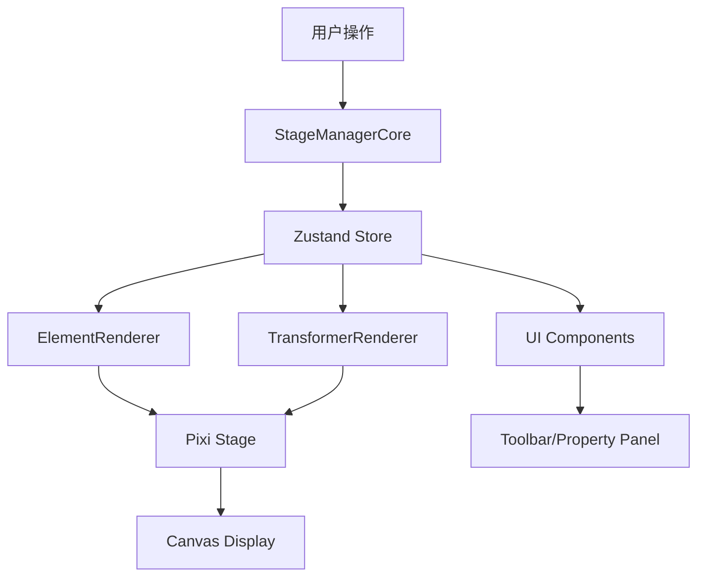

# BDdraw 项目技术架构文档

## 1. 项目概述

BDdraw 是一个基于 Web 的绘图应用程序，允许用户创建和编辑各种图形元素，包括基本形状、线条、文本和图像。该项目采用现代化的前端技术栈构建，具有良好的可扩展性和维护性。

## 2. 技术栈

### 2.1 核心框架
- **React 18**: 用于构建用户界面的核心库
- **TypeScript**: 提供静态类型检查，增强代码质量和开发体验
- **Vite**: 快速的构建工具，提供快速的开发服务器和优化的生产构建

### 2.2 图形渲染
- **PixiJS v8**: 高性能的 2D WebGL 渲染引擎，用于图形渲染
- **pixi-viewport**: 用于处理视口操作（平移、缩放等）

### 2.3 状态管理
- **Zustand**: 轻量级的状态管理解决方案，用于管理画布元素和应用状态

### 2.4 UI 组件和样式
- **Tailwind CSS**: 实用优先的 CSS 框架，用于快速构建自定义设计
- **Arco Design**: UI 组件库，提供丰富的组件
- **Radix UI**: 用于构建高质量的无障碍 UI 组件

### 2.5 文本编辑
- **Tiptap**: 基于 ProseMirror 的 Headless 文本编辑器，用于富文本编辑

### 2.6 工具和库
- **nanoid**: 用于生成唯一 ID
- **Immer**: 用于不可变状态更新
- **Lucide React**: 图标库

## 3. 项目架构

### 3.1 整体架构

项目采用了模块化的架构设计，将不同的功能划分为独立的模块，便于维护和扩展：

```
src/
├── components/           # 可复用的 UI 组件
├── hooks/               # 自定义 React Hooks
├── lib/                 # 工具库和核心功能模块
├── pages/               # 页面组件
├── router/              # 路由配置
├── stores/              # 状态管理
└── pages/canvas/Pixi_STM_modules/  # Pixi Stage Manager 模块
    ├── core/            # 核心类和类型定义
    ├── interaction/     # 交互处理
    ├── rendering/       # 渲染逻辑
    └── utils/           # 工具函数
```

### 3.2 Pixi Stage Manager 架构

Pixi Stage Manager (STM) 是项目中负责处理画布渲染和交互的核心模块，采用了清晰的分层架构：

#### 3.2.1 核心模块 (core/)
- **StageManagerCore.ts**: 主要的舞台管理类，协调整个画布的操作
- **types.ts**: 定义了核心的类型接口和枚举

#### 3.2.2 渲染模块 (rendering/)
- **ElementRenderer.ts**: 负责将画布元素渲染到 Pixi stage 上
- **TransformerRenderer.ts**: 负责渲染选中元素的变换控制器（边框、手柄等）

#### 3.2.3 交互模块 (interaction/)
- **InteractionHandler.ts**: 处理用户交互事件（鼠标按下、移动、释放等）

## 4. 核心功能模块详解

### 4.1 StageManagerCore (核心控制器)

StageManagerCore 是整个绘图系统的核心，它整合了渲染、交互和状态管理等功能：

#### 4.1.1 主要职责
1. 初始化 Pixi 应用和视口
2. 管理图层结构（元素层和UI层）
3. 协调渲染和交互逻辑
4. 处理用户交互事件
5. 管理不同操作模式（选择、绘制、拖拽、调整大小等）

#### 4.1.2 操作模式
- **idle**: 空闲状态
- **selecting**: 选择模式
- **dragging**: 拖拽元素
- **resizing**: 调整元素大小
- **drawing**: 绘制新元素
- **erasing**: 擦除元素

#### 4.1.3 支持的元素类型
- 基本形状：矩形、圆形、三角形、菱形
- 线条：直线、箭头、铅笔绘制
- 文本：支持富文本编辑
- 图像：支持插入和滤镜效果

### 4.2 ElementRenderer (元素渲染器)

负责将存储在状态管理器中的元素数据渲染成可视化的 Pixi 对象：

#### 4.2.1 支持的渲染类型
1. **基本形状**: 使用 PIXI.Graphics 渲染矩形、圆形、三角形等
2. **文本**: 使用 HTMLText 渲染富文本内容
3. **图像**: 使用 PIXI.Sprite 渲染图片，支持滤镜效果

#### 4.2.2 特殊处理
- 图像加载：异步加载并缓存图像纹理
- 文本渲染：支持 HTML 格式的富文本
- 性能优化：通过精灵图映射和对象复用来减少重新创建开销

### 4.3 TransformerRenderer (变换控制器渲染器)

负责渲染选中元素的变换控制器，包括：
- 包围盒显示
- 控制手柄（8个方向）
- 旋转手柄
- 直线/箭头端点控制

### 4.4 状态管理 (Zustand Store)

使用 Zustand 管理全局状态，包括：
- 当前选择的工具
- 所有画布元素的数据
- 选中的元素ID列表
- 当前样式设置
- 剪贴板功能

#### 4.4.1 撤销/重做机制
实现了完整的撤销/重做功能：
- 使用命令模式记录操作
- 支持多种操作类型的撤销/重做
- 防抖机制避免过于频繁的状态快照

### 4.5 交互处理

交互处理采用事件驱动的方式：
1. 通过 InteractionHandler 注册事件监听器
2. 根据当前模式处理不同的交互逻辑
3. 更新状态并触发重新渲染

## 5. 数据流



## 6. 特色功能

### 6.1 多元素选择和操作
- 支持同时选择多个元素进行移动和调整大小
- 智能计算群组边界和相对位置

### 6.2 撤销/重做系统
- 基于命令模式实现
- 支持细粒度的操作追踪

### 6.3 富文本编辑
- 使用 Tiptap 实现所见即所得的文本编辑
- 支持多种文本格式和样式

### 6.4 图像处理
- 支持图像插入和显示
- 提供基础滤镜效果（模糊、亮度、灰度）

## 7. 性能优化

### 7.1 渲染优化
- 使用精灵图映射避免重复创建 Pixi 对象
- 仅在必要时更新元素渲染
- 图像纹理缓存机制

### 7.2 状态更新优化
- 使用防抖机制减少不必要的状态快照
- 精确检测状态变化以避免无效更新

## 8. 可扩展性设计

### 8.1 模块化架构
- 功能分离明确，易于添加新功能
- 渲染器和交互处理器可独立扩展

### 8.2 插件式元素支持
- 通过扩展 CanvasElement 接口可轻松添加新元素类型
- 渲染器和交互逻辑可根据元素类型动态适配

## 9. 总结

BDdraw 项目采用了现代化的前端技术栈和清晰的架构设计，具有良好的可维护性和扩展性。核心的 Pixi Stage Manager 模块通过合理的职责划分和模块化设计，实现了复杂的绘图功能，同时保持了代码的清晰和可理解性。