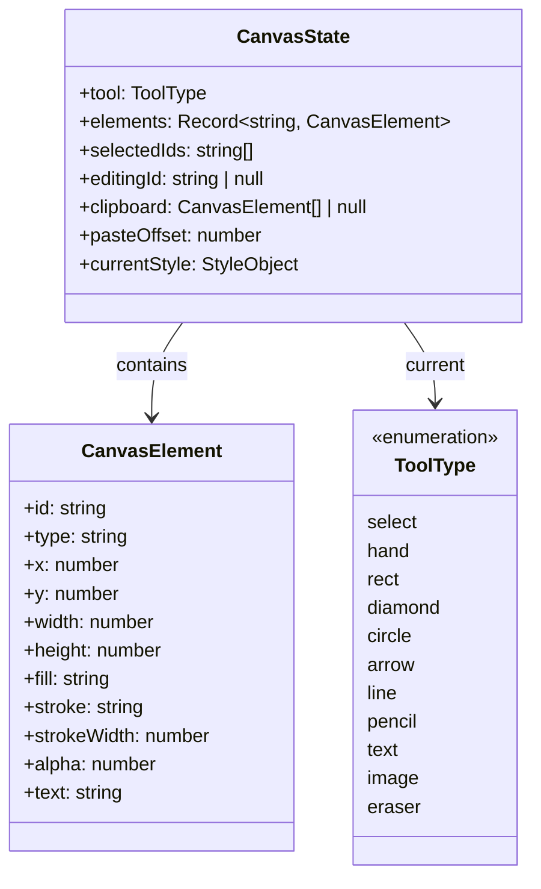
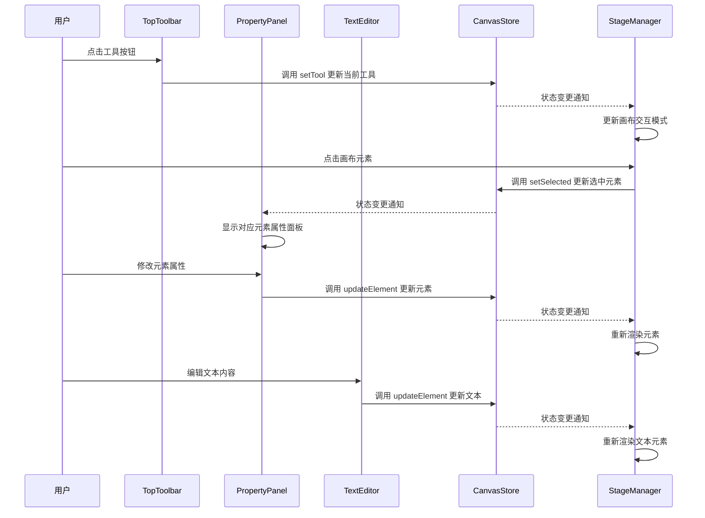

## 1. 模块摘要 (Executive Summary)

通过对项目代码的深入分析，我们整理出以下结构树，展示了调参工具栏相关的组件：

```
src/
├── components/
│   ├── canvas_toolbar/
│   │   └── TopToolbar.tsx           # 顶部主工具栏，包含绘图工具选择
│   ├── property-panel/
│   │   └── index.tsx                # 右侧属性面板，用于设置图形元素属性
│   ├── Richtext_editor/
│   │   ├── Richtext_editor.tsx      # 富文本编辑器组件
│   │   └── BottomTextEditor.tsx     # 底部文本编辑器容器
│   └── ui/                          # UI 图标组件
└── stores/
    └── canvasStore.ts               # 状态管理，存储元素和选中状态
```

调参工具栏模块实现了两种类型的工具栏：

1. 浮动于画布上方的上下文工具栏，根据选中元素类型动态显示
2. 固定在界面右侧的属性面板，用于设置图形元素的具体属性

- **功能描述**：提供用户界面控件，允许用户修改画布元素的各种属性，包括工具选择、图形样式设置和文本编辑功能。
- **文件路径**：src/components/canvas_toolbar/TopToolbar.tsx, src/components/property-panel/index.tsx, src/components/Richtext_editor/
- **核心依赖**：React, Zustand, wangEditor, Lucide Icons

## 2. 组件接口定义 (Props & API)

### 2.1 Props 定义

TopToolbar 组件无外部传入 props。

PropertyPanel 组件无外部传入 props。

RichTextEditor 组件接口如下：

| 字段名    | 类型                    | 必填 | 默认值 | 描述             |
| :-------- | :---------------------- | :--- | :----- | :--------------- |
| value     | string                  | 是   | 无     | 编辑器的初始内容 |
| onChange  | (value: string) => void | 是   | 无     | 内容变化回调函数 |
| className | string                  | 否   | 无     | 自定义 CSS 类名  |

### 2.2 暴露方法 (Ref/ForwardRef)

无

## 3. 核心状态管理 (State Architecture)

### 3.1 状态架构与数据建模

项目使用 Zustand 作为状态管理库，核心状态模型如下：



状态分为两类：

1. 核心业务数据：elements（画布元素集合）、selectedIds（选中元素 ID 列表）
2. UI 交互状态：tool（当前工具类型）、editingId（正在编辑的元素 ID）

初始状态设计合理，elements 初始化为空对象，selectedIds 初始化为空数组，符合常见状态管理模式。

### 3.2 关键流程分析表

| Action 名称   | 触发源 (Trigger)                 | 处理逻辑 (Sync/Async) | 影响的 State 字段 | 副作用 (Side Effects)    |
| :------------ | :------------------------------- | :-------------------- | :---------------- | :----------------------- |
| setTool       | TopToolbar 点击工具按钮          | Sync                  | tool              | 更新当前工具类型         |
| updateElement | 属性面板或文本编辑器修改元素属性 | Sync                  | elements          | 触发画布重新渲染         |
| setSelected   | 画布元素选择操作                 | Sync                  | selectedIds       | 触发工具栏和属性面板更新 |

## 4. 关键逻辑流程 (Logic Flow)

### 4.1 交互时序图 (Mermaid)



### 4.2 核心函数解析

- **`TopToolbar组件`**:

  - **触发时机**: 应用启动时渲染，用户交互时更新
  - **逻辑闭环**: 提供工具选择功能，通过调用 [setTool](/src/stores/canvasStore.ts#L183-L185) 更新当前工具状态
  - **代码片段**:

    ```typescript
    const tools = [
      { id: 'select', value: 'select', icon: MousePointer2, label: 'Selection (V)', shortcut: '1' },
      { id: 'rect', value: 'rect', icon: Square, label: 'Rectangle (R)', shortcut: '2' },
      // ...其他工具
    ]

    // 渲染工具按钮
    {
      tools.map((item, index) => {
        // 渲染分隔线
        if (item.isSeparator) {
          return <div key={`sep-${index}`} className="mx-1 h-6 w-px bg-gray-200" />
        }

        // 渲染按钮
        const isActive = tool === item.value && item.type !== 'action'
        const Icon = item.icon

        return (
          <button
            key={item.id || index}
            title={item.label}
            onClick={() => {
              if (item.onClick) item.onClick()
              if (item.value) setTool(item.value as any)
            }}
            className={cls(
              'relative flex h-9 w-9 items-center justify-center transition-colors duration-100',
              // 选中状态：淡紫色背景，深紫色图标
              isActive ? 'bg-violet-100 text-violet-700' : 'bg-transparent text-gray-600 hover:bg-gray-100',
            )}
          >
            <Icon className={cls('h-4 w-4', item.value === 'line' ? 'rotate-45' : '')} strokeWidth={2} />

            {/* 右下角的快捷键数字 */}
            {item.shortcut && (
              <span className="absolute bottom-[2px] right-[2px] text-[9px] font-medium leading-none opacity-50">
                {item.shortcut}
              </span>
            )}
          </button>
        )
      })
    }
    ```

- **`PropertyPanel组件`**:

  - **触发时机**: 当画布中选中单个非文本、非图像元素时自动显示
  - **逻辑闭环**: 根据元素类型显示相应的属性设置控件，用户修改后通过 [updateElement](/src/stores/canvasStore.ts#L187-L195) 更新状态
  - **代码片段**:

    ```typescript
    // 只处理选中单个元素的情况
    if (selectedIds.length !== 1) return null
    const id = selectedIds[0]
    const element = elements[id]

    // 如果元素不存在或者为图片/文本类型，不显示属性面板
    if (!element) return null
    if (element.type === 'image') return null
    if (element.type === 'text') return null

    const handleChange = (key: string, val: any) => {
      // 记录更改前的属性值
      const oldValue = element[key as keyof typeof element]

      // 更新元素
      updateElement(id, { [key]: val })

      // 创建并执行更新命令以支持撤销/重做
      const updateCommand = new UpdateElementPropertyCommand(
        {
          id,
          property: key,
          oldValue,
          newValue: val,
        },
        `修改元素${key}`,
      )
      undoRedoManager.executeCommand(updateCommand)
    }
    ```

- **`BottomTextEditor组件`**:

  - **触发时机**: 当画布中选中文本元素时自动显示
  - **逻辑闭环**: 显示富文本编辑器，用户编辑内容后实时更新元素文本属性
  - **代码片段**:

    ```typescript
    if (!element || element.type !== 'text') {
      return null
    }

    const handleChange = (html: string) => {
      setLocalHtml(html)
      // 记录更改前的属性值
      const initialText = element.text || ''

      // 实时更新 Store，驱动 Canvas 重新渲染
      updateElement(element.id, { text: html })

      // 创建并执行更新命令以支持撤销/重做
      const updateCommand = new UpdateElementPropertyCommand(
        {
          id: element.id,
          property: 'text',
          oldValue: initialText,
          newValue: html,
        },
        '修改文本内容',
      )
      undoRedoManager.executeCommand(updateCommand)
    }
    ```

- **`RichTextEditor组件`**:

  - **触发时机**: 在 BottomTextEditor 中使用，提供富文本编辑功能
  - **逻辑闭环**: 基于 wangEditor 实现，提供基础文本样式编辑功能
  - **代码片段**:

    ```typescript
    // 工具栏配置：仅保留基础文本样式
    const toolbarConfig: Partial<IToolbarConfig> = {
      toolbarKeys: [
        'bold',
        'italic',
        'underline',
        'through',
        '|',
        'fontSize',
        'fontFamily',
        'color',
        'bgColor',
        '|',
        'justifyLeft',
        'justifyCenter',
        'justifyRight',
        '|',
        'undo',
        'redo',
      ],
    }

    return (
      <div className={`flex flex-col border-t border-gray-50 bg-white shadow-xl ${className || ''}`}>
        {/* 工具栏 */}
        <Toolbar
          editor={editor}
          defaultConfig={toolbarConfig}
          mode="simple"
          className="border-b border-gray-100"
          style={{ borderBottom: '1px solid #e5e7eb' }}
        />
        {/* 编辑区域：高度固定较小，形成底部面板感 */}
        <Editor
          defaultConfig={editorConfig}
          value={value}
          onCreated={setEditor}
          onChange={(editor) => onChange(editor.getHtml())}
          mode="simple"
          style={{ height: '200px', overflowY: 'auto' }}
        />
      </div>
    )
    ```

## 5. UI 与样式实现 (UI Implementation)

- **布局策略**: 采用固定定位布局，TopToolbar 位于顶部中央，PropertyPanel 位于右侧，BottomTextEditor 位于底部
- **样式方案**: 使用 Tailwind CSS 实现样式，通过 `fixed`、`absolute` 等定位类以及阴影、圆角等视觉效果提升用户体验
- **条件渲染**: 大量使用条件渲染，如根据选中元素类型显示不同的属性面板，根据是否有选中元素决定是否显示工具栏

## 6. 健壮性与优化 (Robustness)

- **异常处理**: 通过类型检查和条件渲染避免无效状态，如选中多个元素时不显示属性面板
- **性能优化**: 使用 Zustand 状态管理减少不必要的重渲染，通过精确的状态订阅机制确保组件只在关心的状态变化时更新
- **TypeScript 覆盖率**: 项目广泛使用 TypeScript，类型定义完整，几乎没有使用 any 类型，保证了代码的类型安全
