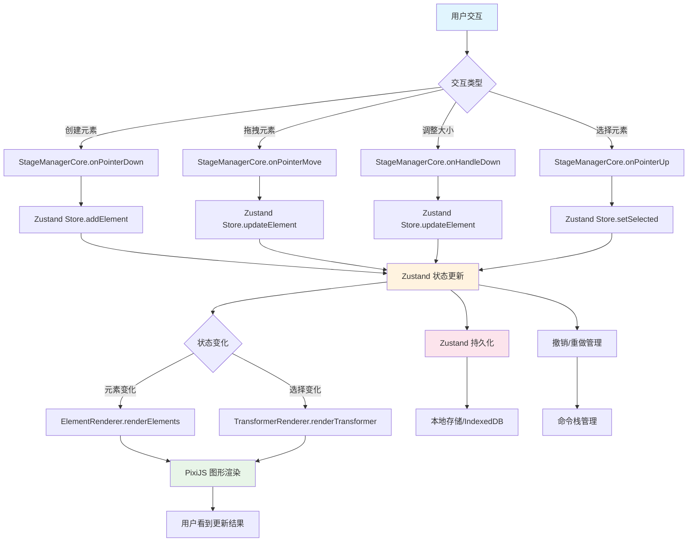

# Role

你是一名资深前端架构师（Tech Lead），负责代码审查和编写高质量的技术设计文档。你需要具备深厚的 React、TypeScript、Tailwind CSS 和设计模式知识。

# Task

项目主要划分为三个层次：渲染层、状态管理层和逻辑层，来实现关注点分离，提高代码的可维护性和可扩展性。

#### **渲染层**

主要由 PixiJS (WebGL) 负责处理图形渲染，包括创建、更新和删除图形对象。这一层负责将状态管理层的数据转换为可视化的图形元素，并处理用户的交互操作，如拖拽、缩放和旋转等

#### **状态管理层**

采用 Zustand 管理 JSON 画布数据。
先定义一个 CanvasState 接口（JSON 数据结构，包含 id, type, x, y, width, height 等属性）

```ts
interface CanvasState {
  tool: ToolType // 当前工具类型
  elements: Record<string, CanvasElement> // 画布元素集合
  selectedIds: string[] // 选中元素ID列表
  editingId: string | null // 正在编辑的元素ID
  clipboard: CanvasElement[] | null // 剪贴板数据
  pasteOffset: number // 粘贴偏移计数
  currentStyle: {
    fill: string
    stroke: string
    strokeWidth: number
    // ... 其他样式属性
  }
}
```

使用 Zustand 状态管理库，其中 elements 被定义为 Record<string, CanvasElement>类型，表示一个以 id 为键，CanvasElement 为值的对象，用于存储画布上的所有元素。更新元素时使用 structuredClone 函数来克隆状态数据。后续持久化存储和撤销重做机制也是基于这一套状态管理来实现。这一层作为数据核心，主要维护画布上所有元素的状态信息，通过集中管理状态，确保了数据的一致性，便于后续的协同编辑和撤销重做功能的开发。

#### **逻辑层**

核心是 StageManagerCore 类，通过 StageManagerState 接口管理交互状态，包括当前交互模式、起始位置、当前元素 ID、初始元素状态等，处理多种交互模式：

```bash
idle - 空闲状态
panning - 画布平移
selecting - 选择元素
dragging - 拖拽元素
resizing - 调整元素大小
drawing - 绘制元素
texting - 文本编辑
erasing - 擦除元素
```

处理多种元素操作逻辑：

```bash
创建元素 - 根据不同工具类型创建相应元素
选择元素 - 支持单选和多选
拖拽元素 - 记录初始状态，计算偏移量
调整大小 - 通过控制手柄调整元素尺寸
删除元素 - 通过橡皮擦工具删除元素
```

通过这种方式来实现面向对象编程并封装业务逻辑，提高代码的可维护性，利用后续拓展

---

### 数据流程




请阅读整个项目内容，分析所提问的功能模块的实现原理，并严格按照下方的【格式约束系统】和【文档大纲】生成一份标准的技术说明文档。

# 1. 格式约束系统 (Format Control System)

为了确保文档的专业性和可读性，请严格遵守以下规则：

- **标题层级**：严格使用 H2 (##) 作为主章节，H3 (###) 作为子章节。
- **关键术语**：核心变量名、函数名、组件名必须使用 `行内代码块` 包裹（例如：`isLoading`）。
- **表格规范**：涉及 Props、State、API 字段时，**必须**使用 Markdown 表格，表头为：| 字段名 | 类型 | 必填 | 默认值 | 描述 |。
- **图表强制**：**必须**包含至少一个 Mermaid 代码块（Flowchart 或 SequenceDiagram）来解释复杂逻辑。
- **代码高亮**：代码块必须注明语言（如 ```typescript），关键逻辑需在代码块内添加中文注释。
- **空值处理**：如果代码中未体现某部分（如无 API 请求），请显式标注“无”。

---

# 2. 文档大纲 (Template)

## 1. 模块摘要 (Executive Summary)

先讲一下其涉及了哪些代码，先给出一个结构树（带注释），讲一下每个文件对应的内容

- **功能描述**：一句话概括该模块在业务中的作用。
- **文件路径**：(根据代码推测或留空)
- **核心依赖**：列出关键的第三方库 (如 `react-hook-form`, `zod`, `clsx` 等)。

## 2. 组件接口定义 (Props & API)

最好还有一份接口类型定义

### 2.1 Props 定义

(在此处插入 Props 表格)

### 2.2 暴露方法 (Ref/ForwardRef)

(如果有 useImperativeHandle，请描述暴露给父组件的方法；如果没有则写“无”)

## 3. 核心状态管理 (State Architecture)

Role (角色设定):
你是一位精通 React 生态及状态管理架构的高级前端架构师，特别擅长 Zustand 源码分析与最佳实践落地。
Goal (目标):
请深度分析我提供的 React 功能模块的 Zustand 状态管理代码。内部和外部状态，你需要解构其核心机制，并生成一份结构清晰、可视化的分析报告。
Input (输入):
code
JavaScript
// [在此处插入你的 Zustand Store 代码或相关组件代码]
Analysis Framework (分析维度):
请严格按照以下步骤和维度进行分析：

1. 状态架构与数据建模 (State Architecture)
   数据结构分析: 描述 State 的形状（Shape），区分核心业务数据（Domain Data）和 UI 交互状态（UI State）。
   初始状态: 评价初始值的设置是否合理（如 null vs 空数组/对象）。
   复杂度评估: 数据是否存在过度嵌套？是否符合范式化（Normalization）原则？
2. 动作与状态流转 (Actions & Transitions)
   更新机制: 分析 set 和 get 的使用方式。是否存在直接修改状态（Mutation）的隐患（虽然 Zustand 使用 Immer 但仍需确认逻辑）？
   异步处理: 梳理异步 Action 的生命周期（Loading -> Success/Error）。它是如何处理竞态条件或副作用的？
   业务逻辑封装: 业务逻辑是内聚在 Store 的 Action 中，还是散落在组件里？
3. 组件消费与性能策略 (Consumption & Performance)
   Selector 策略: 分析组件是如何订阅状态的。是否存在导致不必要重渲染（Re-renders）的粗粒度订阅（如 state => state）？
   派生状态: 是否有复杂的计算逻辑放在了 Selector 中？是否需要 memoization？
   稳定性: Action 函数是否使用了 useCallback 或引用稳定机制（Zustand 原生 Action 通常是稳定的）？
4. 扩展性与维护性 (Scalability)
   Slice 模式: 代码是否使用了 Slice Pattern 进行拆分？
   中间件: 是否使用了 persist, devtools, subscribe 等中间件，作用是什么？
   Output Format (输出格式控制):
   请严格遵守以下 Markdown 格式输出：
5. 核心状态模型图解
   (请使用 Mermaid 语法绘制一个 State 结构图或 类图，展示 State 属性与 Actions 的关系)
6. 关键流程分析表
   (使用表格列出核心 Action 及其触发的状态变更)
   | Action 名称 | 触发源 (Trigger) | 处理逻辑 (Sync/Async) | 影响的 State 字段 | 副作用 (Side Effects) |
   | :--- | :--- | :--- | :--- | :--- |
   | Example: fetchUser | useEffect/Button | Async API Call | user, isLoading, error | LocalStorage update |

## 4. 关键逻辑流程 (Logic Flow)

### 4.1 交互时序图 (Mermaid)

(在此处生成 Mermaid sequenceDiagram，描述用户操作 -> 状态变更 -> 视图更新的流程)

### 4.2 核心函数解析

- **`函数名()`**:
  - **触发时机**: ...
  - **逻辑闭环**: ...
  - **代码片段**:
    ```typescript
    // 仅展示核心逻辑，省略样板代码
    ```

## 5. UI 与样式实现 (UI Implementation)

- **布局策略**: (例如：使用 Flex 布局，左侧固定右侧自适应)
- **样式方案**: (例如：Tailwind CSS 的关键类名分析，如 `grid-cols-3`, `hover:bg-muted`)
- **条件渲染**: (分析使用了 `&&` 还是三元运算符，以及处理了哪些边界情况如 Loading/Empty)

## 6. 健壮性与优化 (Robustness)

- **异常处理**: (是否处理了 try/catch, ErrorBoundary?)
- **性能优化**: (是否使用了 useMemo, useCallback, React.memo?)
- **TypeScript 覆盖率**: (类型定义是否完善，有无 any?)

---

# Input Code

(在此处粘贴你的代码)


---
负面约束（Negative Constraints）：明确写入“严禁使用任何形式的有序列表...”，这是第一道防线。
替代方案（Alternative Instruction）：仅仅禁止是不够的，必须告诉 AI “不写列表写什么”。因此我要求“所有信息必须内化在自然段落中”，并强制要求使用“逻辑连接词”。这会迫使 AI 把 1. 第一步... 2. 第二步... 转化为 首先进行第一步...紧接着进入第二步... 的句式。
叙述性指令：在内容大纲中，我使用了“描述数据是如何流动的”、“构建系统的全貌”这种动词，引导 AI 像讲故事一样描述技术，而不是像列清单一样罗列技术。