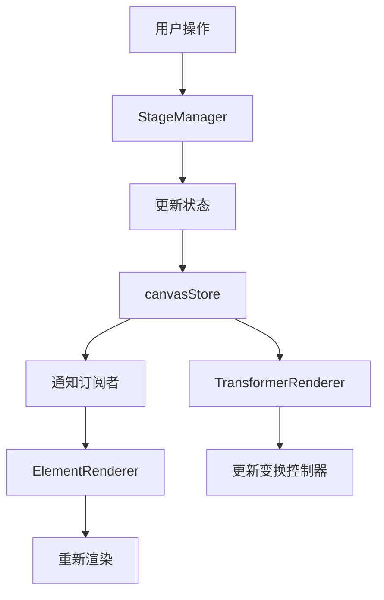

# BDdraw_DEV 项目技术实现详解

## 1. 项目概述

BDdraw_DEV 是一个基于 Web 的图形绘制和编辑工具，使用现代前端技术栈构建。项目提供了丰富的图形编辑功能，包括图形绘制、图片处理、文本编辑等核心功能。

## 2. 技术选型分析

### 2.1 核心框架与库

| 技术 | 用途 | 选择理由 |
|------|------|----------|
| React | UI 构建 | 组件化开发，生态丰富 |
| TypeScript | 类型检查 | 提高代码质量和开发效率 |
| PixiJS | 图形渲染引擎 | 高性能 2D 渲染，支持 WebGL |
| Zustand | 状态管理 | 轻量级，易于使用 |
| Tailwind CSS | 样式系统 | 实用优先的 CSS 框架 |

### 2.2 核心依赖详解

#### 2.2.1 图形渲染相关
- **PixiJS**: 用于高性能 2D 图形渲染，支持 WebGL 和 Canvas 回退
- **pixi-viewport**: 提供无限画布、缩放、平移等视口管理功能
- **@pixi/text-html**: 支持 HTML 富文本渲染

#### 2.2.2 状态管理
- **Zustand**: 轻量级状态管理库，用于管理画布元素、选中状态等全局状态
- **react-hotkeys-hook**: 处理键盘快捷键

#### 2.2.3 UI 组件库
- **Arco Design**: 提供颜色选择器、滑块等 UI 组件
- **Lucide React**: 提供图标组件

## 3. 功能实现详解

### 3.1 基础渲染

#### 3.1.1 图形渲染

**技术实现**:
- 使用 PixiJS 的 `Graphics` 对象进行图形绘制
- 每个图形元素对应一个 `Graphics` 实例
- 图形数据存储在 `CanvasElement` 接口定义的数据结构中

**支持的图形类型**:
1. 矩形 (`rect`): 使用 `g.rect()` 方法绘制
2. 圆角矩形: 使用 `g.roundRect()` 方法绘制，支持 radius 属性
3. 圆形 (`circle`): 使用 `g.ellipse()` 方法绘制椭圆
4. 三角形 (`triangle`): 使用 `g.poly()` 方法绘制多边形
5. 菱形 (`diamond`): 使用 `g.poly()` 方法绘制四边形
6. 线段 (`line`): 使用 `g.moveTo()` 和 `g.lineTo()` 绘制线条
7. 箭头 (`arrow`): 在线段基础上添加箭头头部
8. 铅笔 (`pencil`): 通过记录鼠标轨迹点绘制自由线条

**核心代码位置**:
- [ElementRenderer.ts](file:///e:/ADF-workbase/BDdraw_DEV/src/pages/canvas/Pixi_STM_modules/rendering/ElementRenderer.ts) - 图形渲染实现
- [canvasStore.ts](file:///e:/ADF-workbase/BDdraw_DEV/src/stores/canvasStore.ts) - 图形数据结构定义

#### 3.1.2 图片渲染

**技术实现**:
- 使用 PixiJS 的 `Sprite` 对象渲染图片
- 支持异步加载图片资源
- 使用 PIXI.Assets 管理图片资源加载和缓存

**支持的图片格式**:
- PNG
- JPEG
- 其他浏览器支持的图片格式

**滤镜支持**:
1. 模糊滤镜: 使用 `PIXI.BlurFilter`
2. 亮度调整: 使用 `PIXI.ColorMatrixFilter` 的 brightness 方法
3. 灰度滤镜: 使用 `PIXI.ColorMatrixFilter` 的 grayscale 方法

**核心代码位置**:
- [ElementRenderer.ts](file:///e:/ADF-workbase/BDdraw_DEV/src/pages/canvas/Pixi_STM_modules/rendering/ElementRenderer.ts) - 图片渲染实现

#### 3.1.3 富文本渲染

**技术实现**:
- 使用 PixiJS 的 `HTMLText` 对象渲染富文本
- 支持 HTML 标签和内联样式
- 通过解析 HTML 字符串实现富文本显示

**支持的文本属性**:
- 字体 (font-family): 通过 [fontFamily](file:///e:/ADF-workbase/BDdraw_DEV/src/stores/canvasStore.ts#L45-L45) 属性设置
- 字号 (font-size): 通过 [fontSize](file:///e:/ADF-workbase/BDdraw_DEV/src/stores/canvasStore.ts#L44-L44) 属性设置
- 颜色 (color): 通过 HTML 内联样式设置
- 背景色 (background): 通过 HTML 内联样式设置
- BIUS (加粗、斜体、下划线、删除线): 通过 HTML 标签实现

**核心代码位置**:
- [ElementRenderer.ts](file:///e:/ADF-workbase/BDdraw_DEV/src/pages/canvas/Pixi_STM_modules/rendering/ElementRenderer.ts) - 富文本渲染实现

### 3.2 画布交互

#### 3.2.1 无限画布

**技术实现**:
- 使用 `pixi-viewport` 库实现无限画布功能
- 支持鼠标中键拖拽、滚轮缩放、手势捏合缩放
- 视口状态管理，包括缩放级别和位置

**核心代码位置**:
- [StageManagerCore.ts](file:///e:/ADF-workbase/BDdraw_DEV/src/pages/canvas/Pixi_STM_modules/core/StageManagerCore.ts) - 视口设置和管理

#### 3.2.2 选区功能

**技术实现**:
- 点击选中: 通过检测鼠标点击位置与元素的碰撞实现
- 框选: 通过绘制选择矩形并检测与元素的交集实现
- 多选: 支持按住 Shift 键进行多选

**核心代码位置**:
- [StageManagerCore.ts](file:///e:/ADF-workbase/BDdraw_DEV/src/pages/canvas/Pixi_STM_modules/core/StageManagerCore.ts) - 选区逻辑实现

#### 3.2.3 数据持久化

**技术实现**:
- 使用 Zustand 进行状态管理
- 状态变化自动触发 UI 更新
- 可通过 localStorage 或其他持久化方案保存数据

**核心代码位置**:
- [canvasStore.ts](file:///e:/ADF-workbase/BDdraw_DEV/src/stores/canvasStore.ts) - 状态管理实现

#### 3.2.4 快捷键操作

**技术实现**:
- 使用 `react-hotkeys-hook` 库处理键盘快捷键
- 支持复制、粘贴、删除等操作的快捷键
- 支持工具切换快捷键

**核心代码位置**:
- [use_React_hotkeys_management.ts.ts](file:///e:/ADF-workbase/BDdraw_DEV/src/hooks/use_React_hotkeys_management.ts.ts) - 快捷键处理实现

### 3.3 调参工具栏

#### 3.3.1 浮动工具栏

**技术实现**:
- 使用 React 组件实现工具栏 UI
- 根据当前选中工具显示相应图标
- 支持快捷键提示和工具切换

**核心代码位置**:
- [TopToolbar.tsx](file:///e:/ADF-workbase/BDdraw_DEV/src/components/canvas_toolbar/TopToolbar.tsx) - 工具栏实现

#### 3.3.2 属性面板

**技术实现**:
- 根据选中元素类型显示不同属性调节选项
- 使用 Arco Design 组件实现颜色选择器、滑块等控件
- 实时更新元素属性

**核心代码位置**:
- [property-panel/index.tsx](file:///e:/ADF-workbase/BDdraw_DEV/src/components/property-panel/index.tsx) - 属性面板实现

### 3.4 元素编辑

#### 3.4.1 文本编辑

**技术实现**:
- 双击文本元素进入编辑状态
- 使用富文本编辑器进行文本编辑
- 支持 HTML 格式文本

**核心代码位置**:
- [BottomTextEditor.tsx](file:///e:/ADF-workbase/BDdraw_DEV/src/components/Richtext_editor/BottomTextEditor.tsx) - 文本编辑器实现

#### 3.4.2 元素操作

**技术实现**:
- 删除: 通过 Delete/Backspace 键或工具栏操作
- 拖拽: 通过鼠标拖拽实现元素位置移动
- 缩放: 通过变换控制器手柄实现元素缩放
- 旋转: 数据结构支持但 UI 实现尚未完成

**核心代码位置**:
- [StageManagerCore.ts](file:///e:/ADF-workbase/BDdraw_DEV/src/pages/canvas/Pixi_STM_modules/core/StageManagerCore.ts) - 元素操作实现

### 3.5 性能优化

#### 3.5.1 渲染优化

**技术实现**:
- 使用 PixiJS 进行硬件加速渲染
- 对象池管理避免重复创建对象
- 纹理缓存避免重复加载图片

#### 3.5.2 状态更新优化

**技术实现**:
- 使用 Zustand 的 `subscribeWithSelector` 优化状态订阅
- 防抖机制避免频繁状态更新

**核心代码位置**:
- [StageManagerCore.ts](file:///e:/ADF-workbase/BDdraw_DEV/src/pages/canvas/Pixi_STM_modules/core/StageManagerCore.ts) - 防抖实现

### 3.6 协同功能

#### 3.6.1 Undo & Redo

**技术实现**:
- 使用命令模式实现撤销重做功能
- 快照命令记录状态变化
- 更新命令记录具体元素变化

**核心代码位置**:
- [UndoRedoManager.ts](file:///e:/ADF-workbase/BDdraw_DEV/src/lib/UndoRedoManager.ts) - 撤销重做管理器
- [UpdateElementCommand.ts](file:///e:/ADF-workbase/BDdraw_DEV/src/lib/UpdateElementCommand.ts) - 元素更新命令

#### 3.6.2 协同编辑

**当前状态**:
- 项目包含协同相关的代码结构
- 基于现有状态管理和命令系统可扩展协同功能
- 完整实现需要引入 WebSocket 或其他实时通信技术

## 4. 架构设计

### 4.1 核心模块

#### 4.1.1 StageManager 模块

**职责**:
- 管理 PixiJS 应用和视口
- 处理用户交互事件
- 协调渲染和状态更新

**子模块**:
- [StageManagerCore.ts](file:///e:/ADF-workbase/BDdraw_DEV/src/pages/canvas/Pixi_STM_modules/core/StageManagerCore.ts): 核心类和初始化逻辑
- [ElementRenderer.ts](file:///e:/ADF-workbase/BDdraw_DEV/src/pages/canvas/Pixi_STM_modules/rendering/ElementRenderer.ts): 元素渲染逻辑
- [TransformerRenderer.ts](file:///e:/ADF-workbase/BDdraw_DEV/src/pages/canvas/Pixi_STM_modules/rendering/TransformerRenderer.ts): 变换控制器渲染逻辑
- [InteractionHandler.ts](file:///e:/ADF-workbase/BDdraw_DEV/src/pages/canvas/Pixi_STM_modules/interaction/InteractionHandler.ts): 交互事件处理

#### 4.1.2 状态管理模块

**职责**:
- 管理画布元素数据
- 管理选中状态和工具状态
- 提供状态更新方法

**核心代码位置**:
- [canvasStore.ts](file:///e:/ADF-workbase/BDdraw_DEV/src/stores/canvasStore.ts): Zustand 状态存储

#### 4.1.3 命令模式模块

**职责**:
- 实现撤销重做功能
- 管理命令执行历史

**核心代码位置**:
- [UndoRedoManager.ts](file:///e:/ADF-workbase/BDdraw_DEV/src/lib/UndoRedoManager.ts): 撤销重做管理器
- [UpdateElementCommand.ts](file:///e:/ADF-workbase/BDdraw_DEV/src/lib/UpdateElementCommand.ts): 元素更新命令

### 4.2 数据流

## 5. 扩展性设计

### 5.1 插件化架构

项目采用模块化设计，便于扩展新功能：
- 渲染模块可扩展新的图形类型
- 工具模块可添加新的编辑工具
- 命令模块可添加新的操作类型

### 5.2 组件化设计

UI 组件采用 React 组件化设计：
- 工具栏组件
- 属性面板组件
- 文本编辑器组件
- 各组件之间通过状态管理进行通信

## 6. 性能考虑

### 6.1 渲染性能

- 使用 PixiJS 进行硬件加速渲染
- 对象池管理避免重复创建对象
- 纹理缓存避免重复加载资源

### 6.2 内存管理

- 及时销毁不需要的图形对象
- 清理事件监听器避免内存泄漏
- 纹理资源的合理管理

### 6.3 状态更新优化

- 使用防抖机制避免频繁状态更新
- 精确的状态订阅避免不必要的重渲染
- 增量更新而非全量更新

## 7. 待完善功能

### 7.1 旋转功能

虽然数据结构中定义了 [rotation](file:///e:/ADF-workbase/BDdraw_DEV/src/stores/canvasStore.ts#L36-L36) 属性，但 UI 实现尚未完成。

### 7.2 组合与打组功能

项目中定义了相关数据结构，但功能实现尚未完成。

### 7.3 协同编辑

需要引入实时通信技术实现真正的协同编辑功能。

## 8. 总结

BDdraw_DEV 项目采用了现代化的前端技术栈，实现了较为完整的图形编辑功能。通过 PixiJS 实现高性能渲染，通过 Zustand 管理状态，通过命令模式实现撤销重做功能。项目架构清晰，模块化程度高，具备良好的扩展性。对于未完成的功能，基于现有架构可以相对容易地进行扩展和完善。
