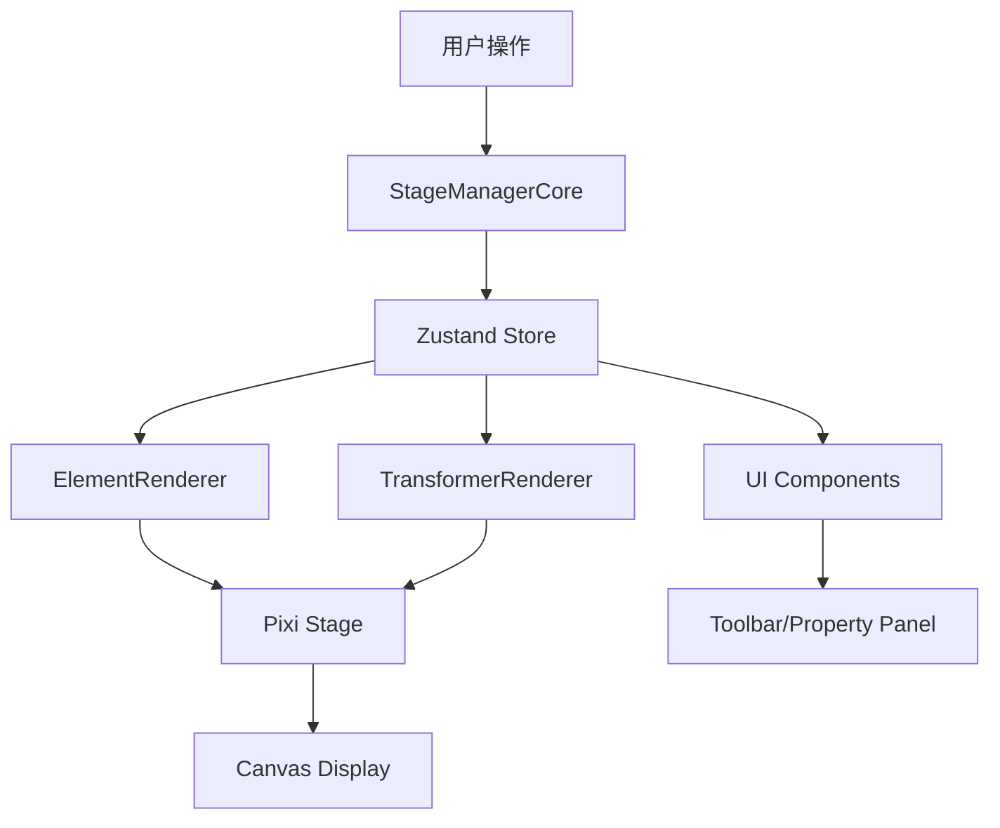

# BDdraw 项目架构和基础功能说明

## 1. 项目概述

BDdraw 是一个基于 Web 的绘图应用程序，允许用户创建和编辑各种图形元素，包括基本形状、线条、文本和图像。该项目采用现代化的前端技术栈构建，具有良好的可扩展性和维护性。应用程序基于 React 和 TypeScript 构建，使用 PixiJS 作为图形渲染引擎，提供了流畅的用户体验和丰富的绘图功能。

## 2. 整体架构设计

项目采用了模块化的架构设计，将不同的功能划分为独立的模块，便于维护和扩展。这种架构使得各个组件可以独立开发、测试和维护，同时保持整体系统的一致性和协调性。

### 2.1 主要目录结构

```
src/
├── components/           # 可复用的 UI 组件
├── hooks/               # 自定义 React Hooks
├── lib/                 # 工具库和核心功能模块
├── pages/               # 页面组件
├── router/              # 路由配置
├── stores/              # 状态管理
└── pages/canvas/Pixi_STM_modules/  # Pixi Stage Manager 模块
    ├── core/            # 核心类和类型定义
    ├── interaction/     # 交互处理
    ├── rendering/       # 渲染逻辑
    └── utils/           # 工具函数
```

### 2.2 核心模块 Pixi Stage Manager

Pixi Stage Manager (STM) 是项目中负责处理画布渲染和交互的核心模块，采用了清晰的分层架构。它将复杂的绘图功能分解为多个专门的子模块，每个子模块负责特定的功能，从而提高了代码的可维护性和可扩展性。

STM 的分层架构包括：
- 核心模块：负责整体协调和状态管理
- 渲染模块：专门处理图形渲染逻辑
- 交互模块：处理用户输入和交互事件
- 工具模块：提供辅助功能和工具函数

## 3. 核心功能模块详解

### 3.1 StageManagerCore（核心控制器）

StageManagerCore 是整个绘图系统的核心，它整合了渲染、交互和状态管理等功能。作为系统的中枢，它负责初始化 Pixi 应用和视口，管理图层结构，协调渲染和交互逻辑，并处理各种用户交互事件。

主要职责包括：
1. 初始化 Pixi 应用和视口
2. 管理图层结构（元素层和 UI 层）
3. 协调渲染和交互逻辑
4. 处理用户交互事件
5. 管理不同操作模式（选择、绘制、拖拽、调整大小等）

系统支持多种操作模式：
- **idle**: 空闲状态，等待用户操作
- **selecting**: 选择模式，用于框选元素
- **dragging**: 拖拽元素，移动选中对象
- **resizing**: 调整元素大小，改变元素尺寸
- **drawing**: 绘制新元素，创建新的图形对象
- **erasing**: 擦除元素，删除不需要的对象

支持的元素类型丰富多样：
- 基本形状：矩形、圆形、三角形、菱形
- 线条：直线、箭头、铅笔绘制
- 文本：支持富文本编辑
- 图像：支持插入和滤镜效果

### 3.2 ElementRenderer（元素渲染器）

ElementRenderer 负责将存储在状态管理器中的元素数据渲染成可视化的 Pixi 对象。它根据元素类型使用不同的渲染策略，确保各种元素都能正确显示。

支持的渲染类型包括：
1. **基本形状**: 使用 PIXI.Graphics 渲染矩形、圆形、三角形等
2. **文本**: 使用 HTMLText 渲染富文本内容
3. **图像**: 使用 PIXI.Sprite 渲染图片，支持滤镜效果

为了提高性能，ElementRenderer 采用了多种优化策略：
- 图像加载：异步加载并缓存图像纹理，避免重复加载
- 文本渲染：支持 HTML 格式的富文本，提供丰富的文本格式化选项
- 性能优化：通过精灵图映射和对象复用来减少重新创建开销

### 3.3 TransformerRenderer（变换控制器渲染器）

TransformerRenderer 负责渲染选中元素的变换控制器，为用户提供直观的元素操作界面。它显示元素的边界框和控制手柄，让用户可以方便地调整元素的位置、大小和旋转。

主要功能包括：
- 包围盒显示：清晰标示选中元素的边界
- 控制手柄：提供8个方向的调整手柄
- 旋转手柄：支持元素旋转操作
- 直线/箭头端点控制：针对线性元素的特殊控制点

### 3.4 状态管理（Zustand Store）

项目使用 Zustand 作为状态管理解决方案，管理全局状态包括：
- 当前选择的工具
- 所有画布元素的数据
- 选中的元素 ID 列表
- 当前样式设置
- 剪贴板功能

为了支持撤销/重做功能，系统实现了完整的命令模式：
- 使用命令模式记录操作，确保每一步操作都可以被精确追踪
- 支持多种操作类型的撤销/重做
- 采用防抖机制避免过于频繁的状态快照，提高性能

### 3.5 交互处理

交互处理采用事件驱动的方式，通过以下流程实现：
1. 通过 InteractionHandler 注册事件监听器
2. 根据当前模式处理不同的交互逻辑
3. 更新状态并触发重新渲染

这种设计使得交互处理更加灵活和可扩展，可以根据不同的操作模式提供相应的交互反馈。

## 4. 数据流设计

系统采用单向数据流设计，确保数据的一致性和可预测性：



## 5. 特色功能

### 5.1 多元素选择和操作
- 支持同时选择多个元素进行移动和调整大小
- 智能计算群组边界和相对位置

### 5.2 撤销/重做系统
- 基于命令模式实现
- 支持细粒度的操作追踪

### 5.3 富文本编辑
- 使用 Tiptap 实现所见即所得的文本编辑
- 支持多种文本格式和样式

### 5.4 图像处理
- 支持图像插入和显示
- 提供基础滤镜效果（模糊、亮度、灰度）

## 6. 性能优化策略

### 6.1 渲染优化
- 使用精灵图映射避免重复创建 Pixi 对象
- 仅在必要时更新元素渲染
- 图像纹理缓存机制

### 6.2 状态更新优化
- 使用防抖机制减少不必要的状态快照
- 精确检测状态变化以避免无效更新

## 7. 可扩展性设计

### 7.1 模块化架构
- 功能分离明确，易于添加新功能
- 渲染器和交互处理器可独立扩展

### 7.2 插件式元素支持
- 通过扩展 CanvasElement 接口可轻松添加新元素类型
- 渲染器和交互逻辑可根据元素类型动态适配

## 8. 总结

BDdraw 项目采用了现代化的前端技术栈和清晰的架构设计，具有良好的可维护性和扩展性。核心的 Pixi Stage Manager 模块通过合理的职责划分和模块化设计，实现了复杂的绘图功能，同时保持了代码的清晰和可理解性。这种架构设计不仅满足了当前的功能需求，也为未来的功能扩展和性能优化提供了良好的基础。